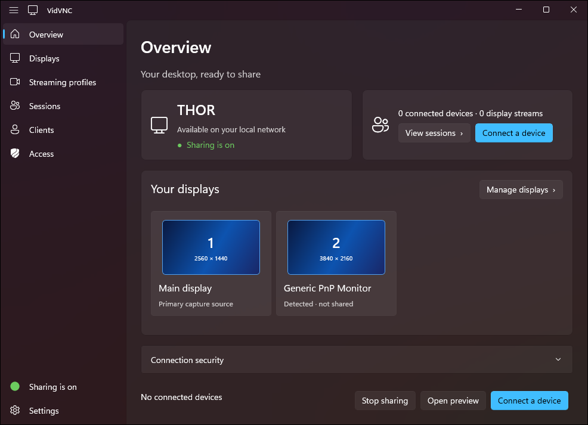

# VidVNC

Low-latency desktop streaming with a native capture/encode worker, a Node.js server,
a server-hosted browser client, and a WinUI 3 server host. It is a development preview,
**not** production-ready.

<p align="center">
  
</p>

Currently implemented: Windows 11 **25H2/build 26200 or newer**, x64, hardware
H.264/H.265/AV1 encoding on NVIDIA, Intel and AMD graphics, selectable-monitor DXGI
capture, WASAPI desktop audio compressed with Opus, and host-granted browser
keyboard/mouse control. VidVNC picks the encoder on the graphics card driving the
display, so hybrid laptops do not copy each frame between GPUs; the host can also
name one. There is still **no software encoder and no software capture fallback** --
a GPU with a working hardware encoder is required. Up to two connected
devices, each with two video streams and one independent audio stream. Only one
device holds input permission at a time. Multi-session hardware acceptance is
still in progress; see [the roadmap](docs/ROADMAP.md).
No Windows software-capture or software-encoder fallback.

Native macOS 27/Apple Silicon capture and native viewer clients are planned, not
implemented. Browser testing on Apple devices is not native macOS server support.

## Install and run

> Nothing is published yet. Both packages can be built as development builds (see
> [Windows packages](#windows-packages)): the VidVNC Server ZIP is unsigned and the
> VidVNC app package is signed with a self-signed development certificate. You can
> also use [Build and run (Windows)](#build-and-run-windows).

VidVNC comes in two Windows packages. Both include VidVNC's own media components,
so you never install GStreamer or developer tools. Both need:

- Windows 11 25H2 (build 26200) or later, x64
- A graphics card with a supported hardware video encoder, and its current driver:
  NVIDIA (NVENC), Intel (Quick Sync) or AMD (AMF). Most Windows 11 PCs from the last
  five years qualify, including integrated Intel and AMD graphics. Windows Media
  Foundation covers anything else that exposes a hardware H.264 encoder
- [Microsoft Visual C++ Redistributable (x64)](https://aka.ms/vc14/vc_redist.x64.exe),
  version 14.44 or later

> **Which encoders have been tested.** NVIDIA NVENC, AMD AMF and Windows Media
> Foundation have all been exercised on real hardware. **Intel Quick Sync has not** --
> no Intel graphics was available during development, so it ships supported but
> unverified. VidVNC proves an encoder really works before it offers it: each backend
> must pass a short real encode at startup, so an untested one that turns out to be
> broken is dropped rather than producing a dead stream. If Quick Sync misbehaves on
> your PC, please open an issue.

### VidVNC app

Also needs the [.NET 10 Runtime](https://dotnet.microsoft.com/download/dotnet/10.0),
the [Windows App Runtime](https://learn.microsoft.com/windows/apps/windows-app-sdk/downloads)
2.2 or later, and [Node.js](https://nodejs.org/) 24 or later. A package that
includes Node.js does not need Node.js installed.

1. The development build is signed with a self-signed certificate, so trust it
   once per PC. Open PowerShell as administrator in the folder with the package and run:

   ```powershell
   powershell -ExecutionPolicy Bypass -File .\VidVNC-Development-Certificate.ps1 install
   ```

   Run it with `uninstall` to stop trusting the certificate.

2. Open the `.msix` file and choose **Install**. It installs for your account only.
3. Open **VidVNC** from the Start menu.

A ZIP with a `prerequisites` folder also contains the runtime installers, and its
`INSTALL.txt` lists these steps. To remove VidVNC, uninstall it from
**Settings > Apps > Installed apps**.

VidVNC starts sharing and shows the address and password. On another device on
your network, open the address in a browser and enter the password. If Windows
asks, allow VidVNC on private networks.

### VidVNC Server (command line)

Also needs [Node.js](https://nodejs.org/) 24 or later.

Extract the VidVNC Server ZIP to any folder, then run this in that folder:

```text
VidVNC.Server.cmd
```

If something is missing, it tells you what to install. A ZIP that includes a
`prerequisites` folder contains the Visual C++ Redistributable installer.

The server prints the address and password. Manage it by typing commands in the
same window; type `help` to list them (see
[CLI server configuration](#cli-server-configuration)). Type `exit` or press Ctrl+C to stop.
To change settings while the server is stopped, run
`VidVNC.Server.cmd config <command>`, for example `VidVNC.Server.cmd config access available`.

Both packages keep settings and logs in `%LOCALAPPDATA%\VidVNC`, so upgrading or
uninstalling keeps them. To remove the command-line server, stop it and delete its folder.
Use VidVNC only on a trusted local network, and don't forward either port. The HTTP
listener binds only loopback and eligible Private-LAN addresses. With the default TLS
mode, the viewer is unavailable until HTTPS starts; an invalid TLS configuration or
listener failure does not fall back to HTTP login or streaming. Only a valid, explicit
`tls.mode: off` setting permits the full viewer on unencrypted LAN-only HTTP.

## Build and run (Windows)

Prerequisites: Node.js 20.6+ (use a maintained LTS), npm, Visual Studio 2022 C++
desktop tools/Windows SDK, CMake 3.25+, a current GPU driver, and GStreamer **1.28.6 MSVC
x86_64 development SDK**. The optional WinUI host also requires .NET 10.

From the repository root:

```powershell
npm ci
npm run build
npm test
npm run test:hardware
npm start
```

`npm start` prints a viewer address once HTTPS is ready, or immediately in explicit
LAN-only TLS-off mode. Before HTTPS is ready, the CLI reports that viewer access is
pending or unavailable; the native host disables Connect and Preview. Do not use the
local HTTP trust URL as a viewer URL. Open an advertised viewer URL from the client.
Clients require host approval by default. In the host, use
Sessions → Grant control, then enable keyboard/mouse in the browser.
Access → Keyboard and mouse can instead allow new connections when control is
available. This saved default does not change existing sessions, take control
from another device, or undo a manual revoke. The browser still enables input
locally. Access defaults are stored separately in `access-settings.json` in the
per-user VidVNC data directory and also apply to the CLI server. Esc releases
local control/exits fullscreen; Ctrl+C stops the server and all its workers.
For live diagnostics on the server PC, use the host's Diagnostics action or the CLI
`diagnostics open` command. It creates a short-lived link to a separate local-only
listener; the normal connection address does not serve diagnostics.

### CLI server configuration

The CLI server can change every setting the Windows host can. Its prompt shows
connected devices and which one has keyboard and mouse control, for example
`vidvnc [2 devices · #1 has control]>`, and updates while you type. Tab completes
commands, display numbers, profile IDs, devices and options; press it twice to list
the choices. Up and Down recall earlier commands from this run. Messages from the
server print above the prompt. Type `help` for the full list:

- Displays: `displays`, `share <display> on|off`, `display-default <display> <profile>|host`,
  `default-profile auto|<profile>`, `audio on|off`
- Profiles: `profiles`, `profile add|edit|duplicate|remove|enable|disable|move …`
- Client customization: `client-mode profiles|options`, `options`,
  `options add|remove size WxH|framerate N|bitrate KBPS`
- Access: `access [approval|available]`
- Public login label: `public-name [name]`
- Devices: `sessions`, `grant <session>`, `revoke [session]`, `stop <stream-id>`,
  `disconnect <session>`
- `info` shows connection addresses, the password, and the data and log folders.
- `exit` or `quit` stops sharing, asking first if devices are connected. Ctrl+C
  stops at once.

Displays use the numbers shown by `displays` (primary first). Profiles accept their
ID or name. Devices use the `#number` shown by `sessions` or one of their stream IDs.
Changes that restart streaming ask before disconnecting connected devices; `--yes`
skips the question. Bitrates are in kbit/s. These commands are local-only, not HTTP
administration endpoints. When commands are piped into the server instead of typed,
there is no prompt or completion.

A profile can use constant or variable bitrate. Set it with `profile add` or
`profile edit` using `--bitrate-mode cbr|vbr` and `--quality efficient|balanced|high`
(the Windows host's profile editor has the same Bitrate mode and Quality choices).
For a variable bitrate profile the bitrate is the sustained cap, and the quality level
applies only to variable profiles. Variable profiles use a 10 second keyframe interval
instead of one second, so after packet loss a client recovers through its keyframe
request. Profiles are constant bitrate unless you change them, and clients cannot choose
the mode.

The same settings commands work without a running server, for example
`npm run config -- share 2 on` or `node apps/server/src/main.mjs config share 2 on`.
Use `npm run config -- public-name "Office PC"` to choose the name shown before
sign-in (default: `VidVNC host`). The Windows host also offers this setting under
Settings and displays the saved name on Overview. The native control is available
while sharing is running; the CLI can change it while the server is stopped.
Treat it as public: anyone who can reach the
HTTPS login page can read it. Keep personal names, internal hostnames, and
location details out of this label. The login page and `/api/info` show only
this label; display details, profiles, and the viewer load after admission.
The TLS certificate can still list the machine hostname and interface IPs.
Read commands accept `--json`, and `config show --json` prints all saved settings. For
scripts, use `npm run -s config -- …` or `node apps/server/src/main.mjs config …`;
plain `npm run` prints its own banner first, which breaks JSON output.
While a server is running, offline changes are refused; use its console instead.
Exit codes: 0 success, 1 failure, 2 usage error.

`npm run build:host` builds `apps/windows-host/VidVnc.Host.csproj` with MSBuild.
Use `npm run prepare:host` to build the Debug worker and host together and write
the development runtime manifest. Then run `npm run start:host` to start the Debug host
(`npm run start:host -- Release` for Release), or run `VidVnc.Host.exe` from
`apps/windows-host/bin/Debug/net10.0-windows10.0.26100.0/win-x64/` directly.
`npm run start:host` first rebuilds what changed: the media worker when anything under
`native/` (other than its tests) is newer than the worker, and the host through an
incremental `dotnet build`. It also refreshes the runtime manifest, so it works without
`prepare:host`. It refuses to start while VidVNC is already running, then stays attached
until the window closes. `npm run start:cli` is the same as `npm start`.
This development output depends on the checkout/SDK; it is not the distribution
payload described in [packaging](docs/PACKAGING.md).

`npm run screenshot:host` regenerates the app screenshot at the top of this README: it starts that Debug
host, waits 8 seconds for it to finish starting, saves its window to
`docs/images/windows-host-overview.png` and closes it. Close VidVNC and any CLI server
first. The image shows this PC's name, and its size follows the display scale.

### Windows packages

```powershell
npm run build
npm run package
```

`npm run package` builds every Windows package: it runs `package:prepare`, then writes
the CLI ZIP with and without the prerequisite installers, and the VidVNC app MSIX with
and without bundled Node.js, each also as a ZIP with the prerequisite installers. It
lists the files when it finishes. The commands below build one package at a time.

```powershell
npm run package:cli
```

This builds the Release worker, then writes the unsigned development ZIP to
`out/installers/windows-cli/<version>/`. It bundles the worker, the allowlisted
GStreamer plugins and their SDK DLLs, license notices and `files.json`. It never
copies files from outside the project. Node.js and the Visual C++ Redistributable
are prerequisites. To add the pinned Visual C++ Redistributable installer to the
ZIP, run `npm run package:prepare` once (it downloads the installer and checks its
hash), then `node packaging/windows/build.mjs windows-cli --include-runtime-installers`.

```powershell
npm run package:prepare
npm run package:app
```

`package:app` writes the VidVNC app MSIX to `out/installers/windows-server/<version>/`
with `VidVNC-Development.cer` and `VidVNC-Development-Certificate.ps1` beside it.
`package:prepare` creates the [development certificate](#development-certificate) and
downloads the pinned installers. The app is published framework-dependent: .NET,
the Windows App Runtime, Node.js and the Visual C++ Redistributable are prerequisites.
Add `--include-node` (`node packaging/windows/build.mjs windows-server --include-node`)
to package Node.js as plain files used only by the app, and `--include-runtime-installers`
to also write a ZIP with the MSIX, certificate, installers and `INSTALL.txt`.

`node packaging/windows/tests/cli-bundle-check.mjs [zip] [node.exe]` extracts a ZIP
outside the checkout and runs it with a minimal environment on real GPU hardware.
`node packaging/windows/tests/server-package-check.mjs [msix] [--register]` checks
the MSIX files and signature and runs the unpacked app from a relocated folder;
`--register` also installs it with Developer Mode, checks it, then removes it.
Plugin allowlist, license mapping, prerequisites and MSIX identity live in
`packaging/windows/inputs.json`.

#### Development certificate

`npm run package:prepare` creates `.deps/signing/vidvnc-development.pfx` and `.cer` if
either is missing ([prepare.mjs](packaging/windows/prepare.mjs)). It builds the
certificate with .NET's `CertificateRequest` in Windows PowerShell and writes only
these files; no certificate store is changed.

- Subject `CN=VidVNC Development`, which must match `msix.publisher` in
  `packaging/windows/inputs.json`
- RSA 3072-bit key, SHA-256, code signing only, not a certificate authority
- Valid for two years from when it is created

The `.pfx` holds the private key without a password. `.deps/` is git-ignored; never
commit or share the `.pfx`. `package:app` signs the MSIX with it
(`signtool sign /fd SHA256`, no timestamp) and copies the `.cer` beside the package.
To trust it on a PC, run `packaging\windows\development-certificate.ps1 install` from
an administrator PowerShell; it imports the `.cer` into **Local Machine > Trusted
People**. `uninstall` removes it again.

To replace the certificate, for example before it expires, first run `uninstall` on
each PC that trusts it. Then delete both files in `.deps/signing`, run
`npm run package:prepare` and rebuild the MSIX. Because the MSIX is not timestamped,
packages signed with an expired certificate cannot be installed.

### SDK and build locations

Set `GSTREAMER_ROOT` to the installed SDK directory. Without an override, the
build/runtime use `.deps/gstreamer`; there is no fallback to other locations.
Use the [official GStreamer installer](https://gstreamer.freedesktop.org/download/)
to change its installation location; do not move a registered installation blindly.

`build-native.cmd` invokes CMake presets and CTest. It finds CMake on PATH, in
Visual Studio, or at `.deps/cmake/bin`. This checkout has checksum-verified portable
CMake 3.31.6 there; it is ignored, not a checked-in dependency.
Native output: `out/native/windows-x64/Release`. No automatic downloads at build/start.
Windows firewall permissions are executable-path-specific: a worker built or copied
to another path needs its own permission. Permit the worker on trusted Private
networks/local subnet only; do not disable the firewall globally.

## Commands and ownership

| Command                                   | Scope                                                              |
| ----------------------------------------- | ------------------------------------------------------------------ |
| `npm test`                                | Portable server, browser utility and tooling tests; no capture/GPU |
| `npm test --workspace @vidvnc/server`     | Server-owned portable tests                                        |
| `npm test --workspace @vidvnc/web-client` | Browser-owned utility tests                                        |
| `npm run test:hardware`                   | Windows GPU worker and whole-system lifecycle checks               |
| `npm run build`                           | `build:native`, then `build:host`                                  |
| `npm run build:native`                    | Native formatting, CMake Release build and module-local C++ tests  |
| `npm run build:host`                      | Native WinUI/MSBuild project                                       |
| `npm run package`                         | Every Windows package (see [Windows packages](#windows-packages))  |
| `npm run format` / `npm run format:check` | Supported C++ and JS/web sources                                   |
| `npm run set-version -- <x.y.z>`          | Sets the version everywhere; without one, lists and checks them    |

For direct CMake use: configure `windows-x64`, build/test `windows-x64-release`.
Direct CMake builds do not run the development formatter hook; `npm run build:native` does.
`npm start` and the server workspace's start command format JS/web sources first.
Direct `node apps/server/src/main.mjs` bypasses formatting for runtime launches.
Native host/client formatting remains deferred as requested.

## Data and configuration

- `VIDVNC_HOST` / `VIDVNC_PORT`: bind address/port; default all interfaces/4382.
- `GSTREAMER_ROOT`: SDK used for building and launching the native worker.
- `VIDVNC_MEDIA_WORKER`: optional absolute executable override for another build.
- `VIDVNC_LOG_DIR`: log directory override; Windows default `%LOCALAPPDATA%/VidVNC/logs`.

Downloaded installers are in `.deps/downloads`; npm dependencies are at root.
None of these generated/dependency directories belongs in version control.

## Design and history

- [Changelog](CHANGELOG.md)
- [Repository conventions and module boundaries](docs/ARCHITECTURE.md)
- [Packages and their prerequisites](docs/PACKAGING.md)
- [Distribution scaffolding and six-target catalog](packaging/README.md)
- [Native-host and cross-process debug scaffolding](tools/debug/README.md)
- [Requirements and research](VNC_RESEARCH.md)
- [Original UI guide](docs/vnc-ui-guide.html) / [POC mockup](docs/vnc-poc-mockup.html)
- [iOS investigation](docs/investigations/IOS-COMPATIBILITY.md)
- [Transport investigation](docs/investigations/TRANSPORT-INVESTIGATION.md)
- [Current Internet-exposure security review](docs/security/internet-exposure-review-2026-09-24.md)

This is a LAN-focused preview. Passkeys, remote access/hub, multi-monitor routing,
signed release packages, and production security hardening remain future work. Do not
expose this development server to the public internet.

## Feedback and contributions

Bug reports and feature requests are welcome as GitHub issues. Pull requests are not
accepted at this time; see [CONTRIBUTING.md](CONTRIBUTING.md). Report security
vulnerabilities privately, as described in [SECURITY.md](SECURITY.md).

## License

Copyright (C) 2026 kiforsbe. VidVNC is licensed under the
[GNU Affero General Public License v3.0](LICENSE) (AGPL-3.0-only), with an additional
permission for linking with Microsoft, NVIDIA, Intel and AMD runtime components.
Third-party components keep their own licenses. See [LICENSING.md](LICENSING.md) for
the details, commercial licensing and the contributions policy.
