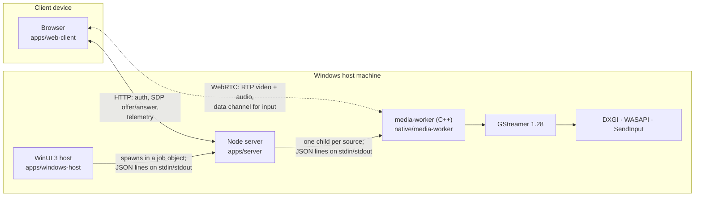
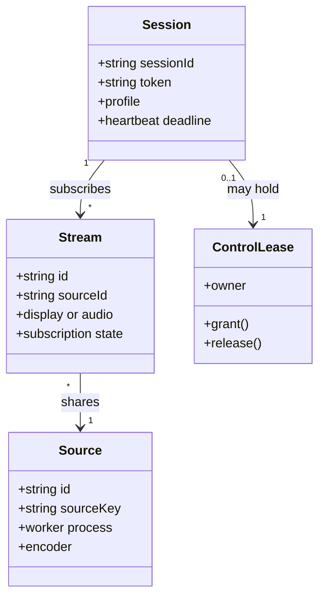
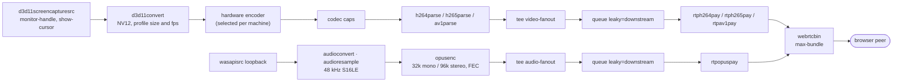
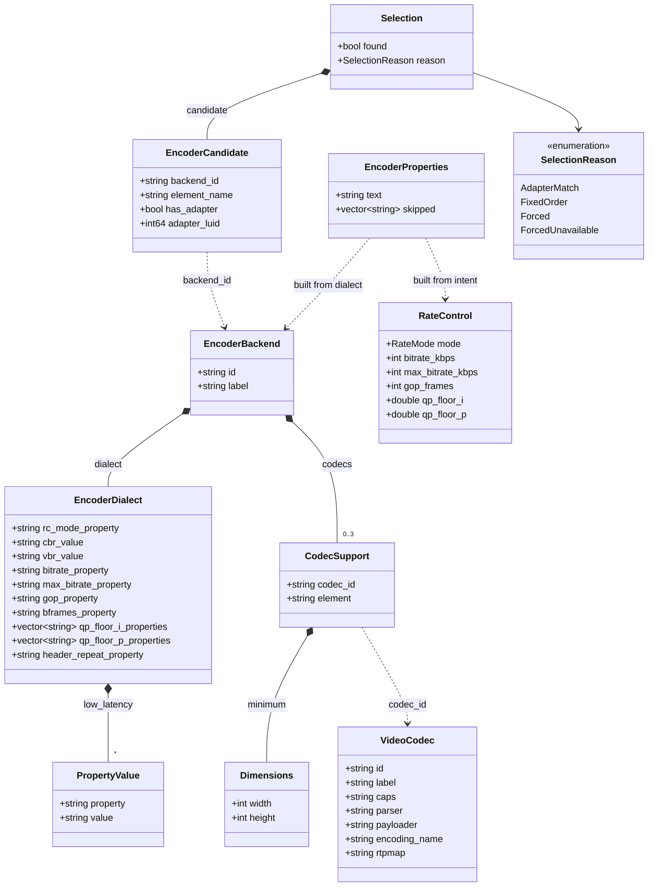
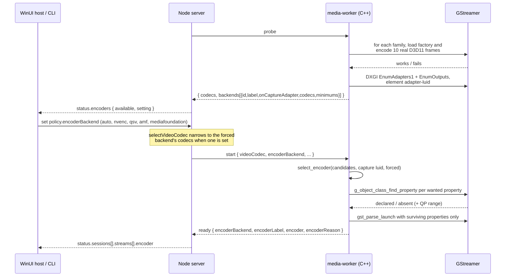

# Architecture

VidVNC streams a Windows desktop to a browser over WebRTC on the local network:
DXGI desktop duplication into a hardware video encoder, out as RTP, with keyboard and
mouse travelling back. This document describes how the running system is put together
and the conventions the repository follows.

See [distribution requirements](PACKAGING.md) for the six self-contained products:
server/host, native viewer, and CLI server, each on Windows and macOS. Build modules
are reusable inputs to those products, not one duplicated source tree per installer.

## System overview

Three processes, each in the language that suits its job. The split is deliberate:
Windows capture and GStreamer need C++, session and authentication logic is far easier
to write and test in JavaScript, and the desktop UI belongs in WinUI.



The browser talks to the Node server for everything except media, and to the worker for
media only. The server never carries pixels; the worker never authenticates anyone.

Signaling is plain HTTP request/response, not WebSocket. The browser POSTs an offer and
receives the answer in the same response, after ICE gathering completes. There is no
STUN or TURN server and no trickle ICE: this is a same-subnet product, so host-local
candidates are all there are. That is a deliberate scope limit, not an omission — a
relay for remote clients is future work.

## Process lifetime and ownership

The WinUI host owns the server, and the server owns its workers. Both links fail closed.

- The host creates a Win32 job object with `KILL_ON_JOB_CLOSE` and assigns the Node
  process to it, so the server cannot outlive the host even if the host is killed. The
  handle is non-inheritable and belongs only to the host ([ServerJob.cs](../apps/windows-host/ServerJob.cs)).
- The server does not open its port until the desktop owner approves. It reads one line
  from stdin and accepts only the exact bytes `{"type":"start"}`; anything else, an
  over-long line, or a closed stream aborts startup
  ([owner-start.mjs](../apps/server/src/owner-start.mjs)). A server launched by something
  other than its host therefore never begins listening.
- After startup the same stdio channel carries host commands in and `status` events out,
  which is what the host UI renders.
- The CLI server is the same Node application driven from a terminal instead of the
  WinUI host.

## Sessions, streams and sources

Three levels, and the distinction between the last two is the part worth understanding.



A **session** is one authenticated client. A **stream** is one client's subscription to
one display or to audio. A **source** is one running worker process producing one encode.

Streams share a source when their encode would be byte-identical. `sourceKey` is built
from exactly the fields that change captured or encoded bytes — display geometry,
resolution, frame rate, bitrate, bitrate mode, codec, and quality only when VBR makes it
matter — and from nothing else ([stream-registry.mjs](../apps/server/src/stream-registry.mjs)).
Profile names and ids are deliberately excluded, so two differently named but numerically
identical profiles encode once and fan out to both viewers rather than running two
encoders. Audio keys on its format alone.

Input is governed by a **control lease** held by at most one session. The lease is a
host-only coordinator: a client request never grants control to itself, and the grant is
serialized so overlapping requests cannot interleave
([control-lease.mjs](../apps/server/src/control-lease.mjs)).

## Control plane

All client traffic is HTTP under `/api`, plus the static client assets. Routes fall into
four groups:

| Group | Routes | Purpose |
| --- | --- | --- |
| Admission | `/api/connect`, `/api/connection-key`, `/api/approved-clients/*` | Authenticate and issue a session token |
| Negotiation | `/api/offer`, `/api/stream-offer`, `/api/audio-offer`, `/api/streams`, `/api/stream-select`, `/api/stream-stop` | Start, pick and tear down media |
| Liveness | `/api/heartbeat`, `/api/reconnect`, `/api/disconnect` | Keep, recover or end a session |
| Reporting | `/api/telemetry`, `/api/stream-telemetry`, `/api/audio-telemetry`, `/api/profiles`, `/api/info`, `/api/diagnostics` | Client-side metrics in, capability and diagnostics out |

Three connection modes are supported, set by the host
([access-settings.mjs](../apps/server/src/access-settings.mjs)):

- `session-key` — one shared key admits clients for the session.
- `one-time-keys` — each key is consumed by the client that redeems it.
- `approved-only` — only clients previously registered and approved by the host.

Stream policy — which profiles exist, which codecs are allowed, which encoder backend to
use — is host-owned, versioned by a revision number, and validated as a whole before it
is stored. Clients may choose among what the policy allows and, when the host enables it,
supply custom settings that are checked against approved bounds; they can never widen the
policy itself.

## Media pipeline

One capture and one encode per source, then a per-viewer branch off a tee. Adding a
second viewer to an identical plan costs a payloader and a `webrtcbin`, not another
encoder.



Frames stay in D3D11 memory from capture through encode; there is no download to system
memory. Both per-peer queues are `leaky=downstream`, so a viewer whose network stalls
drops its own frames instead of stalling the shared encoder — the failure stays local to
that viewer. Audio follows the session profile rather than being chosen separately: the
15 fps mobile profiles get the low-bandwidth mono mix.

Rate control is expressed as intent — mode, target and peak bitrate, GOP length, and
quality floors as *fractions* of the element's QP range — and only turned into concrete
property strings at pipeline build time. See the next section for why.

## Hardware encoder selection

Four encoder families are supported: NVENC, Intel Quick Sync, AMD AMF and Media
Foundation. Which one runs is decided per machine at stream start, not at build time.

### Model

`video-codec.hpp` and `encoder-backend.hpp` are two tables that are joined, not one
table with two concerns. A codec row is true of the bitstream on any chip; a backend
row is true of one vendor's elements. `encoder-selection.hpp` is pure and therefore
testable without a GPU, and `encoder-properties.hpp` is the only place that turns
intent into a property string.



`qp_floor_*_properties` are lists, not names, because AMF disagrees with itself:
`amfh264enc` declares a single `min-qp`, `amfh265enc` declares `min-qp-i`/`min-qp-p`,
and `amfav1enc` declares neither. The floors in `RateControl` are fractions of the
element's QP range rather than QP numbers, because the families do not share a scale
and the Quick Sync and AMF AV1 ranges are undocumented; the real range is read from
the element and the fraction scaled onto it.

### Selection rule

Affinity beats vendor preference. DXGI desktop duplication captures on whichever GPU
drives the monitor — on a hybrid laptop usually the integrated one — so an encoder on
that same adapter avoids copying every frame across adapters. The table order in
`encoder_backends()` only breaks ties.


A forced backend that is not installed does not refuse the stream. A configuration
file follows its machine, and the hardware it names may simply not be there;
`ForcedUnavailable` records that the automatic pick was used instead.

### Start-up flow



The probe's `codecs` keeps its original meaning — what this machine can encode with
any family — so older readers of that field are unaffected. `backends` is the new
detail. A worker built before backends existed reports no `backends` key and the
server defaults it to an empty list.

### Contract fields

| Message | Field | Meaning |
| --- | --- | --- |
| probe result | `backends[].id` | `nvenc`, `qsv`, `amf`, `mediafoundation` |
| probe result | `backends[].onCaptureAdapter` | Element sits on the GPU that captures |
| probe result | `backends[].minimums[codec]` | Smallest input the element accepts |
| `start` | `encoderBackend` | Host override, or absent for automatic |
| `ready` | `encoderBackend`, `encoderLabel` | What was actually chosen |
| `ready` | `encoder` | The GStreamer element name |
| `ready` | `encoderReason` | `capture-adapter`, `forced`, `forced-unavailable`, `fixed-order` |
| `status` | `encoders.available`, `encoders.setting` | Host-facing only; no client sees these |

There is no software encoder fallback. If no family delivers H.264 the worker fails
the probe by name, listing every element it tried.

## Input and control

Keyboard and mouse do **not** travel over HTTP. The browser opens a WebRTC data channel
to the worker and sends `move`, `key`, `button` and `wheel` messages on it, which the
worker turns into `SendInput` calls. Input therefore takes the same path as the video and
inherits its latency, rather than queueing behind the signaling server.

Because that channel bypasses the server, the worker enforces permission itself and
trusts nothing on the channel:

- Only the owner pipe — the server, over stdin — can change who may send input
  (`control-permission`). A client can ask to *use* control it has already been granted;
  it can never grant itself any ([peer-permission.hpp](../native/media-worker/src/peer-permission.hpp)).
- An unknown peer id means the server's view is stale, so the worker refuses it and
  clears the current owner rather than guessing.
- Coordinates are normalised 0..1 and rejected unless finite and in range; button and key
  codes are mapped through explicit allow-lists, never passed through
  ([input-policy.hpp](../native/media-worker/src/input-policy.hpp)).
- If the capture display changes underneath a session, the worker releases any held keys
  and buttons and fails the session rather than replaying input against different
  geometry.

Granting control to a second peer revokes it from the first; only one peer holds it.

## Resilience

Recovery is driven by what the browser reports, and is deliberately damped.

The client reports cumulative `pliCount` and `firCount`. The server treats an increase as
a request for a keyframe, but ignores the first sample and counter resets — neither means
loss — and rate-limits what it forwards ([recovery.mjs](../apps/server/src/recovery.mjs)).
The worker limits again at the source: join keyframes may coalesce over a short window,
while recovery keyframes keep a source-wide two-second floor
([keyframe-limiter.hpp](../native/media-worker/src/keyframe-limiter.hpp)). Both limits
exist because a keyframe is the most expensive frame there is, and sustained packet loss
across several viewers would otherwise produce an IDR storm that worsens the loss.

Sessions are kept by heartbeat and can be resumed through `/api/reconnect` while a
session is in a reconnecting state; ordinary API calls are rejected meanwhile so a
half-recovered client cannot act on stale state.

## Diagnostics

The server keeps a diagnostics snapshot per worker — selected encoder, stream state,
transport and client-reported metrics — exposed at `/api/diagnostics` and rendered by the
host UI and by `diagnostics.html`. Encoder facts land there at `ready` and then hold,
because the worker chooses its encoder once per stream and never switches mid-stream.

Which GPU is encoding is host-facing only. It appears in host status and diagnostics, and
no client ever sees it.

## Trust boundaries

Stated plainly, because the scope limit is a design decision rather than an oversight:

- **The control plane is plain HTTP** ([http-app.mjs](../apps/server/src/http-app.mjs)).
  There is no TLS, so admission keys and session tokens are readable by anything on the
  path. This is a same-subnet product; exposing the port to an untrusted network is not a
  supported configuration.
- **The media plane is encrypted regardless**, since WebRTC mandates DTLS-SRTP. Pixels
  and audio are not in the clear even though the signaling that set them up is.
- **Approved-client credentials are stored hashed**, with a per-client salt, scrypt, and
  constant-time comparison ([approved-clients.mjs](../apps/server/src/approved-clients.mjs)).
  Tokens and claim values are 32 random bytes.
- **The desktop owner is the root of trust.** The server does not listen until the local
  host approves, and the host outlives nothing it started.
- **The worker trusts only its owner pipe.** Everything arriving from a peer — SDP, data
  channel input, telemetry — is validated before use.

TLS, pairing and passkeys are future work; see [ROADMAP.md](ROADMAP.md).

## Repository layout and ownership

```text
apps/
  server/          Node signaling, authentication, worker lifecycle; src/ + tests/
  web-client/      Browser UI and receiver logic; src/ + tests/
  windows-host/    WinUI 3/.NET host, conventional XAML/MSBuild layout
  macos-host/      Planned native Apple server host (ownership guide only)
  windows-client/ Planned WinUI 3 viewer (ownership guide only)
  macos-client/   Planned native Apple viewer (ownership guide only)
native/
  media-worker/   C++ capture/encode/input; src/ + tests/ + CMakeLists.txt
tests/system/     Cross-application lifecycle and real media smoke checks
tools/            Root orchestration and formatting; tools/tests/ owns its tests
  debug/          Cross-process debug target definitions and implementation contract
packaging/        Six-product catalog; shared and OS-specific packaging ownership
docs/             Architecture, mockups, research history
out/              Ignored CMake outputs and preserved legacy artifacts
.deps/            Ignored local SDKs/tools/download cache
```

Tests follow **ownership**, not one mandatory naming convention. JS unit/module
integration tests are inside their app's `tests/`; C++ tests are inside their native
module. App-specific browser tests also belong to that app. Root `tests/system`
is only for checks that exercise the assembled product. A root runner aggregates
tests without taking ownership away from modules.

## Dependency boundaries

- The Node server depends on the web client's exported assets and password helper,
  and the native worker's small exported JS runtime-path adapter.
- Native C++ does not depend on Node. CMake owns its targets, SDK linkage and CTest
  registration. Its private npm manifest only exposes launch configuration and
  its existing Node-driven hardware tests; npm does not compile C++ itself.
- Browser production code does not import the server. Its dev-only server dependency
  supplies a local HTTP fixture for UI smoke tests.
- WinUI owns its MSBuild/XAML project and launches Node through the existing process
  protocol. It does not depend on npm to compile its UI.
- Future Apple apps should use Swift/SwiftUI/AppKit and native Xcode/SPM targets,
  with their own tests. Future Windows viewers should use WinUI 3. The explicitly
  requested ownership scaffolds are not runnable projects; do not invent a shared
  native abstraction before it has users.
- Extract genuinely shared protocol/validation code into a package when needed;
  do not duplicate it or introduce a generic `shared` dumping ground now.
- Encoder knowledge is split deliberately and must stay split. `video-codec.hpp` holds
  bitstream facts that are true of a codec anywhere (caps, parser, payloader, rtpmap);
  `encoder-backend.hpp` holds one row per hardware family, because the four families do
  not agree on property names and AMF does not agree with itself across its own codecs.
  Encoder property strings are built by asking the GStreamer element class what it
  declares, never by concatenating literals: a name an element lacks fails
  `gst_parse_launch` and loses the whole vendor, whereas a skipped property is logged and
  survives. The server learns backends from the probe as data and never names an element.
  Minimum input size belongs to the element, not the codec.

The cross-process JSON/stdin/stdout and WebRTC contracts remain unchanged in this
migration. Stream profiles, H.264/Opus settings, input and session ownership remain
unchanged. Modules resolve resources relative to their own location, not launch CWD.

## Build, dependencies, and tests

One root npm workspace lockfile pins JS dependencies. Use `npm ci` from the root;
no separate nested npm lockfiles. CMake presets coordinate native configurations;
MSBuild remains authoritative for WinUI. Keep generated files out of source control.
GStreamer development headers and runtime DLLs must come from the same SDK install.
Using a custom CMake SDK path requires the matching runtime `GSTREAMER_ROOT` too.

`npm test` is portable and uses stubbed hardware. `npm run test:hardware` explicitly
requires Windows 25H2+, a GPU with a supported hardware encoder (NVIDIA, Intel or AMD)
and an interactive desktop. CTest registers the native unit suites; assert-based checks
remain enabled in Release.
The GitHub Actions workflow `Portable checks` runs formatting and portable tests on
Windows, macOS and Linux. It runs only when started manually from the Actions tab, not
on pushes or pull requests. It does not claim native capture support on those other
OSes or replace device acceptance tests.

Existing opt-in browser checks require an installed Playwright module path:

```powershell
node apps/web-client/tests/toolbar-browser-check.mjs C:\path\to\playwright
node tests/system/browser-media-check.mjs C:\path\to\playwright iphone-720p-test
```

The second captures the real desktop and requires Windows and a hardware encoder.
Chromium with an
iPhone user-agent tests routing, not Safari or iPhone hardware decoding.

## Platform target

Windows SDK 26100 is the compilation target; runtime preflight enforces Windows build
26200 (25H2).
