# Architecture

VidVNC streams a Windows desktop to a browser over WebRTC on the local network:
DXGI desktop duplication into a hardware video encoder, out as RTP, with keyboard and
mouse travelling back. This document describes how the running system is put together
and the conventions the repository follows.

See [distribution requirements](PACKAGING.md) for the six self-contained products:
server/host, native viewer, and CLI server, each on Windows and macOS. Build modules
are reusable inputs to those products, not one duplicated source tree per installer.

## System overview

Four kinds of process, each in the language that suits its job. The split is deliberate:
Windows capture and GStreamer need C++, session and authentication logic is far easier
to write and test in JavaScript, and the desktop UI belongs in WinUI.

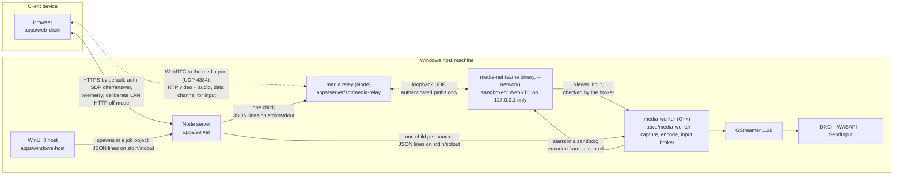
```mermaid
flowchart LR
    subgraph client["Client device"]
        browser["Browser<br/>apps/web-client"]
    end

    subgraph machine["Windows host machine"]
        host["WinUI 3 host<br/>apps/windows-host"]
        server["Node server<br/>apps/server"]
        relay["media relay (Node)<br/>apps/server/src/media-relay"]
        worker["media-worker (C++)<br/>native/media-worker<br/>capture, encode, input broker"]
        net["media-net (same binary, --network)<br/>sandboxed: WebRTC on 127.0.0.1 only"]
        gst["GStreamer 1.28"]
        win["DXGI · WASAPI · SendInput"]
    end

    browser <-->|"HTTPS by default: auth, SDP offer/answer,<br/>telemetry; deliberate LAN HTTP off mode"| server
    browser <-.->|"WebRTC to the media port (UDP 4384):<br/>RTP video + audio, data channel for input"| relay
    relay <-.->|"loopback UDP,<br/>authenticated paths only"| net
    worker -->|"starts in a sandbox;<br/>encoded frames, control"| net
    net -->|"viewer input,<br/>checked by the broker"| worker
    host -->|"spawns in a job object;<br/>JSON lines on stdin/stdout"| server
    server -->|"one child;<br/>JSON lines on stdin/stdout"| relay
    server -->|"one child per source;<br/>JSON lines on stdin/stdout"| worker
    worker --> gst --> win
```

The browser talks to the Node server for everything except media, and to the source's
sandboxed network process for media only, through the media relay. The server never carries
pixels; the worker never authenticates anyone and never talks to the network; the relay
forwards only senders that proved a stream's ICE password (see [Media relay](#media-relay));
and the network process can neither capture the screen nor inject input (see
[Network process](#network-process-media-net)).

Signaling is HTTP request/response over HTTPS by default, not WebSocket. The browser POSTs an offer and
receives the answer in the same response, after ICE gathering completes. There is no
STUN or TURN server and no trickle ICE. The server removes every candidate from the offer,
and the answer names one address per family on the media port: the address the client
reached over HTTPS, or for an internet client the router's public address
([sdp-candidates.mjs](../apps/server/src/sdp-candidates.mjs),
[relay-addresses.mjs](../apps/server/src/relay-addresses.mjs)). A third-party relay or
rendezvous hub is not used.

## Process lifetime and ownership

The WinUI host owns the server, and the server owns its workers and the media relay. Every
link fails closed.

- The host creates a Win32 job object with `KILL_ON_JOB_CLOSE` and assigns the Node
  process to it, so the server cannot outlive the host even if the host is killed. The
  handle is non-inheritable and belongs only to the host ([ServerJob.cs](../apps/windows-host/ServerJob.cs)).
- The server does not open its port until the desktop owner approves. It reads one line
  from stdin and accepts only one of three exact approval lines: `{"type":"start"}`, or the
  same with `"sharing":"local"` or `"sharing":"remote"` added. Anything else, a line over
  64 bytes, or a closed stream aborts startup
  ([owner-start.mjs](../apps/server/src/owner-start.mjs)). A server launched by something
  other than its host therefore never begins listening.
- After startup the same stdio channel carries host commands in and `status` events out,
  which is what the host UI renders.
- The CLI server is the same Node application driven from a terminal instead of the
  WinUI host.

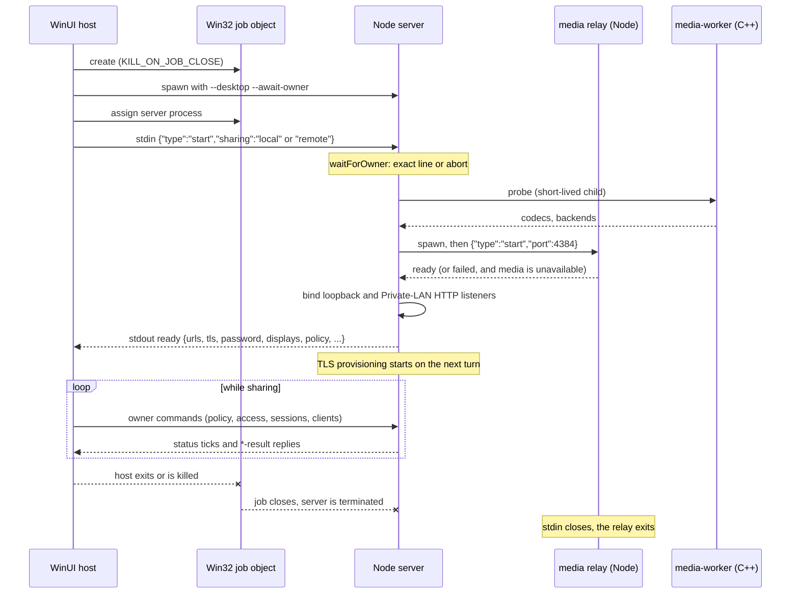
```mermaid
sequenceDiagram
    participant Host as WinUI host
    participant Job as Win32 job object
    participant Server as Node server
    participant Relay as media relay (Node)
    participant Worker as media-worker (C++)

    Host->>Job: create (KILL_ON_JOB_CLOSE)
    Host->>Server: spawn with --desktop --await-owner
    Host->>Job: assign server process
    Host->>Server: stdin {"type":"start","sharing":"local" or "remote"}
    Note over Server: waitForOwner: exact line or abort
    Server->>Worker: probe (short-lived child)
    Worker-->>Server: codecs, backends
    Server->>Relay: spawn, then {"type":"start","port":4384}
    Relay-->>Server: ready (or failed, and media is unavailable)
    Server->>Server: bind loopback and Private-LAN HTTP listeners
    Server-->>Host: stdout ready {urls, tls, password, displays, policy, ...}
    Note over Server: TLS provisioning starts on the next turn
    loop while sharing
        Host->>Server: owner commands (policy, access, sessions, clients)
        Server-->>Host: status ticks and *-result replies
    end
    Host--xJob: host exits or is killed
    Job--xServer: job closes, server is terminated
    Note over Relay: stdin closes, the relay exits
```

## Sessions, streams and sources

Three levels, and the distinction between the last two is the part worth understanding.

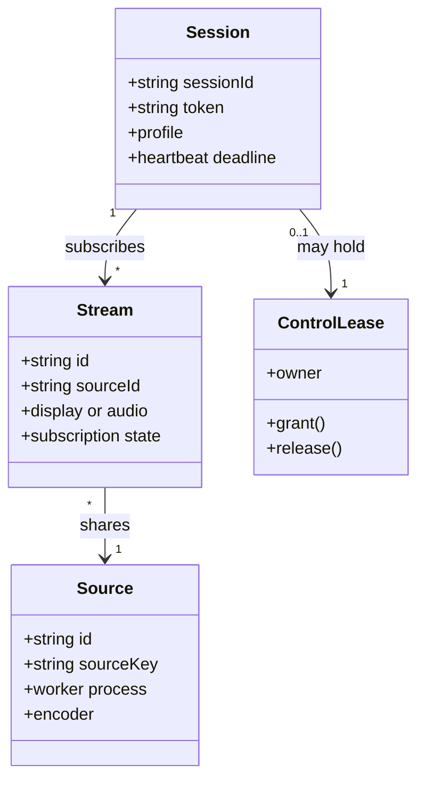
```mermaid
classDiagram
    class Session {
        +string sessionId
        +string token
        +profile
        +heartbeat deadline
    }
    class Stream {
        +string id
        +string sourceId
        +display or audio
        +subscription state
    }
    class Source {
        +string id
        +string sourceKey
        +worker process
        +encoder
    }
    class ControlLease {
        +owner
        +grant()
        +release()
    }
    Session "1" --> "*" Stream : subscribes
    Stream "*" --> "1" Source : shares
    Session "0..1" --> "1" ControlLease : may hold
```

A **session** is one authenticated client. A **stream** is one client's subscription to
one display or to audio. A **source** is one running worker process producing one encode.

Streams share a source when their encode would be byte-identical. `sourceKey` is built
from exactly the fields that change captured or encoded bytes — display geometry,
resolution, frame rate, bitrate, bitrate mode, codec, and quality only when VBR makes it
matter — and from nothing else ([stream-registry.mjs](../apps/server/src/stream-registry.mjs)).
Profile names and ids are deliberately excluded, so two differently named but numerically
identical profiles encode once and fan out to both viewers rather than running two
encoders. Audio keys on its format alone.

A subscription and its source each move through a small, one-way state machine
([stream-registry.mjs](../apps/server/src/stream-registry.mjs)). A new subscription
either joins a live source with the same `sourceKey` or creates one; the source stops
when its last subscription closes.

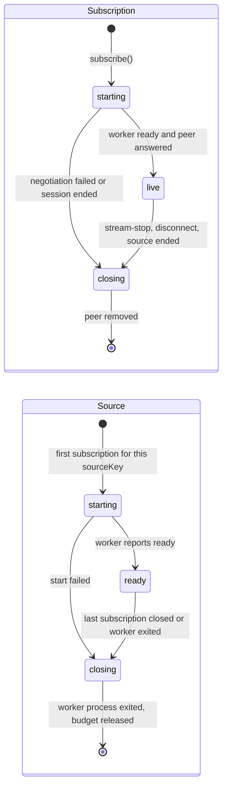
```mermaid
stateDiagram-v2
    direction LR
    state "Subscription" as sub {
        [*] --> s_starting : subscribe()
        s_starting --> s_live : worker ready and peer answered
        s_starting --> s_closing : negotiation failed or session ended
        s_live --> s_closing : stream-stop, disconnect, source ended
        s_closing --> [*] : peer removed
        s_starting : starting
        s_live : live
        s_closing : closing
    }
    state "Source" as src {
        [*] --> w_starting : first subscription for this sourceKey
        w_starting --> w_ready : worker reports ready
        w_starting --> w_closing : start failed
        w_ready --> w_closing : last subscription closed or worker exited
        w_closing --> [*] : worker process exited, budget released
        w_starting : starting
        w_ready : ready
        w_closing : closing
    }
```

Input is governed by a **control lease** held by at most one session. The lease is a
host-only coordinator: a client request never grants control to itself, and the grant is
serialized so overlapping requests cannot interleave
([control-lease.mjs](../apps/server/src/control-lease.mjs)).

## Control plane

All client traffic is HTTP under `/api`, plus the static client assets. Routes fall into
four groups:

| Group       | Routes                                                                                                                                                          | Purpose                                                                                 |
| ----------- | --------------------------------------------------------------------------------------------------------------------------------------------------------------- | --------------------------------------------------------------------------------------- |
| Admission   | `/api/key-start`, `/api/approved-clients/*`                                                                                                                     | Meter key attempts or authenticate an approved browser/client and issue a session token |
| Negotiation | `/api/offer`, `/api/stream-offer`, `/api/audio-offer`, `/api/streams`, `/api/stream-select`, `/api/stream-stop`, `/api/control-request`, `/api/control-release` | Start, pick and tear down media                                                         |
| Liveness    | `/api/heartbeat`, `/api/reconnect`, `/api/disconnect`                                                                                                           | Keep, recover or end a session                                                          |
| Reporting   | `/api/telemetry`, `/api/stream-telemetry`, `/api/audio-telemetry`, `/api/profiles`, `/api/info`                                                                 | Client-side metrics and public-safe status on the normal listener                       |

A viewer's path from sign-in to video, with a second viewer on an identical plan
joining the same source instead of starting a new worker
([stream-runtime.mjs](../apps/server/src/stream-runtime.mjs)):

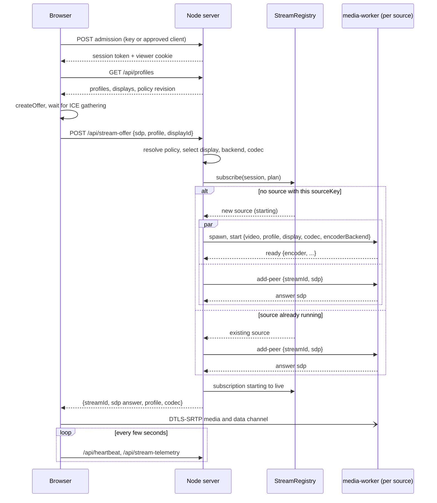
```mermaid
sequenceDiagram
    participant Browser
    participant Server as Node server
    participant Registry as StreamRegistry
    participant Worker as media-worker (per source)

    Browser->>Server: POST admission (key or approved client)
    Server-->>Browser: session token + viewer cookie
    Browser->>Server: GET /api/profiles
    Server-->>Browser: profiles, displays, policy revision
    Browser->>Browser: createOffer, wait for ICE gathering
    Browser->>Server: POST /api/stream-offer {sdp, profile, displayId}
    Server->>Server: resolve policy, select display, backend, codec
    Server->>Registry: subscribe(session, plan)
    alt no source with this sourceKey
        Registry-->>Server: new source (starting)
        par
            Server->>Worker: spawn, start {video, profile, display, codec, encoderBackend}
            Worker-->>Server: ready {encoder, ...}
        and
            Server->>Worker: add-peer {streamId, sdp}
            Worker-->>Server: answer sdp
        end
    else source already running
        Registry-->>Server: existing source
        Server->>Worker: add-peer {streamId, sdp}
        Worker-->>Server: answer sdp
    end
    Server->>Registry: subscription starting to live
    Server-->>Browser: {streamId, sdp answer, profile, codec}
    Browser-)Worker: DTLS-SRTP media and data channel
    loop every few seconds
        Browser->>Server: /api/heartbeat, /api/stream-telemetry
    end
```

Three connection modes are supported, set by the host
([access-settings.mjs](../apps/server/src/access-settings.mjs)):

- `session-key` — one shared key admits clients for the session.
- `one-time-keys` — each key is consumed by the client that redeems it.
- `approved-only` — only clients previously registered and approved by the host.

Stream policy — which profiles exist, which codecs are allowed, which encoder backend to
use — is host-owned, versioned by a revision number, and validated as a whole before it
is stored. Clients may choose among what the policy allows and, when the host enables it,
supply custom settings that are checked against approved bounds; they can never widen the
policy itself.

## Media pipeline

One capture and one encode per source, then a per-viewer branch off a tee. Adding a
second viewer to an identical plan costs a payloader and a `webrtcbin`, not another
encoder. The pipeline is split between two processes at the encoded bitstream: the worker
captures and encodes, and its network process, media-net, carries the frames to viewers.


```mermaid
flowchart LR
    subgraph W["media-worker (desktop user, medium integrity)"]
        cap["d3d11screencapturesrc<br/>monitor-handle, show-cursor"] --> conv["d3d11convert<br/>NV12, profile size and fps"]
        conv --> enc["hardware encoder<br/>(selected per machine)"]
        enc --> caps["codec caps"] --> parse["h264parse / h265parse / av1parse"]
        parse --> vsink["appsink video-sink"]
        wasapi["wasapisrc loopback"] --> ares["audioconvert · audioresample<br/>48 kHz S16LE"] --> opus["opusenc<br/>32k mono / 96k stereo, FEC"] --> asink["appsink audio-sink"]
    end
    subgraph N["media-net (sandboxed)"]
        vsrc["appsrc video-source"] --> vtee["tee video-fanout"]
        asrc["appsrc audio-source"] --> atee["tee audio-fanout"]
        vtee --> vq["queue leaky=downstream"] --> vpay["rtph264pay / rtph265pay / rtpav1pay"] --> wrtc["webrtcbin<br/>max-bundle, 127.0.0.1"]
        atee --> aq["queue leaky=downstream"] --> apay["rtpopuspay"] --> wrtc
    end
    vsink -->|"frames pipe"| vsrc
    asink -->|"frames pipe"| asrc
    wrtc --> peer(["browser peer, through the relay"])
```

Frames stay in D3D11 memory from capture through encode; there is no download to system
memory, and raw frames never leave the worker: only the encoded bitstream crosses to
media-net. Both per-peer queues are `leaky=downstream`, so a viewer whose network stalls
drops its own frames instead of stalling the shared encoder — the failure stays local to
that viewer. Audio follows the session profile rather than being chosen separately: the
15 fps mobile profiles get the low-bandwidth mono mix.

Rate control is expressed as intent — mode, target and peak bitrate, GOP length, and
quality floors as _fractions_ of the element's QP range — and only turned into concrete
property strings at pipeline build time. See the next section for why.

### Network process (media-net)

Each source's WebRTC runs in a second process: the same `media-worker.exe`, started by the
worker with `--network` ([media-net.cpp](../native/media-worker/src/media-net.cpp)). It is
Part B of the [R4 design](superpowers/specs/2026-09-26-r4-media-relay-and-privilege-split-design.md),
so that a flaw in the WebRTC stack (libnice, OpenSSL's DTLS, libsrtp, usrsctp) exploited by a
viewer lands in a process that cannot capture the screen, inject input, read the user's
files or reach the network beyond loopback.

The worker starts it under the tier T1 sandbox ([sandbox.hpp](../native/media-worker/src/sandbox.hpp),
proved by gate P3):

- a restricted primary token (the user and most groups deny-only; restricting SIDs Everyone,
  Users, RESTRICTED and the logon SID; no privileges but change-notify) at low integrity;
- a job: one process, no children, killed with the worker, a 2 GiB commit cap and every UI
  limit;
- its own desktop, labelled low, so it sees and messages no window of the user's;
- an explicit inherited-handle list (its four pipe ends and nothing else), no console, and
  the mitigations strict handle checks, extension points off, no remote or low-label images,
  and System32 first.

It starts impersonating a same-access token, starts Winsock and loads every plugin and
library it needs, then calls `RevertToSelf` before it opens a socket or reads anything from a
viewer; it then turns on Arbitrary Code Guard (gate P4). Win32k lockdown is not used: it can
only be set at creation, and GLib needs `user32`.

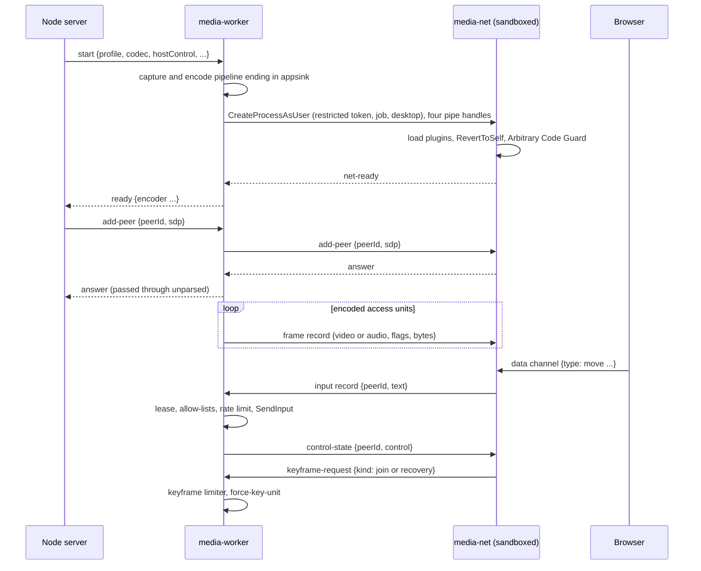
```mermaid
sequenceDiagram
    participant S as Node server
    participant W as media-worker
    participant N as media-net (sandboxed)
    participant B as Browser

    S->>W: start {profile, codec, hostControl, ...}
    W->>W: capture and encode pipeline ending in appsink
    W->>N: CreateProcessAsUser (restricted token, job, desktop), four pipe handles
    N->>N: load plugins, RevertToSelf, Arbitrary Code Guard
    N-->>W: net-ready
    W-->>S: ready {encoder ...}
    S->>W: add-peer {peerId, sdp}
    W->>N: add-peer {peerId, sdp}
    N-->>W: answer
    W-->>S: answer (passed through unparsed)
    loop encoded access units
        W->>N: frame record {video or audio, flags, bytes}
    end
    B->>N: data channel {type: move ...}
    N->>W: input record {peerId, text}
    W->>W: lease, allow-lists, rate limit, SendInput
    W->>N: control-state {peerId, control}
    N->>W: keyframe-request {kind: join or recovery}
    W->>W: keyframe limiter, force-key-unit
```

**Pipes.** Four anonymous pipes ([net-pipes.hpp](../native/media-worker/src/net-pipes.hpp)):
control in each direction (JSON lines: `configure`, `add-peer`, `remove-peer`,
`control-state` one way; `net-ready`, `answer`, `peer-failed`, `peer-closed`,
`channel-closed`, `keyframe-request`, `peer-metrics`, `log`, `fatal` the other), frames
(worker to media-net: a 32-byte header and the payload, with a caps record whenever caps
change) and input (media-net to worker: peer id and data-channel text, at most 64 and 1,024
bytes). The record formats are in [net-records.hpp](../native/media-worker/src/net-records.hpp).
Anonymous pipes have no name, so nothing else can open them. All pipe I/O runs on dedicated
threads; the worker's main loop only queues, so a stalled media-net can delay video but never
the owner pipe, input release or shutdown. The frame queue holds at most 32 MiB; on overflow
it is emptied, video skips to the next keyframe and one is requested.

**Trust.** The worker treats everything from media-net as untrusted: known peer ids only,
bounded sizes, expected message types; anything malformed ends the source. Input goes
through the same broker as before the split — the owner's lease, the peer's control flag,
the allow-lists and the rate limit — so a compromised media-net can act as the viewer that
currently holds control, but cannot grant control or inject input when nobody holds it. A
source whose `start` does not carry `hostControl` is refused. Viewers that arrive before
media-net is ready wait in the worker, in order. media-net writes no files: its log lines go
to the worker, which writes them to `native-worker.log` with a `NET` prefix. Capture starts
only when the first viewer is answered.

### Media relay

Every viewer's media, LAN and internet alike, reaches the workers through one process: the
media relay ([media-relay/](../apps/server/src/media-relay/), supervised by
[media-relay.mjs](../apps/server/src/media-relay.mjs)). It owns the one public media port
(`mediaPort`, UDP, default 4384, bound on `::` dual-stack or `0.0.0.0`). Workers gather on
`127.0.0.1` only (`VIDVNC_ICE_BIND=loopback`: the worker adds 127.0.0.1 to each peer's ICE
agent with `add-local-ip-address` and turns ICE-TCP off). The relay is JavaScript, so the
code that handles unauthenticated datagrams is memory-safe; it runs in its own process so
media forwarding never shares an event loop with TLS and signaling. Its design, including
the second phase (a sandboxed network process), is in the
[R4 design](superpowers/specs/2026-09-26-r4-media-relay-and-privilege-split-design.md).

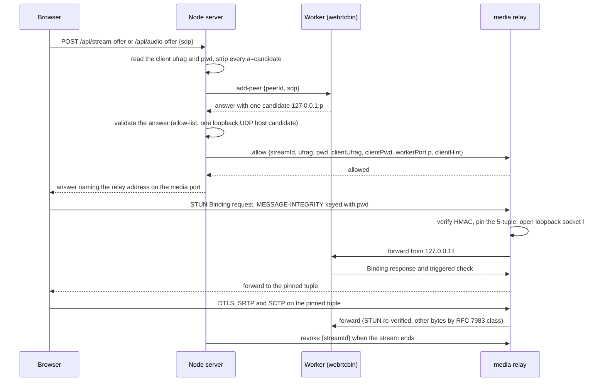
```mermaid
sequenceDiagram
    participant B as Browser
    participant S as Node server
    participant W as Worker (webrtcbin)
    participant R as media relay

    B->>S: POST /api/stream-offer or /api/audio-offer {sdp}
    S->>S: read the client ufrag and pwd, strip every a=candidate
    S->>W: add-peer {peerId, sdp}
    W-->>S: answer with one candidate 127.0.0.1:p
    S->>S: validate the answer (allow-list, one loopback UDP host candidate)
    S->>R: allow {streamId, ufrag, pwd, clientUfrag, clientPwd, workerPort p, clientHint}
    R-->>S: allowed
    S-->>B: answer naming the relay address on the media port
    B->>R: STUN Binding request, MESSAGE-INTEGRITY keyed with pwd
    R->>R: verify HMAC, pin the 5-tuple, open loopback socket l
    R->>W: forward from 127.0.0.1:l
    W-->>R: Binding response and triggered check
    R-->>B: forward to the pinned tuple
    B->>R: DTLS, SRTP and SCTP on the pinned tuple
    R->>W: forward (STUN re-verified, other bytes by RFC 7983 class)
    S->>R: revoke {streamId} when the stream ends
```

- **Offer.** The server keeps the client's ICE credentials and removes every candidate, so
  the worker sends connectivity checks to nobody and learns the client only as a
  peer-reflexive candidate from checks the relay has authenticated
  ([stream-runtime.mjs](../apps/server/src/stream-runtime.mjs)).
- **Answer.** At most 64 KiB, only allow-listed SDP lines, and exactly one candidate: UDP,
  component 1, `127.0.0.1`, `typ host`
  ([sdp-candidates.mjs](../apps/server/src/sdp-candidates.mjs) `validateRelayAnswer`).
  Anything else fails the peer. The server registers the stream and waits for `allowed`
  before it answers, so the client's first check is never dropped. The candidate is then
  replaced by the relay's addresses for this client
  ([relay-addresses.mjs](../apps/server/src/relay-addresses.mjs)): the address it reached
  over HTTPS (an IPv6 link-local one becomes its interface's other addresses, because SDP
  cannot carry a zone), or for an internet client the public IPv4 addresses of the public
  names and this PC's global IPv6 addresses.
- **Unauthenticated datagrams** are budgeted before parsing, in two lanes: 200 per second
  per stream for the address the client signed in from (IPv6 by /64), 50 per second per
  other source and 5,000 per second in total. Then only a well-formed STUN Binding request
  whose `USERNAME` names a registered stream and whose MESSAGE-INTEGRITY verifies with that
  stream's password is accepted ([stun.mjs](../apps/server/src/media-relay/stun.mjs),
  [relay.mjs](../apps/server/src/media-relay/relay.mjs)). The relay never replies to an
  unauthenticated sender. The HTTPS address is a hint, never a gate: iCloud Private Relay
  and carrier-grade NAT legitimately send media from another address, which is counted and
  shown in Sessions.
- **Authenticated paths.** A pinned 5-tuple gets its own loopback socket towards the
  worker. STUN on it must verify in either direction (requests with the stream's password,
  responses with the client's); DTLS (first byte 20–63) and RTP/RTCP (128–191) pass
  unchanged; anything else is dropped, as is a valid request for another stream. A path ends
  after 30 seconds without traffic.

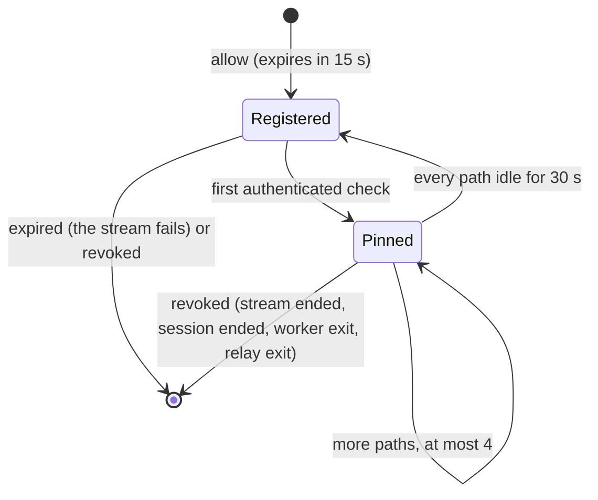
```mermaid
stateDiagram-v2
    [*] --> Registered: allow (expires in 15 s)
    Registered --> Pinned: first authenticated check
    Registered --> [*]: expired (the stream fails) or revoked
    Pinned --> Pinned: more paths, at most 4
    Pinned --> Registered: every path idle for 30 s
    Pinned --> [*]: revoked (stream ended, session ended, worker exit, relay exit)
```

**Protocol.** JSON lines over the relay's stdin and stdout. The server sends `start`,
`allow`, `revoke` and `stop`; the relay answers `ready` or `failed`, `allowed` or `refused`
(a limit or a duplicate), and reports `pinned`, `unpinned`, `expired`, `address-differs`
and `metrics` (every 2 seconds). An invalid command ends the relay, and so does the end of
its input, so it never outlives the server. Limits: 64 registrations, 4 sharing one ufrag,
4 paths each.

**Supervision.** The server starts the relay before it reports `ready`. If the port cannot
be bound, sign-in still works, offers are refused with the reason (for example "UDP 4384 is
in use"), and the host shows it. If the relay exits, every stream stops and the relay is
restarted, at most three times a minute. Changing `mediaPort` restarts it and stops live
streams. Sessions show each stream's authenticated media address; `media-relay` in the
CLI shows the counters, and the server log records paths and a once-a-minute summary of
unauthenticated drops, never packet contents or credentials.

## Hardware encoder selection

Four encoder families are supported: NVENC, Intel Quick Sync, AMD AMF and Media
Foundation. Which one runs is decided per machine at stream start, not at build time.

### Model

`video-codec.hpp` and `encoder-backend.hpp` are two tables that are joined, not one
table with two concerns. A codec row is true of the bitstream on any chip; a backend
row is true of one vendor's elements. `encoder-selection.hpp` is pure and therefore
testable without a GPU, and `encoder-properties.hpp` is the only place that turns
intent into a property string.

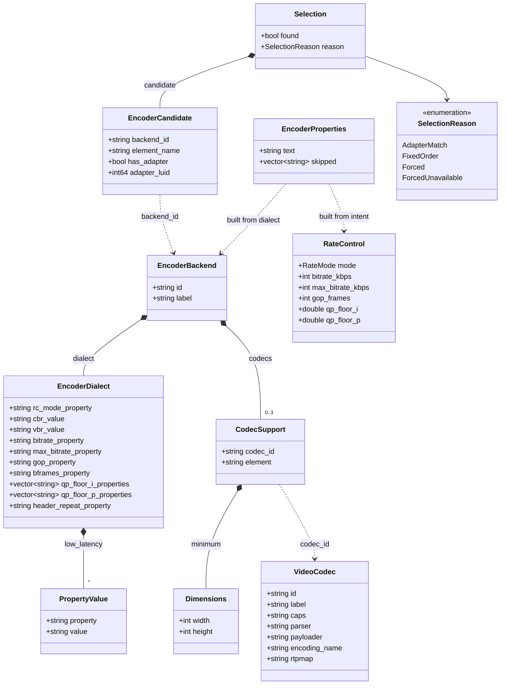
```mermaid
classDiagram
    class VideoCodec {
        +string id
        +string label
        +string caps
        +string parser
        +string payloader
        +string encoding_name
        +string rtpmap
    }
    class EncoderBackend {
        +string id
        +string label
    }
    class EncoderDialect {
        +string rc_mode_property
        +string cbr_value
        +string vbr_value
        +string bitrate_property
        +string max_bitrate_property
        +string gop_property
        +string bframes_property
        +vector~string~ qp_floor_i_properties
        +vector~string~ qp_floor_p_properties
        +string header_repeat_property
    }
    class CodecSupport {
        +string codec_id
        +string element
    }
    class Dimensions {
        +int width
        +int height
    }
    class PropertyValue {
        +string property
        +string value
    }
    class RateControl {
        +RateMode mode
        +int bitrate_kbps
        +int max_bitrate_kbps
        +int gop_frames
        +double qp_floor_i
        +double qp_floor_p
    }
    class EncoderProperties {
        +string text
        +vector~string~ skipped
    }
    class EncoderCandidate {
        +string backend_id
        +string element_name
        +bool has_adapter
        +int64 adapter_luid
    }
    class Selection {
        +bool found
        +SelectionReason reason
    }
    class SelectionReason {
        <<enumeration>>
        AdapterMatch
        FixedOrder
        Forced
        ForcedUnavailable
    }

    EncoderBackend *-- EncoderDialect : dialect
    EncoderBackend *-- "0..3" CodecSupport : codecs
    CodecSupport *-- Dimensions : minimum
    EncoderDialect *-- "*" PropertyValue : low_latency
    Selection *-- EncoderCandidate : candidate
    Selection --> SelectionReason
    EncoderCandidate ..> EncoderBackend : backend_id
    CodecSupport ..> VideoCodec : codec_id
    EncoderProperties ..> EncoderBackend : built from dialect
    EncoderProperties ..> RateControl : built from intent
```

`qp_floor_*_properties` are lists, not names, because AMF disagrees with itself:
`amfh264enc` declares a single `min-qp`, `amfh265enc` declares `min-qp-i`/`min-qp-p`,
and `amfav1enc` declares neither. The floors in `RateControl` are fractions of the
element's QP range rather than QP numbers, because the families do not share a scale
and the Quick Sync and AMF AV1 ranges are undocumented; the real range is read from
the element and the fraction scaled onto it.

### Selection rule

Affinity beats vendor preference. DXGI desktop duplication captures on whichever GPU
drives the monitor — on a hybrid laptop usually the integrated one — so an encoder on
that same adapter avoids copying every frame across adapters. The table order in
`encoder_backends()` only breaks ties.

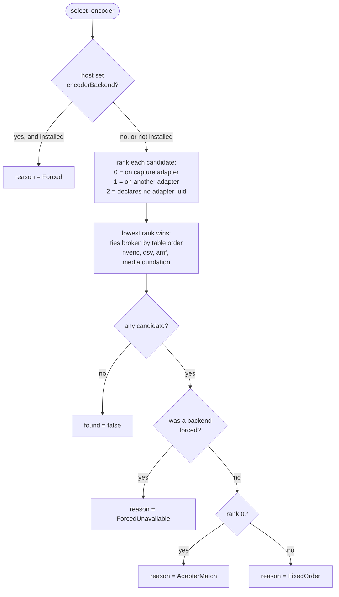
```mermaid
flowchart TD
    begin([select_encoder]) --> forced{"host set<br/>encoderBackend?"}
    forced -->|yes, and installed| useForced["reason = Forced"]
    forced -->|no, or not installed| rank["rank each candidate:<br/>0 = on capture adapter<br/>1 = on another adapter<br/>2 = declares no adapter-luid"]
    rank --> best["lowest rank wins;<br/>ties broken by table order<br/>nvenc, qsv, amf, mediafoundation"]
    best --> any{"any candidate?"}
    any -->|no| none["found = false"]
    any -->|yes| wasForced{"was a backend<br/>forced?"}
    wasForced -->|yes| unavailable["reason = ForcedUnavailable"]
    wasForced -->|no| matched{"rank 0?"}
    matched -->|yes| adapter["reason = AdapterMatch"]
    matched -->|no| order["reason = FixedOrder"]
```

A forced backend that is not installed does not refuse the stream. A configuration
file follows its machine, and the hardware it names may simply not be there;
`ForcedUnavailable` records that the automatic pick was used instead.

### Start-up flow

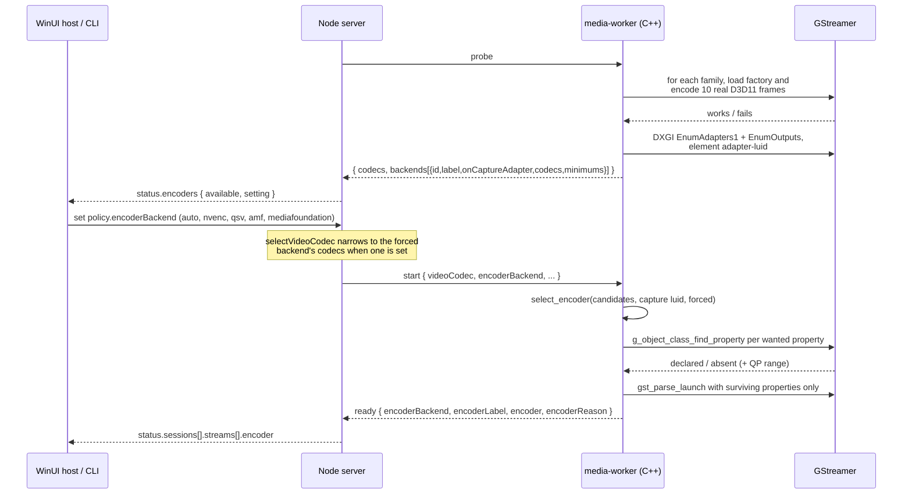
```mermaid
sequenceDiagram
    participant Host as WinUI host / CLI
    participant Server as Node server
    participant Worker as media-worker (C++)
    participant GStreamer

    Server->>Worker: probe
    Worker->>GStreamer: for each family, load factory and<br/>encode 10 real D3D11 frames
    GStreamer-->>Worker: works / fails
    Worker->>GStreamer: DXGI EnumAdapters1 + EnumOutputs,<br/>element adapter-luid
    Worker-->>Server: { codecs, backends[{id,label,onCaptureAdapter,codecs,minimums}] }
    Server-->>Host: status.encoders { available, setting }

    Host->>Server: set policy.encoderBackend (auto, nvenc, qsv, amf, mediafoundation)
    Note over Server: selectVideoCodec narrows to the forced<br/>backend's codecs when one is set

    Server->>Worker: start { videoCodec, encoderBackend, ... }
    Worker->>Worker: select_encoder(candidates, capture luid, forced)
    Worker->>GStreamer: g_object_class_find_property per wanted property
    GStreamer-->>Worker: declared / absent (+ QP range)
    Worker->>GStreamer: gst_parse_launch with surviving properties only
    Worker-->>Server: ready { encoderBackend, encoderLabel, encoder, encoderReason }
    Server-->>Host: status.sessions[].streams[].encoder
```

The probe's `codecs` keeps its original meaning — what this machine can encode with
any family — so older readers of that field are unaffected. `backends` is the new
detail. A worker built before backends existed reports no `backends` key and the
server defaults it to an empty list.

### Contract fields

| Message      | Field                                    | Meaning                                                          |
| ------------ | ---------------------------------------- | ---------------------------------------------------------------- |
| probe result | `backends[].id`                          | `nvenc`, `qsv`, `amf`, `mediafoundation`                         |
| probe result | `backends[].onCaptureAdapter`            | Element sits on the GPU that captures                            |
| probe result | `backends[].minimums[codec]`             | Smallest input the element accepts                               |
| `start`      | `encoderBackend`                         | Host override, or absent for automatic                           |
| `ready`      | `encoderBackend`, `encoderLabel`         | What was actually chosen                                         |
| `ready`      | `encoder`                                | The GStreamer element name                                       |
| `ready`      | `encoderReason`                          | `capture-adapter`, `forced`, `forced-unavailable`, `fixed-order` |
| `status`     | `encoders.available`, `encoders.setting` | Host-facing only; no client sees these                           |

There is no software encoder fallback. If no family delivers H.264 the worker fails
the probe by name, listing every element it tried.

## Input and control

Keyboard and mouse do **not** travel over HTTP. The browser opens a WebRTC data channel
to the source's network process and sends `move`, `key`, `button` and `wheel` messages on
it; media-net passes each message unchanged to the worker, whose broker turns the allowed
ones into `SendInput` calls ([Network process](#network-process-media-net)). Input therefore takes the same path as the video and
inherits its latency, rather than queueing behind the signaling server.

Because that channel bypasses the server, the worker enforces permission itself and
trusts nothing on the channel:

- Only the owner pipe — the server, over stdin — can change who may send input
  (`control-permission`). A client can ask to _use_ control it has already been granted;
  it can never grant itself any ([peer-permission.hpp](../native/media-worker/src/peer-permission.hpp)).
- An unknown peer id means the server's view is stale, so the worker refuses it and
  clears the current owner rather than guessing.
- Coordinates are normalised 0..1 and rejected unless finite and in range; button and key
  codes are mapped through explicit allow-lists, never passed through
  ([input-policy.hpp](../native/media-worker/src/input-policy.hpp)).
- If the capture display changes underneath a session, the worker releases any held keys
  and buttons and fails the session rather than replaying input against different
  geometry.

Granting control to a second peer revokes it from the first; only one peer holds it.

Who holds the server's lease is decided in one of two ways
([stream-runtime.mjs](../apps/server/src/stream-runtime.mjs)):

- **The host grants it** (Sessions → Grant control, or `grant` in the CLI). It stays until the
  host revokes it; the viewer turning its own control off does not give it up.
- **The viewer's user asks for it**, when Access → Keyboard and mouse is **Allow when
  available** (or the approved device is set to that) and nobody else holds it: pressing
  Control in the viewer sends `/api/control-request`, and the server grants the lease without
  asking the host. Releasing control (the button, Esc, leaving the video) sends
  `/api/control-release`, which hands such a lease back so another device can ask. Nothing
  is taken just by connecting or choosing a display, a request never takes control from
  another session, and after the host revokes a session's control it can no longer ask for
  the rest of that session. The same rules apply on the LAN and from the internet.
  `/api/heartbeat` and `/api/stream-select` report `controlRequestable`, which enables the
  button.

Permission is a short lease the server must keep renewing. The server sends
`control-permission` with a 5-second `leaseMs` and renews it every 2 seconds while the
owning session is still active; client pings cannot extend it
([host-input-permission.hpp](../native/media-worker/src/host-input-permission.hpp)). If
the server stops renewing, input stops within the lease. A peer also loses control if
its data-channel pings stop for 5 seconds, or if it sends more than 1000 input messages
in a second.

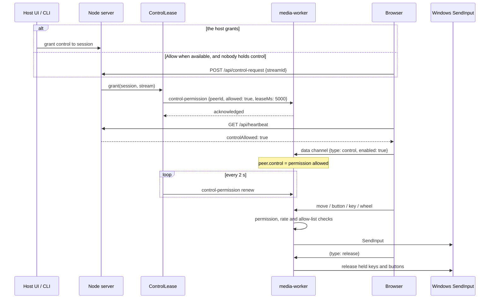
```mermaid
sequenceDiagram
    participant Owner as Host UI / CLI
    participant Server as Node server
    participant Lease as ControlLease
    participant Worker as media-worker
    participant Browser
    participant OS as Windows SendInput

    alt the host grants
        Owner->>Server: grant control to session
    else Allow when available, and nobody holds control
        Browser->>Server: POST /api/control-request {streamId}
    end
    Server->>Lease: grant(session, stream)
    Lease->>Worker: control-permission {peerId, allowed: true, leaseMs: 5000}
    Worker-->>Lease: acknowledged
    Browser->>Server: GET /api/heartbeat
    Server-->>Browser: controlAllowed: true
    Browser->>Worker: data channel {type: control, enabled: true}
    Note over Worker: peer.control = permission allowed
    loop every 2 s
        Lease->>Worker: control-permission renew
    end
    Browser->>Worker: move / button / key / wheel
    Worker->>Worker: permission, rate and allow-list checks
    Worker->>OS: SendInput
    Browser->>Worker: {type: release}
    Worker->>OS: release held keys and buttons
```

Touch gestures are interpreted in the browser
([viewer/app.js](../apps/web-client/src/viewer/app.js)); the worker only ever sees the
same `move` and `button` messages a mouse produces. A touch does not press a button when
it lands, because a finger that drags to move the pointer would otherwise click when it
lifts. Instead:

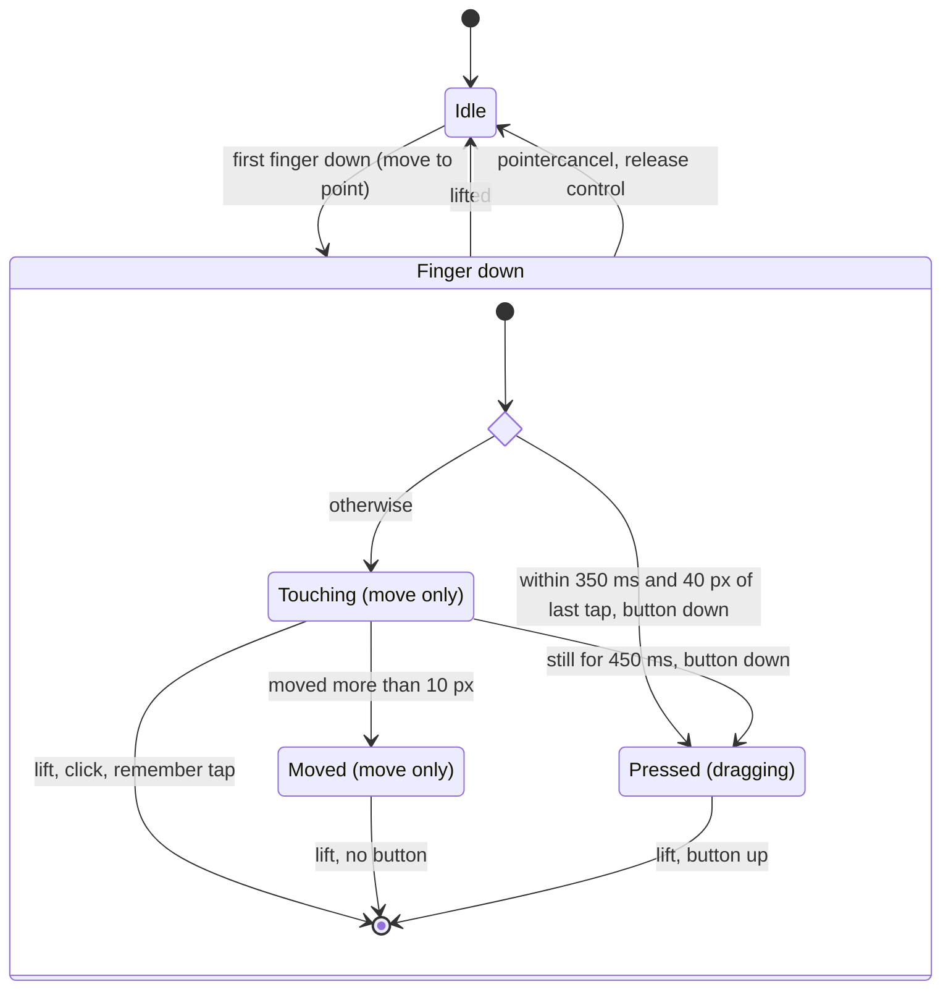
```mermaid
stateDiagram-v2
    [*] --> Idle
    Idle --> Down : first finger down (move to point)
    state "Finger down" as Down {
        state armed <<choice>>
        [*] --> armed
        armed --> Pressed : within 350 ms and 40 px of last tap, button down
        armed --> Touching : otherwise
        Touching --> Moved : moved more than 10 px
        Touching --> Pressed : still for 450 ms, button down
        Touching --> [*] : lift, click, remember tap
        Moved --> [*] : lift, no button
        Pressed --> [*] : lift, button up
        Touching : Touching (move only)
        Moved : Moved (move only)
        Pressed : Pressed (dragging)
    }
    Down --> Idle : lifted
    Down --> Idle : pointercancel, release control
```

| Gesture                                                            | Messages sent                                         |
| ------------------------------------------------------------------ | ----------------------------------------------------- |
| Drag                                                               | `move` only                                           |
| Tap (lifted within 10 px of where it landed, before the hold time) | left `button` down then up on lift                    |
| Tap, then touch again within 350 ms and 40 px, and drag            | left `button` down at once, `move`, up on lift        |
| Touch and hold still for 450 ms, then drag                         | left `button` down after the hold, `move`, up on lift |

Only the first finger is tracked; a second concurrent touch is ignored. A cancelled
touch releases control like any other `pointercancel`. Mouse and pen input still press
and release buttons exactly as the device reports them.

## Resilience

Recovery is driven by what the browser reports, and is deliberately damped.

The client reports cumulative `pliCount` and `firCount`. The server treats an increase as
a request for a keyframe, but ignores the first sample and counter resets — neither means
loss — and rate-limits what it forwards ([recovery.mjs](../apps/server/src/recovery.mjs)).
The worker limits again at the source: join keyframes may coalesce over a short window,
while recovery keyframes keep a source-wide two-second floor
([keyframe-limiter.hpp](../native/media-worker/src/keyframe-limiter.hpp)). Both limits
exist because a keyframe is the most expensive frame there is, and sustained packet loss
across several viewers would otherwise produce an IDR storm that worsens the loss.

Sessions are kept by heartbeat and can be resumed through `/api/reconnect` while a
session is in a reconnecting state; ordinary API calls are rejected meanwhile so a
half-recovered client cannot act on stale state.

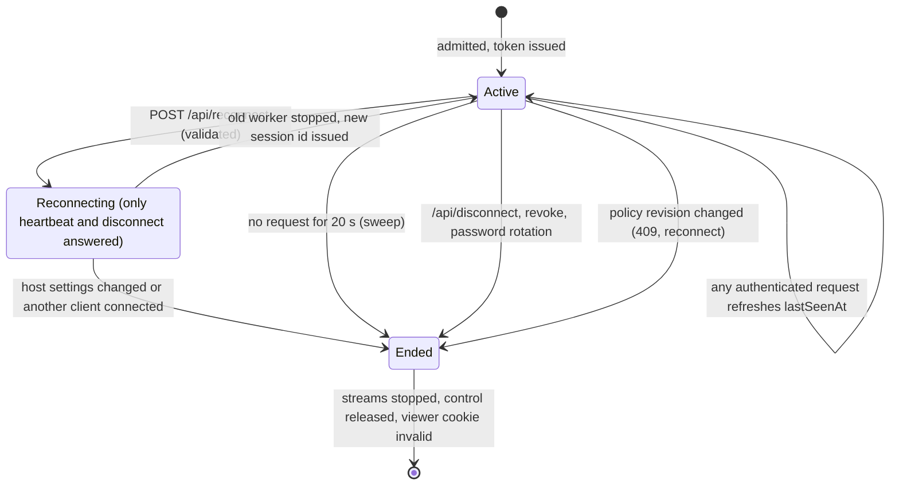
```mermaid
stateDiagram-v2
    [*] --> Active : admitted, token issued
    Active --> Active : any authenticated request refreshes lastSeenAt
    Active --> Reconnecting : POST /api/reconnect (validated)
    Reconnecting : Reconnecting (only heartbeat and disconnect answered)
    Reconnecting --> Active : old worker stopped, new session id issued
    Reconnecting --> Ended : host settings changed or another client connected
    Active --> Ended : no request for 20 s (sweep)
    Active --> Ended : /api/disconnect, revoke, password rotation
    Active --> Ended : policy revision changed (409, reconnect)
    Ended --> [*] : streams stopped, control released, viewer cookie invalid
```

## Diagnostics

The server keeps a diagnostics snapshot per worker — selected encoder, stream state,
transport and client-reported metrics — exposed at `/api/diagnostics` only on a
separate `127.0.0.1`-bound listener. The normal HTTP/HTTPS handler does not route
the diagnostics API, page, or dedicated assets. The host and CLI issue an explicit,
short-lived local URL and bearer; the browser page sends that bearer only in an
Authorization header. Encoder facts land there at `ready` and then hold,
because the worker chooses its encoder once per stream and never switches mid-stream.

Which GPU is encoding is host-facing only. It appears in host status and diagnostics, and
no client ever sees it.

## Security architecture

This section is the security view of the architecture. It follows the usual structure of
an architecture-level security description: scope, objectives, assets, actors, trust
zones and data flows, the attack surface, the controls by domain, a STRIDE threat model,
and the residual risk that remains. The threat model uses Microsoft's STRIDE categories
over the data flow diagram. Controls are grouped by the chapters of the OWASP Application
Security Verification Standard (ASVS) 4.0 so they can be checked against it. This is a
design description, not an assurance claim: VidVNC has had source reviews and targeted
tests, but no external penetration test.

Related documents, and what each one owns:

| Document                                                 | Owns                                                                        |
| -------------------------------------------------------- | --------------------------------------------------------------------------- |
| This section                                             | The security design: zones, flows, controls, threat model                   |
| [Security analysis](security/internet-exposure.md)       | Findings register (F1–F8, R1–R8), their status, and the verification record |
| [Remote access guide](security/remote-access.md)         | The operator's steps and required checks for internet exposure              |
| [R4 hardening options](security/r4-hardening-options.md) | Design options compared for finding R4; A, F1 and B were selected           |
| [SECURITY.md](../SECURITY.md)                            | Support position and private vulnerability reporting                        |

### Security objectives

| ID  | Objective                                                                                                          | Property        |
| --- | ------------------------------------------------------------------------------------------------------------------ | --------------- |
| O1  | Only a client the desktop owner has admitted can see the screen or hear the audio                                  | Confidentiality |
| O2  | Only the one session the owner has granted control can send keyboard and mouse input, and only while it is granted | Integrity       |
| O3  | No client can change host policy, access settings, approved devices or who holds control                           | Integrity       |
| O4  | Pixels, audio, input and credentials are never readable on the network in the default configuration                | Confidentiality |
| O5  | The owner can end any session, revoke any device and stop sharing at once, and nothing outlives the host           | Integrity       |
| O6  | One misbehaving client cannot lock out others or exhaust the host                                                  | Availability    |
| O7  | Internet clients are refused unless the owner turned remote access on, and then get only approved-device sign-in   | Confidentiality |

**Non-goals.** VidVNC does not defend against an attacker who already runs code as the
desktop user or as an administrator on the host, or who has physical access to it: such an
attacker can read the settings files and inject input directly. It does not provide
anonymity, multi-tenant isolation between Windows users on one PC, or protection against
volumetric network floods (see A5 below). Security of the client device itself (a
compromised browser or phone) is out of scope.

### Assets

| Asset                           | Where it lives                                                                             | Sensitivity                                               |
| ------------------------------- | ------------------------------------------------------------------------------------------ | --------------------------------------------------------- |
| Desktop video and system audio  | GPU memory in the worker, then DTLS-SRTP to the viewer                                     | High: anything on screen, including other secrets         |
| Input injection capability      | `SendInput` in the worker, gated by the control lease                                      | Critical: equivalent to the user's own keyboard and mouse |
| Standing session password       | Server memory only; regenerated on every server start; shown in the host UI                | High: admits LAN clients in `session-key` mode            |
| One-time and setup codes        | Server memory as SHA-256 digests; the plaintext is shown once to the owner                 | High until used or expired (300 s default)                |
| Approved-device credential      | Client: device secret in IndexedDB plus the user's password. Host: `approved-clients.json` | High: long-lived remote identity                          |
| Session bearer token            | Client page memory; server memory                                                          | High for its lifetime (seconds after the last request)    |
| Viewer grant cookie             | Client cookie jar (`HttpOnly`); server memory                                              | Medium: loads viewer assets only, not the API             |
| TLS private key                 | Per-user state directory (PFX and passphrase sidecar, or mkcert/provided files)            | High: impersonating the host to enrolled devices          |
| Trust anchor certificate        | Served at `/trust` to local peers; installed on client devices                             | Public, but its integrity matters                         |
| Diagnostics bearer              | Owner's browser; server memory as a SHA-256 digest                                         | Medium: local diagnostics for 15 minutes                  |
| Host policy and access settings | `%LOCALAPPDATA%\VidVNC\*.json`                                                             | Medium: decide who may connect and how                    |
| Server log                      | `%LOCALAPPDATA%\VidVNC\...\server.log` (desktop host only)                                 | Low: lifecycle messages, no secrets by design             |

### Actors and trust levels

| Actor                           | Trust     | How it is identified                                                               | May                                                                                        |
| ------------------------------- | --------- | ---------------------------------------------------------------------------------- | ------------------------------------------------------------------------------------------ |
| Desktop owner                   | Full      | Runs the WinUI host or CLI as the desktop user                                     | Start and stop sharing, set policy and access, issue codes, approve devices, grant control |
| Admitted viewer                 | Limited   | Session bearer bound to its socket address                                         | Subscribe to streams the policy allows; send input only while granted control              |
| Approved device (not signed in) | Limited   | Client id, 256-bit device secret, username and password                            | Sign in; at most one live session per identity                                             |
| Local-network peer              | Untrusted | Source address on an eligible Private physical LAN                                 | Reach sign-in, codes, `/trust`; nothing else before admission                              |
| Private-network peer            | Untrusted | VPN, loopback, link-local, overlay `100.64.0.0/10`, IPv6 ULA or this PC's prefixes | As a local peer, except the standing password and `/trust`                                 |
| Internet peer                   | Hostile   | Any other source address; unknown addresses fail closed as internet                | Nothing while remote access is off; approved-device sign-in over HTTPS when it is on       |
| Local process (same user)       | Trusted   | Out of scope (see non-goals)                                                       | Could read settings and inject input without VidVNC                                        |

Peer classification comes from the socket's source address, never from a header
([peer-network.mjs](../apps/server/src/peer-network.mjs),
[local-session-scope.mjs](../apps/server/src/local-session-scope.mjs)).

### Assumptions and operating conditions

The design holds under these conditions. VidVNC checks or prompts for some of them but
cannot establish them alone; the [security analysis](security/internet-exposure.md#scope-and-assumptions)
lists them as Security-Related Application Conditions and says what changes when one is
not met.

- **A1** The host PC, its Windows account and the VidVNC binaries are not compromised.
- **A2** The LAN is the owner's own network. Plain HTTP (`tls.mode: off`) is only used where
  everyone on path is trusted.
- **A3** With remote access on, only the HTTPS port and the media UDP port are forwarded,
  and nothing between the router and the PC rewrites the client's source address.
- **A4** Codes and trust-anchor fingerprints reach the viewer over a channel the owner
  trusts (reading the host screen counts), and the owner checks each pending approval.
- **A5** An upstream edge absorbs volumetric floods; VidVNC only bounds its own work.
- **A6** Lost devices are revoked promptly and approved-device passwords are strong.

### Trust zones and data flows

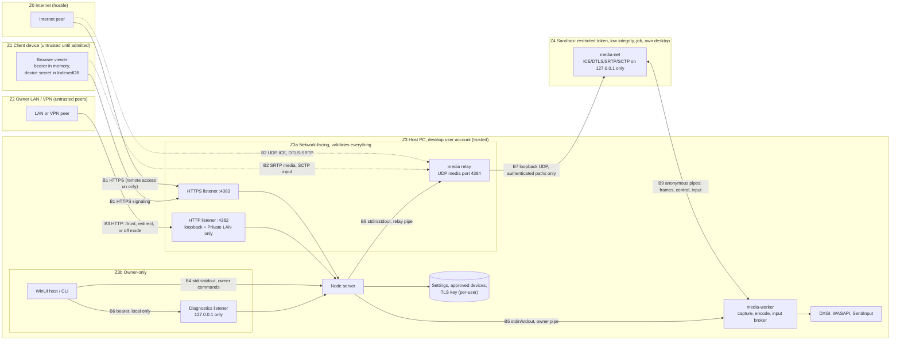
```mermaid
flowchart LR
    subgraph Z0["Z0 Internet (hostile)"]
        inet["Internet peer"]
    end
    subgraph Z1["Z1 Client device (untrusted until admitted)"]
        browser["Browser viewer<br/>bearer in memory,<br/>device secret in IndexedDB"]
    end
    subgraph Z2["Z2 Owner LAN / VPN (untrusted peers)"]
        lanpeer["LAN or VPN peer"]
    end
    subgraph Z3["Z3 Host PC, desktop user account (trusted)"]
        subgraph Z3a["Z3a Network-facing, validates everything"]
            https["HTTPS listener :4383"]
            http["HTTP listener :4382<br/>loopback + Private LAN only"]
            relay["media relay<br/>UDP media port 4384"]
        end
        subgraph Z3b["Z3b Owner-only"]
            host["WinUI host / CLI"]
            diag["Diagnostics listener<br/>127.0.0.1 only"]
        end
        server["Node server"]
        worker["media-worker<br/>capture, encode, input broker"]
        store[("Settings, approved devices,<br/>TLS key (per-user)")]
        os["DXGI, WASAPI, SendInput"]
    end
    subgraph Z4["Z4 Sandbox: restricted token, low integrity, job, own desktop"]
        net["media-net<br/>ICE/DTLS/SRTP/SCTP on 127.0.0.1 only"]
    end

    inet -->|"B1 HTTPS (remote access on only)"| https
    inet -.->|"B2 UDP ICE, DTLS-SRTP"| relay
    browser -->|"B1 HTTPS signaling"| https
    lanpeer -->|"B3 HTTP: /trust, redirect, or off mode"| http
    browser -.->|"B2 SRTP media, SCTP input"| relay
    https --> server
    http --> server
    relay -->|"B7 loopback UDP, authenticated paths only"| net
    net <-->|"B9 anonymous pipes: frames, control, input"| worker
    host -->|"B4 stdin/stdout, owner commands"| server
    server -->|"B5 stdin/stdout, owner pipe"| worker
    server -->|"B8 stdin/stdout, relay pipe"| relay
    host -->|"B6 bearer, local only"| diag
    diag --> server
    server --> store
    worker --> os
```

| Boundary | Crossing                                  | Authentication                                                                                                                          | Protection in transit                          |
| -------- | ----------------------------------------- | --------------------------------------------------------------------------------------------------------------------------------------- | ---------------------------------------------- |
| B1       | Client or internet peer to HTTPS listener | Code or approved device, then session bearer                                                                                            | TLS; HSTS on public names                      |
| B2       | Client to the media relay's port          | STUN MESSAGE-INTEGRITY with the stream's ICE password from B1, checked by the relay; then the DTLS fingerprint from B1                  | DTLS-SRTP (media), DTLS-SCTP (input)           |
| B3       | LAN peer to HTTP listener                 | As B1 in off mode; none for `/trust`                                                                                                    | None; local peers only; redirect when TLS live |
| B4       | Host to server                            | Process ownership (inherited pipe), exact start line                                                                                    | In-process pipe                                |
| B5       | Server to worker                          | Process ownership (inherited pipe)                                                                                                      | In-process pipe                                |
| B6       | Owner browser to diagnostics listener     | 256-bit bearer, 15-minute lifetime                                                                                                      | Loopback only                                  |
| B7       | Relay to media-net                        | Only 5-tuples the relay pinned after B2's check; media-net accepts datagrams from the pin's socket                                      | Loopback only; DTLS as B2                      |
| B9       | media-net to worker                       | Process ownership (inherited handles only); everything from media-net is validated; input only through the broker and the owner's lease | Anonymous pipes, no name                       |
| B8       | Server to relay                           | Process ownership (inherited pipe); invalid commands end the relay                                                                      | In-process pipe                                |

### Attack surface

| Entry point                | Protocol and port                     | Reachable by                                 | Pre-authentication exposure                                                                                              |
| -------------------------- | ------------------------------------- | -------------------------------------------- | ------------------------------------------------------------------------------------------------------------------------ |
| Login shell, `/api/info`   | HTTPS `4383` (HTTP in off mode)       | Local, private; internet if remote access on | Static assets and the owner-chosen public name only                                                                      |
| `/api/key-start`           | HTTPS                                 | Local and private only                       | Metered code check; standing password from local peers only                                                              |
| `/api/approved-clients/*`  | HTTPS                                 | Local, private; internet if remote access on | Ticketed registration, claim polling, sign-in; separate budgets per zone                                                 |
| Session and signaling APIs | HTTPS                                 | Admitted sessions                            | None: bearer bound to the socket address                                                                                 |
| Viewer assets `/viewer/*`  | HTTPS                                 | Admitted sessions                            | None: session- and peer-bound grant cookie                                                                               |
| `/trust`, `/api/trust/*`   | HTTP `4382` and HTTPS                 | Local peers only                             | Public certificate and fingerprint                                                                                       |
| Media port                 | UDP `4384` (`mediaPort`), the relay   | Anyone who can reach it while sharing        | The relay's bounded STUN parser in JavaScript, budgeted before parsing; no reply to unauthenticated senders (finding R4) |
| Diagnostics                | HTTP on an ephemeral `127.0.0.1` port | Local processes                              | None: owner-issued bearer                                                                                                |
| Owner pipe                 | stdin/stdout                          | The parent process only                      | Exact approval line before anything listens                                                                              |

There is no owner-management route on any HTTP listener. Everything that changes policy,
access, devices or control arrives over B4.

### Authentication (ASVS V2)

Three admission modes, set by the owner
([access-settings.mjs](../apps/server/src/access-settings.mjs)):

| Mode            | Credential                                                | Accepted from           | Notes                                                            |
| --------------- | --------------------------------------------------------- | ----------------------- | ---------------------------------------------------------------- |
| `session-key`   | Standing 8-character password, regenerated each start     | Local peers             | One-time codes also work                                         |
| `one-time-keys` | Owner-issued 8-character code, single use, 300 s default  | Local and private peers | Standing password refused                                        |
| `approved-only` | Device secret + username + password, after owner approval | All permitted zones     | Required whenever remote access is on; setup codes only register |

Codes are 8 symbols drawn by rejection sampling; the default alphabet has 31 symbols
without look-alike characters (about 40 bits), are compared
as SHA-256 digests, never encode their purpose, and are metered before lookup: 120 per
minute overall, 10 per source, and per code class 20 failures overall and 5 per source for
each code generation ([connection-keys.mjs](../apps/server/src/connection-keys.mjs),
[admission-budget.mjs](../apps/server/src/admission-budget.mjs)). Failures return the
same `401` whatever the reason, so there is no validity oracle.

An approved device is registered once, on the LAN or VPN, and signs in from then on:

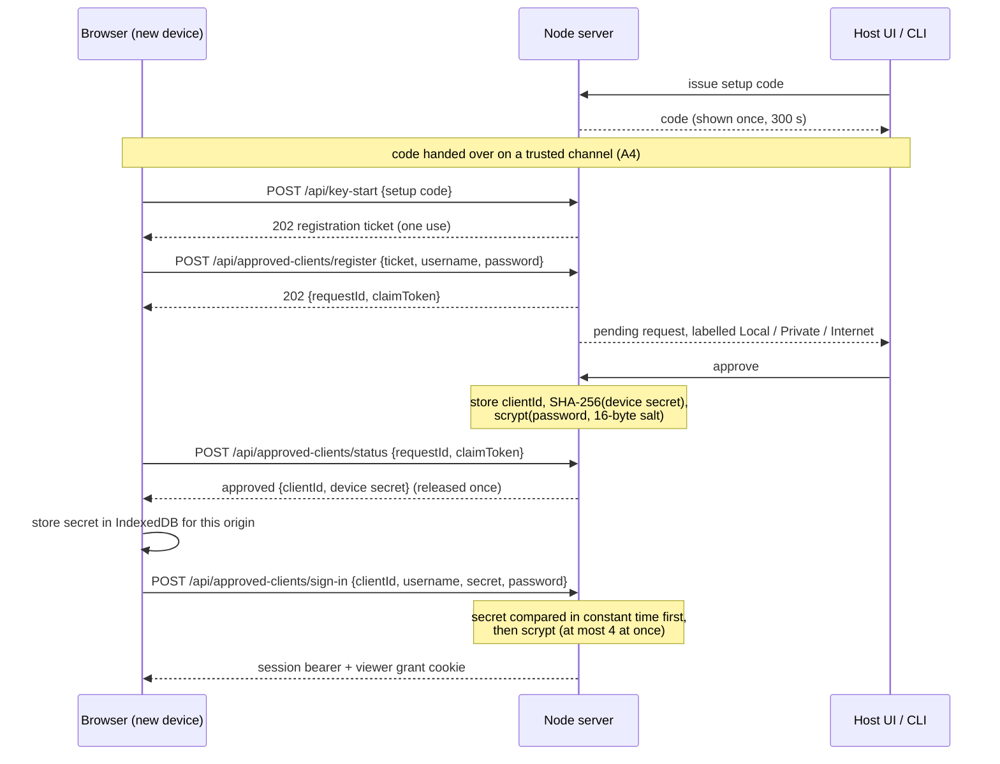
```mermaid
sequenceDiagram
    participant Device as Browser (new device)
    participant Server as Node server
    participant Owner as Host UI / CLI

    Owner->>Server: issue setup code
    Server-->>Owner: code (shown once, 300 s)
    Note over Owner,Device: code handed over on a trusted channel (A4)
    Device->>Server: POST /api/key-start {setup code}
    Server-->>Device: 202 registration ticket (one use)
    Device->>Server: POST /api/approved-clients/register {ticket, username, password}
    Server-->>Device: 202 {requestId, claimToken}
    Server-->>Owner: pending request, labelled Local / Private / Internet
    Owner->>Server: approve
    Note over Server: store clientId, SHA-256(device secret),<br/>scrypt(password, 16-byte salt)
    Device->>Server: POST /api/approved-clients/status {requestId, claimToken}
    Server-->>Device: approved {clientId, device secret} (released once)
    Device->>Device: store secret in IndexedDB for this origin

    Device->>Server: POST /api/approved-clients/sign-in {clientId, username, secret, password}
    Note over Server: secret compared in constant time first,<br/>then scrypt (at most 4 at once)
    Server-->>Device: session bearer + viewer grant cookie
```

Approved-device credentials are stored as a SHA-256 hash of the 256-bit device secret and an
scrypt verifier of the password with a per-device 16-byte salt; both comparisons are
constant-time ([approved-clients.mjs](../apps/server/src/approved-clients.mjs)). Passwords
are 10 to 256 characters. At most 64 registrations may be pending, and tickets and claims
expire. Owner edits or removal bump a generation counter that ends the device's live
session synchronously.

The owner is authenticated by the operating system: whoever runs the host or CLI as the
desktop user is the owner. The server accepts owner commands only on the stdio pipe of the
process that started it (B4), and will not listen at all until that pipe delivers an
exact approval line ([owner-start.mjs](../apps/server/src/owner-start.mjs)).

### Session management (ASVS V3)

- The session bearer is a random UUID, returned in the admission response, kept in page
  memory (never a cookie or storage), and sent as `Authorization: Bearer`. The server
  accepts it only from the socket address that was admitted.
- A session ends after 20 seconds without an authenticated request, on `/api/disconnect`,
  when the owner revokes it or rotates the password, when the device is edited or removed,
  and when host policy changes under it. Turning remote access off ends every internet
  session at once. The [session state diagram](#resilience) shows the transitions.
- Reconnecting replaces the session id; the old worker is stopped before the new id is
  issued, and other API calls are refused meanwhile.
- The viewer grant cookie is 32 random bytes, `HttpOnly`, `SameSite=Strict`, `Path=/viewer`,
  `Secure` over HTTPS, bound to the session and peer, and invalidated with the session
  ([viewer-asset-grants.mjs](../apps/server/src/viewer-asset-grants.mjs)). It loads viewer
  assets only; the API still needs the bearer. The login page imports the viewer into the
  live document rather than adopting nodes from a template, because WebKit sets a media
  element's inline-playback policy when the element is created.
- The owner sets how many sessions may be live at once (1 to 64); each approved identity may
  hold one.

### Access control (ASVS V4)

| Privilege                      | Granted by                                          | Enforced at                                                         |
| ------------------------------ | --------------------------------------------------- | ------------------------------------------------------------------- |
| Reach a route                  | Peer zone and listener                              | HTTP handler, before routing                                        |
| View a display or audio        | Admission, within host stream policy                | Server policy resolution on every offer and reconnect               |
| Choose custom stream settings  | Owner enables client options                        | Server validates against approved bounds                            |
| Send input                     | Owner grant, or a per-device or default `available` | `ControlLease` in the server and the permission lease in the worker |
| Change policy, access, devices | Owner only                                          | No HTTP route exists; owner pipe only                               |
| Read diagnostics               | Owner-issued bearer                                 | Separate loopback listener                                          |

Input is authorized twice, independently: the server's `ControlLease` decides who holds
control, and the worker enforces it on every message because the data channel bypasses the
server. The worker accepts permission only from its owner pipe, as a 5-second lease the
server renews every 2 seconds; a peer cannot extend or grant it
([Input and control](#input-and-control)). With the `available` default, or an approved
device set to `available`, the viewer's user can take control when nobody holds it, on the
LAN and from the internet alike, without the host approving it; nothing is taken without
that request, and a host revoke for the session ends it.

### Cryptography and key management (ASVS V6)

| Purpose                          | Mechanism                                                                 | Secret and lifetime                                                                                                          |
| -------------------------------- | ------------------------------------------------------------------------- | ---------------------------------------------------------------------------------------------------------------------------- |
| Control plane transport          | TLS via Node.js defaults                                                  | Server certificate: provided, mkcert, or self-signed for 2 years; reissued within 30 days of expiry or when addresses change |
| Media and input transport        | DTLS-SRTP and DTLS-SCTP (WebRTC mandatory)                                | Per-connection DTLS keys; fingerprints exchanged over authenticated signaling                                                |
| Device secret                    | `crypto.randomBytes(32)`, stored as SHA-256                               | Until the owner revokes the device                                                                                           |
| Device password                  | scrypt, 16-byte random salt, 32-byte output                               | Until changed or revoked                                                                                                     |
| Registration ticket, claim token | `crypto.randomBytes(32)`, tickets stored as SHA-256                       | Minutes; single use                                                                                                          |
| Codes and standing password      | 8 symbols from `crypto.randomBytes`, rejection-sampled; stored as SHA-256 | 300 s default (60–600) and single use; standing password per server run                                                      |
| Session bearer                   | `crypto.randomUUID()`                                                     | Session lifetime                                                                                                             |
| Viewer grant                     | `crypto.randomBytes(32)`                                                  | Session lifetime                                                                                                             |
| Diagnostics bearer               | `crypto.randomBytes(32)`, stored as SHA-256, constant-time compare        | 15 minutes                                                                                                                   |
| Self-signed PFX                  | Exported by `Export-PfxCertificate` with a random passphrase              | Key removed from the Windows store after export; PFX and passphrase in the per-user directory                                |

All randomness comes from the operating system CSPRNG through Node's `crypto` module. No
custom cryptography is implemented. The certificate provisioning details are in
[TLS and trust provisioning](#tls-and-trust-provisioning) below.

### Data protection (ASVS V8, V9)

**In transit.** With the default `tls.mode`, all admission, signaling and viewer traffic uses
HTTPS; if HTTPS is pending or failed those routes return `503` rather than fall back to
plaintext. Media and input always use DTLS. The only plaintext is certificate enrolment
for local peers (the anchor is public; its integrity is checked by fingerprint, A4) and the
deliberate `off` mode.

**At rest.** VidVNC keeps no recordings or screenshots. Persistent files are in the desktop
user's profile (`%LOCALAPPDATA%\VidVNC`, or `~/Library/Application Support/VidVNC` for the
CLI on macOS) and rely on the operating system's per-user file permissions:

| File                                       | Contents                                            | Secrets                                             |
| ------------------------------------------ | --------------------------------------------------- | --------------------------------------------------- |
| `access-settings.json`                     | Mode, limits, remote access, public names and ports | None                                                |
| `approved-clients.json`                    | Devices, usernames, labels, generation              | Hashes and scrypt verifiers only                    |
| `stream-policy.json`, `profile-order.json` | Stream policy                                       | None                                                |
| `tls-settings.json`                        | TLS mode, ports, provided certificate paths         | A provided PFX passphrase, if the operator sets one |
| TLS state directory                        | Certificate, private key or PFX, passphrase sidecar | Private key (plaintext sidecar by design)           |
| `server.log`                               | Lifecycle messages                                  | None by design                                      |

Settings are written to a temporary file and renamed, so a crash cannot leave a half-written
file. Standing passwords, codes, bearers and grants are never written to disk. On the
client, the approved-device secret is kept in IndexedDB for the origin, and the bearer only
in page memory.

**Minimisation.** The anonymous `/api/info` returns only the owner-chosen public name. Which
GPU encodes, the host's display inventory and diagnostics are never sent to unadmitted
clients, and the encoder is never sent to any client.

### Input validation and output handling (ASVS V5)

- **HTTP.** Bodies are capped at 128 KiB and parsed as JSON only; SDP must start with `v=0`
  and be at most 64 KiB. Absolute-form request targets must match the listener's scheme,
  authority and port. Credentials and names are length-bounded and type-checked.
- **SDP.** For internet clients the offer keeps only candidates on public IP addresses, so a
  client cannot aim the host's ICE checks at LAN machines or hostnames, and the answer
  carries only the public address ([sdp-candidates.mjs](../apps/server/src/sdp-candidates.mjs)).
- **Host policy.** Stream policy and access settings are validated as a whole before they
  are stored; a client can never widen them.
- **Worker.** Messages from peers are parsed as JSON objects. Coordinates must be finite and
  within 0..1; buttons and key codes pass through explicit allow-lists
  ([input-policy.hpp](../native/media-worker/src/input-policy.hpp)); more than 1000 input
  messages a second revokes control. The owner pipe accepts only known message types.
- **Output.** The web client writes server- and user-supplied text with text APIs
  (`textContent`). Its only HTML insertion is the viewer's own same-origin fragment and
  built-in toolbar icons, and the CSP below forbids inline script.

### Browser and HTTP security headers (ASVS V14)

Every response the page loads carries:

| Header                      | Value                                                                                                                                                              |
| --------------------------- | ------------------------------------------------------------------------------------------------------------------------------------------------------------------ |
| `Content-Security-Policy`   | `default-src 'self'; script-src 'self'; style-src 'self'; media-src 'self' blob:; connect-src 'self'; frame-ancestors 'none'; base-uri 'none'; form-action 'self'` |
| `X-Content-Type-Options`    | `nosniff`                                                                                                                                                          |
| `Referrer-Policy`           | `no-referrer`                                                                                                                                                      |
| `Cache-Control`             | `no-store` on API, admission and failure responses                                                                                                                 |
| `Strict-Transport-Security` | `max-age=15552000` (180 days), on the configured public names while remote access is on                                                                            |

Requests whose `Origin` does not match `Host`, including the port, are refused with `403`
([tls/origin.mjs](../apps/server/src/tls/origin.mjs)). The approved-device handoff to the
remote origin carries the device secret in the URL fragment, which browsers never send to a
server; the receiving page strips it and refuses to replace a different stored secret.

### Availability and resource limits

- Each listener accepts 32 connections in total and 12 per source address (IPv6 grouped per
  /64); loopback is exempt. Header and request timeouts are set.
- Admission budgets are kept separately for internet peers and for local and private peers,
  so an internet flood cannot lock out LAN or VPN devices. Approved sign-in and registration:
  600 per minute overall and 10 per source; claim polling: 1200 and 60; 10 per minute per
  identity. scrypt runs at most 4 at a time and only after the device secret matches.
- Every admission map is bounded and every pending registration, ticket and claim expires.
- Telemetry is rate-limited per stream, and keyframe requests are damped twice
  ([Resilience](#resilience)), so a client cannot drive the shared encoder into an IDR storm.
- Per-peer media queues are leaky, so one slow viewer cannot stall others.

### Process isolation and least privilege

- Every process runs as the interactive desktop user, without elevation. The
  self-signed certificate is created in `Cert:\CurrentUser` for the same reason. Each
  source's network process, media-net, runs with a restricted version of that user's token
  at low integrity, in its own job and desktop
  ([Network process](#network-process-media-net)).
- The host places the server in a Win32 job object with `KILL_ON_JOB_CLOSE`; the server owns
  the media relay and one worker process per source. No process outlives its parent: the
  job covers the server's children, and the relay and workers also exit when their input
  pipe closes.
- The worker never authenticates anyone, trusts only its owner pipe and holds no network
  socket; the server never handles pixels. WebRTC runs in media-net, which listens on
  `127.0.0.1` only and is reached only through the media relay, for senders that proved a
  stream's ICE password ([Media relay](#media-relay)). A flaw in the WebRTC stack exploited
  by forged DTLS or RTP from an authenticated address therefore lands in the sandbox: it can
  act as the viewer that holds control while the owner has granted it, and nothing more
  (R4). The relay itself still runs at medium integrity.
- Diagnostics run on a separate listener bound to `127.0.0.1`, not routed by the main
  handler at all.

### Logging and monitoring (ASVS V7)

- The server writes concise lifecycle messages to stderr and, under the desktop host, to
  `server.log` in the per-user directory. Log messages are written to exclude passwords,
  codes, bearers and device secrets, and a logging failure never affects the server.
- The host's Sessions view is the live audit surface: each session with its source
  address, its streams, and who holds control. Pending registrations are labelled Local
  network, Private network or Internet from the registering peer's address.
- Diagnostics (owner-only) record the selected encoder, stream state, transport and
  client-reported metrics per worker.
- There is no persistent security audit trail or alerting yet.

### Secure defaults

| Setting          | Default                                | Effect                                                                                 |
| ---------------- | -------------------------------------- | -------------------------------------------------------------------------------------- |
| Server listening | Only after the owner's approval line   | A server started by anything else never listens                                        |
| TLS              | `auto` (HTTPS, fail closed)            | No plaintext admission unless the owner picks `off`                                    |
| HTTP bind        | Loopback and eligible Private-LAN only | Never a wildcard or public address                                                     |
| Remote access    | Off; each host start is local-only     | Internet peers get `403` everywhere                                                    |
| Remote access on | Forces `approved-only`                 | Standing password and one-time codes stop working for everyone                         |
| Control          | Keyboard and mouse start off           | Nobody can inject input until the owner grants it                                      |
| Codes            | Issued on request, single use, 300 s   | No standing code sits waiting                                                          |
| Media            | One UDP port (4384), the media relay   | The worker is on loopback only; nothing is forwarded before the ICE password is proved |

### Supply chain and build

- JavaScript dependencies are pinned by one root `package-lock.json` and installed with
  `npm ci`. The server and web client have no third-party npm runtime dependencies (only
  development tooling), and `npm audit --omit=dev` has reported no advisories.
- Native dependencies come from one pinned GStreamer SDK (1.28.6), checked before every test
  run; its headers and runtime DLLs must come from the same install. `npm audit` does not
  cover GStreamer or libnice, so they are tracked separately (R4).
- The repository does not accept outside pull requests (see [CONTRIBUTING.md](../CONTRIBUTING.md)).
  CI runs only when started manually.
- Packaging produces self-contained products per [PACKAGING.md](PACKAGING.md). Code signing
  and SBOM generation are not in place yet.

### Threat model

STRIDE applied to the elements and boundaries above. "Residual" refers to the findings
register in the [security analysis](security/internet-exposure.md#findings-register).

| ID  | Element or flow         | STRIDE | Threat                                                                       | Mitigation                                                                                                                                                                                                                                                                     | Residual                   |
| --- | ----------------------- | ------ | ---------------------------------------------------------------------------- | ------------------------------------------------------------------------------------------------------------------------------------------------------------------------------------------------------------------------------------------------------------------------------ | -------------------------- |
| T1  | Admission (B1, B3)      | S      | Guess a code or the standing password                                        | 40-bit codes, rolling and per-generation failure budgets, single use, short expiry, uniform `401`                                                                                                                                                                              | F1                         |
| T2  | Approved sign-in (B1)   | S      | Use a copied device secret and password                                      | 256-bit secret plus password, one live session per identity, generation revocation, zone label at registration                                                                                                                                                                 | F5                         |
| T3  | Peer classification     | S      | Appear local through source NAT or a proxy                                   | Socket address only, never headers; remote access forces `approved-only`; required source-address check (A3)                                                                                                                                                                   | R2                         |
| T4  | Session bearer (B1)     | S      | Replay a stolen bearer                                                       | Bound to the socket address; memory only; 20 s idle expiry; HTTPS                                                                                                                                                                                                              | —                          |
| T5  | Enrolment (B3)          | S, T   | Serve a forged trust anchor on the LAN                                       | Local peers only; fingerprint shown on the host screen for comparison (A4)                                                                                                                                                                                                     | F3                         |
| T6  | Signaling (B1)          | T      | Aim the host's ICE at internal addresses with crafted candidates             | The server removes every candidate from every offer; the worker sends checks to nobody                                                                                                                                                                                         | R3 fixed                   |
| T7  | Settings files          | T      | Change policy or approved devices on disk                                    | Per-user permissions; atomic writes; whole-document validation on load; attacker at A1 is out of scope                                                                                                                                                                         | —                          |
| T8  | Owner pipe (B4, B5, B8) | T, E   | Start or command a server, relay or worker from another process              | Inherited pipes only; exact approval line; no owner route on any listener; job object; the relay exits on any invalid command                                                                                                                                                  | —                          |
| T9  | Browser page            | T, I   | Script injection or framing                                                  | Strict CSP, `frame-ancestors 'none'`, `nosniff`, `Origin` check, no inline script                                                                                                                                                                                              | —                          |
| T10 | Owner actions           | R      | A viewer denies having connected or acted                                    | Sessions view shows each session's address live; lifecycle log                                                                                                                                                                                                                 | No persistent audit trail  |
| T11 | Control plane (B3)      | I      | Read admission or signaling on the LAN                                       | HTTPS by default and fail closed; `off` only by explicit choice                                                                                                                                                                                                                | F3 (off mode)              |
| T12 | Media (B2)              | I      | Capture screen or audio on the network                                       | DTLS-SRTP with fingerprints from authenticated signaling                                                                                                                                                                                                                       | —                          |
| T13 | Public endpoints        | I      | Learn host details before sign-in                                            | `/api/info` returns the public name only; certificate omits the hostname in remote mode                                                                                                                                                                                        | R7                         |
| T14 | Diagnostics (B6)        | I      | Read diagnostics from the network or a proxy                                 | Separate `127.0.0.1` listener, `404` on main ports, 256-bit 15-minute bearer                                                                                                                                                                                                   | F4 fixed                   |
| T15 | Admission endpoints     | D      | Flood sign-in to lock devices out                                            | Per-zone budgets, per-source and per-/64 limits, bounded scrypt concurrency                                                                                                                                                                                                    | R1, F7                     |
| T16 | Listeners and media     | D      | Exhaust connections, memory, relay registrations or the encoder              | Connection caps, body and SDP caps, timeouts, bounded maps; relay budgets before parsing in two lanes, at most 64 registrations and 4 paths each; keyframe damping, leaky queues                                                                                               | F7 (volumetric)            |
| T17 | Media port (B2, B7)     | E      | Exploit native STUN/DTLS parsing before authentication                       | The relay checks MESSAGE-INTEGRITY in JavaScript before anything reaches libnice; media-net is on loopback only; only DTLS and RTP from an authenticated 5-tuple pass unchecked, and they reach media-net, which is sandboxed and holds no input capability; current GStreamer | R4                         |
| T18 | Input path (B2, B9)     | E      | Inject input without a grant, or keep it after revoke                        | Broker in the worker: lease from the owner pipe only, 5 s expiry, per-peer control flag, allow-lists, rate limit, release of held keys; media-net can only relay what a viewer sent; `hostControl` required                                                                    | F2 (queued message window) |
| T19 | Viewer assets           | E      | Load the viewer or its code without admission                                | Session- and peer-bound `HttpOnly` grant cookie                                                                                                                                                                                                                                | —                          |
| T20 | Media relay (B2, B8)    | S, T   | Send media into another viewer's stream, or confirm a live port to strangers | Pins keyed by 5-tuple and stream; a valid check for another stream on a pinned path is dropped; the worker's replies go only to the pinned tuple; no reply before authentication                                                                                               | R4                         |

### Residual risk and open items

The current register, with severity and verification, is kept in the
[security analysis](security/internet-exposure.md#open-and-residual-findings). In summary:

- **R4** Native ICE/STUN parsing was reachable before authentication on the media ports.
  The media relay now checks the ICE password first, and WebRTC runs in the sandboxed
  media-net (built; not yet validated on Windows). Forged DTLS or RTP from an authenticated
  address still reaches OpenSSL and libsrtp there; a compromised media-net can act as the
  viewer that holds control while it is granted. The relay still runs at medium integrity.
- **R8** The remote media path has run through one real router; IPv6, carrier NAT and a
  packet capture are still to do.
- **R2, R1, F7** depend on the operating conditions A3 and A5.
- **F5** An approved-device credential can be copied; passkeys (WebAuthn) are the proposed
  stronger model.
- Not in place yet: sandboxing of the worker, a persistent audit trail, code signing, an
  SBOM, and an external penetration test.

Until R8 is closed, a self-hosted VPN with remote access off is the recommended way to reach
VidVNC from outside, as [SECURITY.md](../SECURITY.md) states.

### Security verification

- `npm test` includes regression tests for the controls above: admission budgets and IPv6
  grouping, peer classification, origin and host checks, redirect and fail-closed TLS,
  diagnostics isolation, viewer grants, approved-device registration and revocation, SDP
  candidate filtering, and settings validation. HTTPS regressions drive an internet client
  against a real TLS listener.
- Native unit tests (CTest) cover the input allow-lists, peer permission and the media port
  range; `npm run test:hardware` exercises the real worker.
- The [verification record](security/internet-exposure.md#verification-record) lists each
  review and run, including what was not tested.

### Keeping this section current

Update this section in the same change as any code that adds an entry point, a secret, a
persisted file, a boundary crossing or a new privilege; add the threat to the table and,
if it is not fully mitigated, a finding to the security analysis. Report vulnerabilities
privately as described in [SECURITY.md](../SECURITY.md).

### TLS and trust provisioning

#### Two listeners

The plaintext listener keeps the product's original port, `4382` by default
(`VIDVNC_PORT`-overridable, [main.mjs](../apps/server/src/main.mjs)). The TLS listener
takes a second port, `4383` by default — one above the plaintext default so the pair
never collides out of the box — independently configurable through TLS settings or the
CLI's `tls-port` command
([tls-settings.mjs](../apps/server/src/tls/tls-settings.mjs)). If the two ever end up
equal (for example `VIDVNC_PORT` moved onto the TLS default), TLS is disabled for that
run rather than failing to start, and the reason is logged; HTTP viewer access remains disabled
([load-settings.mjs](../apps/server/src/tls/load-settings.mjs)).

The HTTP listeners bind only loopback and eligible physical Private-LAN addresses, never a
wildcard or public address. `VIDVNC_HOST` can narrow those binds but cannot widen them;
adapter refresh removes ineligible sockets. The handler also checks the live peer scope on
every HTTP request, including existing keep-alive connections. The local scope is injected
into the production router as well as the listener manager. Trust routes are local-peer-only
on HTTP **and HTTPS**, even when TLS binds publicly.

Once TLS is active, local HTTP serves only the enrolment page and its assets
(`/trust` and everything it loads) plus the two trust API routes
(`/api/trust/anchor`, `/api/trust/status`) unredirected. Diagnostics routes return `404`
on both main ports; other plaintext requests get a `307` redirect (not `308`, so a client that cached it does not keep being sent to
a TLS port that may later change) to the same path and query on the HTTPS listener,
preserving the request method. Absolute-form requests must match the socket scheme,
authority, and port before routing; they cannot bypass the redirect. When HTTPS is
required but unavailable, every non-trust HTTP route returns no-store `503`. Only a
valid, deliberate `tls.mode: off` serves the full viewer over LAN-only HTTP. A device
that does not yet trust the host has no un-warned way to fetch the trust anchor over the very connection that anchor
exists to authenticate, so those routes remain reachable locally in the clear
([http-app.mjs](../apps/server/src/http-app.mjs)).

#### Strategy order and reissue

Provisioning tries strategies in a fixed order — `provided`, then `mkcert`, then
`windows-self-signed` — and uses the first one that is available and succeeds
([ensure-certificate.mjs](../apps/server/src/tls/ensure-certificate.mjs),
`DEFAULT_STRATEGIES`). In `provided` mode only the `provided` strategy is ever a
candidate, so a failure there is reported rather than silently replaced by a generated
certificate. In every other mode all three are tried in that order:

| Strategy              | Condition                                          | Anchor a device must trust         |
| --------------------- | -------------------------------------------------- | ---------------------------------- |
| `provided`            | Operator configured a certificate and key (or PFX) | Whatever their CA chain already is |
| `mkcert`              | `mkcert` resolves on `PATH`                        | The mkcert local root CA           |
| `windows-self-signed` | Always available on Windows                        | The leaf certificate itself        |

A credential is reissued — at startup, and again on a periodic re-check — whenever any
of these holds: it is absent or unreadable; its expiry falls inside the renewal window
(30 days by default); or its subject alternative name no longer covers an address the
machine currently has, which is what keeps a certificate valid across a DHCP lease change
or a laptop moving networks
([certificate-facts.mjs](../apps/server/src/tls/certificate-facts.mjs),
`renewalStatus`/`checkCoverage`). Each strategy owns this check for its own credential
type; `ensure-certificate.mjs` only selects a strategy and forwards the result unchanged.

#### Enrolment flow

The host offers the current trust anchor at `/trust`, a page served over plaintext (see
above) that explains what to do with it per platform. `/api/trust/anchor` downloads the
anchor certificate as DER; `/api/trust/status` reports whether TLS is active, which
strategy is in effect, and the anchor's SHA-256 fingerprint. The host UI shows the same
fingerprint and a QR code pointing at `/trust`, so enrolling a device means: open the
page, compare the fingerprint shown there against the one on the host screen, then
install the certificate through the OS's own certificate UI. That fingerprint comparison
is the only integrity check available before trust exists — see Known limitations below.

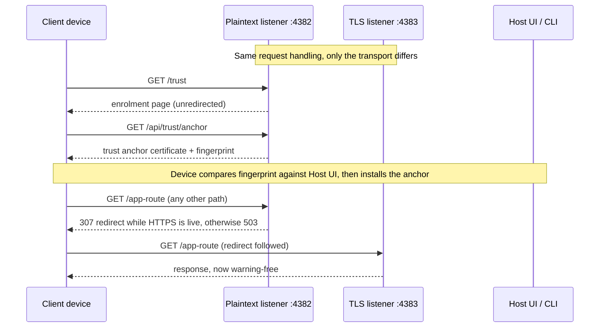
```mermaid
sequenceDiagram
    participant Device as Client device
    participant Plain as Plaintext listener :4382
    participant TLS as TLS listener :4383
    participant Host as Host UI / CLI

    Note over Plain,TLS: Same request handling, only the transport differs

    Device->>Plain: GET /trust
    Plain-->>Device: enrolment page (unredirected)
    Device->>Plain: GET /api/trust/anchor
    Plain-->>Device: trust anchor certificate + fingerprint
    Note over Device,Host: Device compares fingerprint against Host UI, then installs the anchor

    Device->>Plain: GET /app-route (any other path)
    Plain-->>Device: 307 redirect while HTTPS is live, otherwise 503
    Device->>TLS: GET /app-route (redirect followed)
    TLS-->>Device: response, now warning-free
```

#### Known limitations

- **Explicit LAN HTTP is not encrypted.** A valid `off` setting keeps the viewer and
  admission on local HTTP; clients on that network should treat passwords and session
  data as readable by anyone on path. In default auto/provided mode the viewer cannot be
  loaded on HTTP while HTTPS is pending or failed. If an operator changes a running
  deployment's TLS configuration, clients should reload at the advertised viewer URL.
- **Enrolment over plaintext is trust-on-first-use.** Comparing the fingerprint on the
  page against the one on the host screen detects a mismatched or tampered display, but
  does not by itself prove the downloaded certificate file is genuine against a
  fully-controlling on-path attacker on the plaintext LAN segment. The strongest
  available check is comparing the fingerprint the device's own certificate viewer shows
  at install time (where the OS offers one) against the host's screen.
- **The host UI's failure reason is not always specific enough to diagnose.** It can say
  TLS failed and show a port number, but cannot always distinguish "the port is already
  in use" from "no provisioning strategy worked" — check the server log for the precise
  cause.
- **Self-signed reissue invalidates every enrolled device's trust; mkcert's local CA does
  not.** Under `windows-self-signed` the certificate is its own trust anchor, so
  reissuing it — which happens automatically near expiry or when an address changes, or
  manually via "regenerate" in the host UI — means every device that enrolled must enrol
  again. Under `mkcert` the anchor is the stable local CA, so a reissued leaf is still
  trusted without re-enrolling.
- **Provisioning can freeze the server briefly.** Certificate provisioning shells out to
  external tools (mkcert, Windows PowerShell certificate cmdlets) synchronously, which
  can block the server's event loop for up to roughly 150 seconds in the worst case (each
  tool has its own timeout, and they can stack). This happens after local HTTP listeners
  are bound, but viewer admission remains blocked until HTTPS is active unless deliberate
  `off` mode is selected. It can
  happen more than once: at startup, and again on every periodic re-check.
- **A default install still shows a browser warning on devices that have not enrolled.**
  This is expected, not a bug — enrolling a device (visiting `/trust` and installing the
  certificate) is a one-time step per device, not something the server can do for the
  user.

## Repository layout and ownership

```text
apps/
  server/          Node signaling, authentication, worker lifecycle; src/ + tests/
  web-client/      Browser UI and receiver logic; src/ + tests/
  windows-host/    WinUI 3/.NET host, conventional XAML/MSBuild layout
  macos-host/      Planned native Apple server host (ownership guide only)
  windows-client/ Planned WinUI 3 viewer (ownership guide only)
  macos-client/   Planned native Apple viewer (ownership guide only)
native/
  media-worker/   C++ capture/encode/input broker and the sandboxed media-net; src/ + tests/ + CMakeLists.txt
tests/system/     Cross-application lifecycle and real media smoke checks
tools/            Root orchestration and formatting; tools/tests/ owns its tests
  debug/          Cross-process debug target definitions and implementation contract
packaging/        Six-product catalog; shared and OS-specific packaging ownership
docs/             Architecture, mockups, research history
out/              Ignored CMake outputs and preserved legacy artifacts
.deps/            Ignored local SDKs/tools/download cache
```

Tests follow **ownership**, not one mandatory naming convention. JS unit/module
integration tests are inside their app's `tests/`; C++ tests are inside their native
module. App-specific browser tests also belong to that app. Root `tests/system`
is only for checks that exercise the assembled product. A root runner aggregates
tests without taking ownership away from modules.

## Dependency boundaries

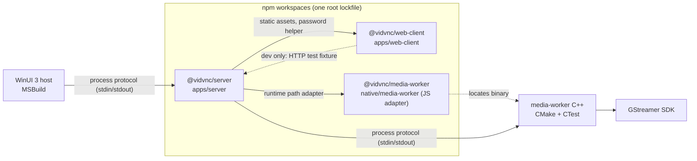
```mermaid
flowchart LR
    subgraph npm["npm workspaces (one root lockfile)"]
        server["@vidvnc/server<br/>apps/server"]
        web["@vidvnc/web-client<br/>apps/web-client"]
        mw["@vidvnc/media-worker<br/>native/media-worker (JS adapter)"]
    end
    cpp["media-worker C++<br/>CMake + CTest"]
    host["WinUI 3 host<br/>MSBuild"]
    gst["GStreamer SDK"]

    server -->|"static assets, password helper"| web
    server -->|"runtime path adapter"| mw
    web -.->|"dev only: HTTP test fixture"| server
    mw -.->|"locates binary"| cpp
    cpp --> gst
    host -->|"process protocol (stdin/stdout)"| server
    server -->|"process protocol (stdin/stdout)"| cpp
```

- The Node server depends on the web client's exported assets and password helper,
  and the native worker's small exported JS runtime-path adapter.
- Native C++ does not depend on Node. CMake owns its targets, SDK linkage and CTest
  registration. Its private npm manifest only exposes launch configuration and
  its existing Node-driven hardware tests; npm does not compile C++ itself.
- Browser production code does not import the server. Its dev-only server dependency
  supplies a local HTTP fixture for UI smoke tests.
- WinUI owns its MSBuild/XAML project and launches Node through the existing process
  protocol. It does not depend on npm to compile its UI.
- Future Apple apps should use Swift/SwiftUI/AppKit and native Xcode/SPM targets,
  with their own tests. Future Windows viewers should use WinUI 3. The explicitly
  requested ownership scaffolds are not runnable projects; do not invent a shared
  native abstraction before it has users.
- Extract genuinely shared protocol/validation code into a package when needed;
  do not duplicate it or introduce a generic `shared` dumping ground now.
- Encoder knowledge is split deliberately and must stay split. `video-codec.hpp` holds
  bitstream facts that are true of a codec anywhere (caps, parser, payloader, rtpmap);
  `encoder-backend.hpp` holds one row per hardware family, because the four families do
  not agree on property names and AMF does not agree with itself across its own codecs.
  Encoder property strings are built by asking the GStreamer element class what it
  declares, never by concatenating literals: a name an element lacks fails
  `gst_parse_launch` and loses the whole vendor, whereas a skipped property is logged and
  survives. The server learns backends from the probe as data and never names an element.
  Minimum input size belongs to the element, not the codec.

The cross-process JSON/stdin/stdout and WebRTC contracts remain unchanged in this
migration. Stream profiles, H.264/Opus settings, input and session ownership remain
unchanged. Modules resolve resources relative to their own location, not launch CWD.

## Build, dependencies, and tests

One root npm workspace lockfile pins JS dependencies. Use `npm ci` from the root;
no separate nested npm lockfiles. CMake presets coordinate native configurations;
MSBuild remains authoritative for WinUI. Keep generated files out of source control.
GStreamer development headers and runtime DLLs must come from the same SDK install.
Using a custom CMake SDK path requires the matching runtime `GSTREAMER_ROOT` too.

`npm test` is portable and uses stubbed hardware. `npm run test:hardware` explicitly
requires Windows 25H2+, a GPU with a supported hardware encoder (NVIDIA, Intel or AMD)
and an interactive desktop. CTest registers the native unit suites; assert-based checks
remain enabled in Release.
The GitHub Actions workflow `Portable checks` runs formatting and portable tests on
Windows, macOS and Linux. It runs only when started manually from the Actions tab, not
on pushes or pull requests. It does not claim native capture support on those other
OSes or replace device acceptance tests.

Existing opt-in browser checks require an installed Playwright module path:

```powershell
node apps/web-client/tests/toolbar-browser-check.mjs C:\path\to\playwright
node tests/system/browser-media-check.mjs C:\path\to\playwright iphone-720p-test
node native/media-worker/tests/relay-check.mjs C:\path\to\playwright
node native/media-worker/tests/sandbox-check.mjs
```

`relay-check.mjs` checks the media relay's core with a loopback-only worker
(`VIDVNC_ICE_BIND=loopback`) against headless Chromium, and reports gates P1 and P2 of the
[R4 design](superpowers/specs/2026-09-26-r4-media-relay-and-privilege-split-design.md).
`sandbox-check.mjs` runs gate P3: `sandbox-probe.exe` starts itself under the planned sandbox for
the network process and reports what it can and cannot do. If the full sandbox fails, it runs
the probe again with one part turned off at a time (`sandbox-probe --relax <part>`) and shows
which part the failure depends on. When it passes, it runs gate P4: the probe again with
Arbitrary Code Guard and Win32k lockdown turned on (`--harden`), reporting what breaks. The
sandbox is not part of the product yet.

The second captures the real desktop and requires Windows and a hardware encoder.
Chromium with an
iPhone user-agent tests routing, not Safari or iPhone hardware decoding.

## Platform target

Windows SDK 26100 is the compilation target; runtime preflight enforces Windows build
26200 (25H2).
