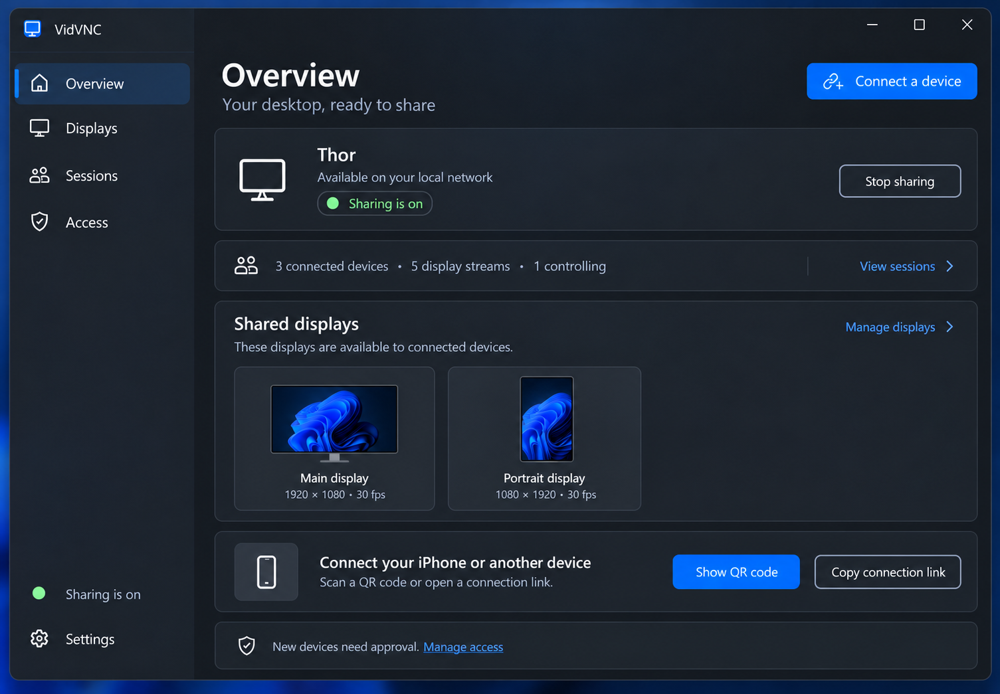
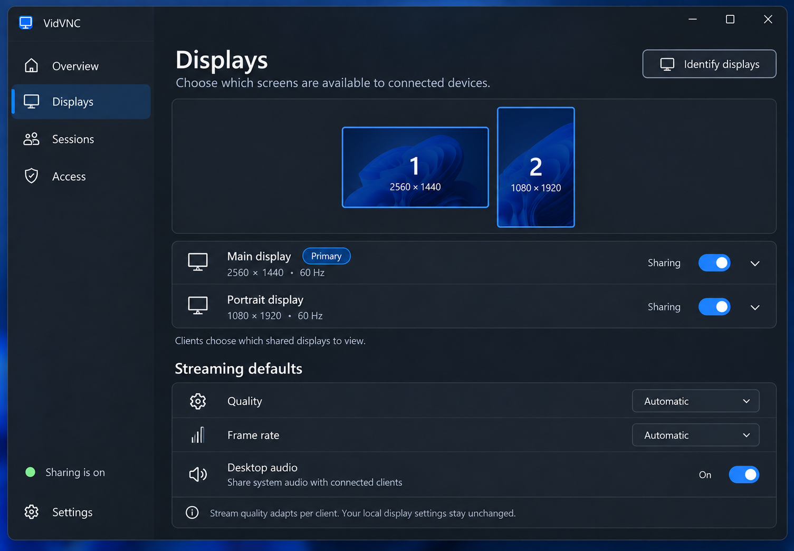
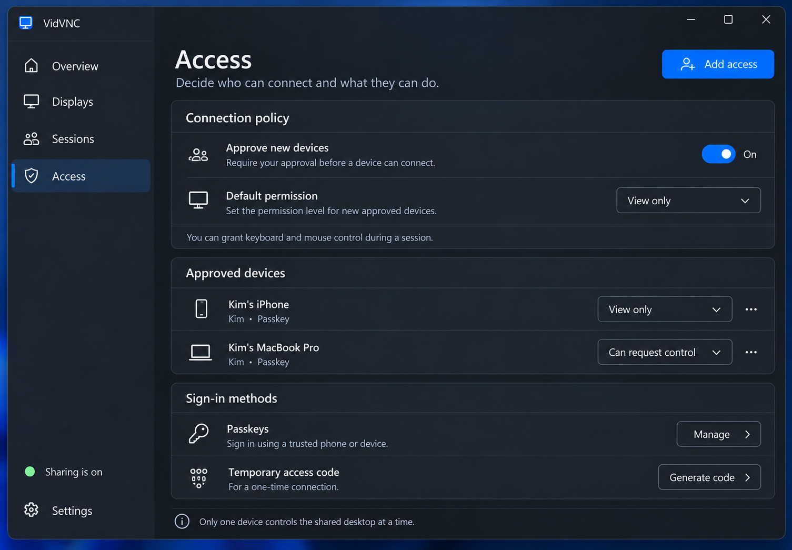
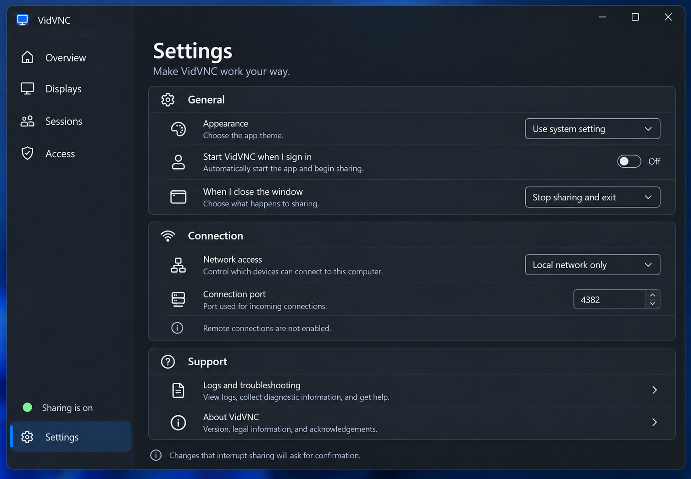

# Windows host page previews

Generated with the built-in image tool. These are future-product UX concepts, not evidence of implemented functionality. Example devices, passkeys, approval, multi-monitor and multi-session data are illustrative. Sharing status sits above Settings. Opening at sign-in should not implicitly grant remote access; final behavior requires a separate explicit sharing preference.

## Identify displays

Approved on 2026-09-14: [identify-v1.png](identify-v1.png). Show a compact numbered
dark label near the bottom-left of each current physical monitor for three seconds.
Use the same numbering as Displays. No focus stealing, task-switcher entry, screen
capture or monitor-setting changes. Replace labels on repeated invocation and
dismiss them when inventory changes, sharing stops or the host closes. Position
inside the monitor work area so labels do not cover its taskbar.

## Session stability addition

Approved layout: [session-stability-v1.png](session-stability-v1.png). Compact stream
details on the left, inline 60-second graph on the right, no nested graph card.
The user's follow-up supersedes the single trace in that mockup: plot capture,
encode, and decode FPS on one shared scale using the same timestamped sources as
web Diagnostics. Preserve missing-data gaps rather than inventing zeroes or
interpolating across missing samples. At narrow widths the graph wraps below.

Markers report interval changes in frame drops, freezes, and PLI/FIR recovery
requests; recovery requests do not claim successful recovery. Hover/tap exposes
interval details, packet loss, RTT, and jitter. History is bounded to the current
session and latest minute. Light/dark palettes retain distinct traces and shapes.
The Sessions header opens the local Diagnostics page at the active server port.

## overview

Prompt:

Use case ui-mockup. Generate one high-fidelity native Windows 11 WinUI 3 VidVNC HOST application concept. The attached image is a STYLE AND SHELL REFERENCE, not content to copy. Preserve its window proportions, charcoal Mica, Segoe UI, blue accent, authentic Windows titlebar and Fluent line icons. Landscape complete window, crisp readable type. No browser chrome, no POC, no developer dashboard. Left navigation Overview, Displays, Sessions, Access; IMPORTANT bottom sidebar must have green dot 'Sharing is on' ABOVE 'Settings' which is the bottom-most item. Select the requested page only. Fixed window size, all content and footer visible. This is a future full-product UX concept, illustrative state not a working feature claim. Page Overview. Heading 'Overview', subtitle 'Your desktop, ready to share'. Top right blue 'Connect a device'. Compact status card 'Thor' with green 'Sharing is on', 'Available on your local network', secondary 'Stop sharing'. Below single understated summary row '3 connected devices · 5 display streams · 1 controlling', link 'View sessions'. Midpane 'Shared displays' with two modest monitor representations landscape 1 'Main display' and portrait 2 'Portrait display', link 'Manage displays'; NOT massive thumbnails. Lower pairing card phone icon, 'Connect your iPhone or another device', text 'Scan a QR code or open a connection link.', primary small 'Show QR code', secondary 'Copy connection link'. Do not render an actual QR. Bottom informative unobtrusive line 'New devices need approval. Manage access'. Compact refined WinUI layout.

## displays

The approved flat-settings revision is [displays-flat-defaults-v2.png](displays-flat-defaults-v2.png).
It supersedes nested Host defaults and display-detail cards: use flat setting rows
with separators, profile selectors instead of independent quality/fps controls,
and footer Apply/Cancel. Unsupported per-display allowed-profile selection stays
disabled without a placeholder label.

Prompt:

Use case ui-mockup. Generate one high-fidelity native Windows 11 WinUI 3 VidVNC HOST application concept. The attached image is a STYLE AND SHELL REFERENCE, not content to copy. Preserve its window proportions, charcoal Mica, Segoe UI, blue accent, authentic Windows titlebar and Fluent line icons. Landscape complete window, crisp readable type. No browser chrome, no POC, no developer dashboard. Left navigation Overview, Displays, Sessions, Access; IMPORTANT bottom sidebar must have green dot 'Sharing is on' ABOVE 'Settings' which is the bottom-most item. Select the requested page only. Fixed window size, all content and footer visible. This is a future full-product UX concept, illustrative state not a working feature claim. Page Displays. Heading 'Displays', subtitle 'Choose which screens are available to connected devices'. Top right 'Identify displays' neutral button. Compact monitor arrangement diagram landscape rectangle numbered1 left and portrait rectangle numbered2 right, both blue subtle borders, exact different orientations. Below two native setting cards: 'Main display' badge 'Primary', '2560 × 1440 · 60 Hz', sharing ToggleSwitch On; second 'Portrait display', '1080 × 1920 · 60 Hz', sharing ToggleSwitch On. Small subordinate text 'Clients choose which shared displays to view.' Lower section 'Streaming defaults', native settings rows 'Quality' dropdown 'Automatic', 'Frame rate' dropdown 'Automatic', 'Desktop audio' ToggleSwitch On. Footer help text 'Stream quality adapts per client. Your local display settings stay unchanged.' Do not imply the host controls arrangement of physical client monitors. Native tasteful compact controls.

## access

Prompt:

Use case ui-mockup. Generate one high-fidelity native Windows 11 WinUI 3 VidVNC HOST application concept. The attached image is a STYLE AND SHELL REFERENCE, not content to copy. Preserve its window proportions, charcoal Mica, Segoe UI, blue accent, authentic Windows titlebar and Fluent line icons. Landscape complete window, crisp readable type. No browser chrome, no POC, no developer dashboard. Left navigation Overview, Displays, Sessions, Access; IMPORTANT bottom sidebar must have green dot 'Sharing is on' ABOVE 'Settings' which is the bottom-most item. Select the requested page only. Fixed window size, all content and footer visible. This is a future full-product UX concept, illustrative state not a working feature claim. Page Access. Heading 'Access', subtitle 'Decide who can connect and what they can do'. Top right primary 'Add access'. Compact section 'Connection policy': 'Approve new devices' ToggleSwitch On; 'Default permission' dropdown 'View only'. Helper 'You can grant keyboard and mouse control during a session.' Section 'Approved devices', two compact real-looking illustrative rows: phone icon 'Kim’s iPhone', subtext 'Kim · Passkey', permission 'View only', menu ellipsis; laptop icon 'Kim’s MacBook Pro', subtext 'Kim · Passkey', permission 'Can request control', menu ellipsis. Section 'Sign-in methods' native row key icon 'Passkeys', subtitle 'Sign in using a trusted phone or device', right 'Manage'; native row 'Temporary access code', subtitle 'For a one-time connection', right 'Generate code'. Restrained bottom info 'Only one device controls the shared desktop at a time.' No sample passwords, no QR, no giant avatars, no claims of secure HTTP.

## settings

Prompt:

Use case ui-mockup. Generate one high-fidelity native Windows 11 WinUI 3 VidVNC HOST application concept. The attached image is a STYLE AND SHELL REFERENCE, not content to copy. Preserve its window proportions, charcoal Mica, Segoe UI, blue accent, authentic Windows titlebar and Fluent line icons. Landscape complete window, crisp readable type. No browser chrome, no POC, no developer dashboard. Left navigation Overview, Displays, Sessions, Access; IMPORTANT bottom sidebar must have green dot 'Sharing is on' ABOVE 'Settings' which is the bottom-most item. Select the requested page only. Fixed window size, all content and footer visible. This is a future full-product UX concept, illustrative state not a working feature claim. Page Settings. Heading 'Settings', subtitle 'Make VidVNC work your way'. Selected bottom-most Settings row with status Sharing is on immediately ABOVE it. Native stacked settings cards grouped 'General': 'Appearance' dropdown 'Use system setting'; 'Start VidVNC when I sign in' ToggleSwitch Off; 'When I close the window' dropdown 'Stop sharing and exit'. Group 'Connection': 'Network access' dropdown 'Local network only'; 'Connection port' compact numeric field '4382'; small info 'Remote connections are not enabled.' Group 'Support': 'Logs and troubleshooting' chevron row; 'About VidVNC' chevron row. Bottom subdued text 'Changes that interrupt sharing will ask for confirmation.' No Apply button unless needed, no codec jargon, no debug output, no giant blank areas. Clear normal native font and icon hierarchy.
