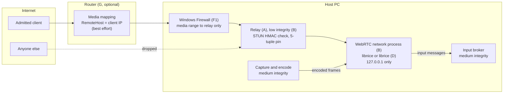

# R4 hardening: design options

**Status: options, recommendation and selection, 2026-09-26.** Options **A**, **F1** and **B**
were selected on 2026-09-26; their design is
[R4: authenticating media relay, firewall rules and privilege split](../superpowers/specs/2026-09-26-r4-media-relay-and-privilege-split-design.md).
The design review then decided to route **every** session through the relay, LAN included,
rather than remote access first as recommended below (decision point 3). Option **A** is
implemented (phase 1 of that design, validated end to end on Windows); **F1** and
**B** are not yet. This document collects the analysis that led to that choice for finding
[R4](internet-exposure.md#r4-native-parsing-is-reachable-before-authentication-on-the-media-ports-open-reduced)
(native parsing reachable before authentication on the media ports).

Constraint for every option: **no third-party service or operator** (no hosted relay, no
cloud TURN, no external scanner). Bundled open-source code is allowed but is called out
where an option depends on it.

Sources are listed at the end. Claims marked _(unverified)_ come from search summaries
because the primary page was blocked from the research environment; confirm them before
relying on them.

## Contents

- [The problem](#the-problem)
- [Evaluation criteria](#evaluation-criteria)
- [Summary of options](#summary-of-options)
- [Option A: authenticating UDP relay](#option-a-authenticating-udp-relay)
- [Option B: privilege split and sandboxing](#option-b-privilege-split-and-sandboxing)
- [Option C: media over the authenticated HTTPS connection](#option-c-media-over-the-authenticated-https-connection)
- [Option D: memory-safe ICE stack](#option-d-memory-safe-ice-stack)
- [Option E: ICE-TCP on the HTTPS port](#option-e-ice-tcp-on-the-https-port)
- [Option F: host firewall configuration](#option-f-host-firewall-configuration)
- [Option G: automatic router configuration](#option-g-automatic-router-configuration)
- [How the options combine](#how-the-options-combine)
- [Recommendation](#recommendation)
- [Decision points](#decision-points)
- [Open questions to prototype](#open-questions-to-prototype)
- [Sources](#sources)

## The problem

With remote access on, each source worker's `webrtcbin` binds libnice UDP sockets in the
forwarded `media-ports` range
([media-worker.cpp](../../native/media-worker/src/media-worker.cpp), the `ice-agent`
`min-rtp-port`/`max-rtp-port` setup; ICE-TCP is turned off when a range is set). While a
stream is live, anyone who can reach those ports can make libnice parse a STUN message
before its MESSAGE-INTEGRITY is checked. DTLS and the input data channel only follow a
successful ICE check, which needs credentials from the authenticated signaling.

The risk has two separable parts:

| Part         | Today                                                                                                               |
| ------------ | ------------------------------------------------------------------------------------------------------------------- |
| **Exposure** | Unauthenticated internet senders reach a C parser (libnice STUN over UDP) in the media worker.                      |
| **Impact**   | That worker runs as the desktop user, unsandboxed, and holds `SendInput`. A parser exploit becomes input injection. |

No defect in libnice is known. Searches found no libnice STUN CVE, while STUN parsers in
other C projects have had exploitable length-handling bugs (Sofia-SIP CVE-2023-22741 and
CVE-2023-32307; coturn parsing past MESSAGE-INTEGRITY, fixed in 4.15.0). The concern is
the class of bug, not a known one.

The same ports are reachable by every LAN peer with remote access off; the options below
mostly target the internet case but several also help on the LAN.

## Evaluation criteria

1. **Exposure reduction:** does an unauthenticated sender still reach native parsing?
2. **Impact reduction:** if the network-facing code is exploited, what does the attacker get?
3. **Compatibility:** browsers (including iPhone Safari), routers, existing clients.
4. **Latency and quality:** extra hops, head-of-line blocking, loss behaviour.
5. **Privilege:** does it need administrator rights at install or at runtime?
6. **Effort and risk:** new code, new dependencies, maturity.
7. **Verifiability:** can VidVNC itself confirm the control is in force?

## Summary of options

| #   | Option                                                                  | Exposure                       | Impact              | Browser change | Admin needed                    | Effort               | Verifiable by VidVNC |
| --- | ----------------------------------------------------------------------- | ------------------------------ | ------------------- | -------------- | ------------------------------- | -------------------- | -------------------- |
| A   | Authenticating UDP relay, worker on loopback                            | **Closed** to unauthenticated  | —                   | None           | No                              | Medium               | Yes                  |
| B   | Privilege split: low-integrity network process, separate input broker   | —                              | **Large reduction** | None           | No                              | Medium–high          | Yes                  |
| C   | Media over the HTTPS connection (WebSocket or WebTransport + WebCodecs) | **Removed** (no media ports)   | Removed with it     | Rewrite player | No                              | High                 | Yes                  |
| D   | Memory-safe ICE (librice via `webrtcbin2`)                              | Same reach, memory-safe parser | —                   | None           | No                              | Low–medium if mature | Yes                  |
| E   | ICE-TCP multiplexed on the HTTPS port                                   | None alone                     | —                   | None           | No                              | Medium               | Yes                  |
| F   | Host firewall rules                                                     | Narrowed (by address)          | —                   | None           | Install; runtime for per-client | Low–medium           | Yes (locally)        |
| G   | Automatic router configuration (UPnP IGD, PCP)                          | Narrowed, best effort          | —                   | None           | No (router must allow UPnP)     | Medium               | **No**               |

## Option A: authenticating UDP relay

**Idea.** Move the first contact with internet UDP out of libnice and into a small
memory-safe process that has no input rights, and let only authenticated peers through.

**How it works.**

1. In remote mode the worker's ICE sockets bind to `127.0.0.1` only. The relay owns the
   forwarded public `media-ports` range.
2. The server already returns the worker's SDP answer, so it knows the worker's ICE
   username fragment and password for each peer. It hands the relay, per admitted stream:
   the ufrag, the password, the client's source IP from its HTTPS socket, and the worker's
   loopback port.
3. For an unknown sender, the relay accepts only a STUN Binding request that:
   - comes from the client's HTTPS source IP (optional, see CGNAT below);
   - carries `USERNAME` = `<worker ufrag>:<client ufrag>` for a live stream;
   - has a `MESSAGE-INTEGRITY` HMAC-SHA1 that verifies with that stream's password, computed
     exactly as RFC 5389 specifies (the length field covers up to and including
     MESSAGE-INTEGRITY; FINGERPRINT follows it).
     Everything else is dropped without a reply.
4. After a valid check, the relay pins that 5-tuple to the stream and forwards all its
   packets (STUN consent checks, DTLS, SRTP, SCTP) both ways between the client and one
   loopback socket per peer. Packets from any other tuple are dropped.
5. The pin is removed when the stream ends, consent checks stop, or the session ends.

**What it closes.** libnice then only sees traffic from peers that proved knowledge of the
ICE password delivered over authenticated HTTPS. The pre-authentication parser that
remains is the relay's: a few hundred lines that read a STUN header, walk attributes with
bounds checks, and compute one HMAC, in memory-safe code, in a process that can neither
capture nor inject input.

**Implementation choices.**

- In the Node server with `dgram`: no new language; per-packet cost is small at desktop
  bitrates (thousands of packets per second), but media then shares the server's event
  loop with signaling and TLS. Measure jitter.
- As a separate small process (Rust or Node) spawned by the server: isolates media
  forwarding from signaling, and can itself run at low integrity (see Option B).

**Costs and risks.**

- One extra local hop in both directions; expected well under a millisecond, to be measured.
- The relay must mirror ICE behaviour closely enough that libnice and the browser still
  agree (loopback candidates in the worker, public candidates in the answer, consent
  freshness). A prototype must confirm webrtcbin accepts peers arriving via loopback.
- Source-IP matching does not help when many clients share one address (carrier-grade
  NAT); the HMAC check is the real gate there.
- A peer whose address changes mid-stream (Wi-Fi to mobile) must re-authenticate with a
  new valid check before the new tuple is pinned.

**Applies to** remote mode first; could also be used on the LAN to stop unadmitted LAN
peers reaching libnice.

## Option B: privilege split and sandboxing

**Idea.** Reduce what an exploit in network-facing code can do, even if it is reached.

**Structure.**

| Process            | Integrity / token                               | Does                                                                                      | Must not have                   |
| ------------------ | ----------------------------------------------- | ----------------------------------------------------------------------------------------- | ------------------------------- |
| Capture and encode | Medium (the desktop user)                       | DXGI duplication, WASAPI, hardware encode; writes encoded frames out                      | Network sockets                 |
| Network (WebRTC)   | **Low integrity**, restricted token, job object | ICE, DTLS, SRTP, SCTP; reads encoded frames in; writes input messages out                 | `SendInput` effect, file access |
| Input broker       | Medium                                          | Receives input messages; applies the lease, allow-lists and rate limit; calls `SendInput` | Network sockets                 |

**Why low integrity helps with input.** User Interface Privilege Isolation (UIPI) blocks a
lower-integrity process from sending input or window messages to higher-integrity windows.
A low-integrity network process therefore cannot inject input into the user's medium
integrity desktop directly; it can only ask the broker, which enforces the existing
permission lease. Low-integrity processes are created with `CreateProcessAsUser` and a
low-integrity token; child processes inherit the parent's level by default.

**Why capture stays at medium.** `IDXGIOutput1::DuplicateOutput` returns
`E_ACCESSDENIED` when the caller lacks access to the current desktop image. Whether a
low-integrity or AppContainer process can duplicate the normal desktop is not documented;
treat it as not possible until a prototype shows otherwise. Windows.Graphics.Capture is
available to AppContainer apps with the `graphicsCapture` capability, but it is a different
capture path from the current `d3d11screencapturesrc` pipeline.

**Why not AppContainer for the network process (yet).** AppContainer blocks inbound
connections unless the app has `internetClientServer` or `privateNetworkClientServer`
capabilities **and** a firewall filter permits inbound traffic; for packaged apps the
installer registers that filter. Loopback to other processes is blocked unless exempted.
That makes it workable only with install-time firewall setup (Option F) and a loopback
exemption, so low integrity plus a restricted token and job object is the simpler first
step. Chromium's Windows sandbox combines restricted tokens, job objects, alternate
desktops and integrity levels in the same way.

**Costs and risks.**

- The GStreamer pipeline is split across processes: encoded frames (small) cross from the
  capture process to the network process, for example over shared memory or a pipe. Raw
  frames stay in the capture process on the GPU.
- Keyframe requests and bitrate feedback must flow back from network to encoder.
- More processes to start, supervise and tear down under the existing job object.
- Does not reduce exposure by itself; pairs naturally with Option A.

**Applies to** LAN and remote mode alike.

## Option C: media over the authenticated HTTPS connection

**Idea.** Remove the media ports entirely: carry encoded video, audio and input over the
same authenticated TLS connection as signaling, and decode in the browser with WebCodecs.

**Variants.**

| Variant         | Transport                         | Server side                                                                                                                                                  | Loss behaviour                                    |
| --------------- | --------------------------------- | ------------------------------------------------------------------------------------------------------------------------------------------------------------ | ------------------------------------------------- |
| C1 WebSocket    | TLS over TCP, existing HTTPS port | Node's existing HTTPS server: **no new pre-auth parser**                                                                                                     | Head-of-line blocking: one lost packet stalls all |
| C2 WebTransport | HTTP/3 over QUIC (UDP)            | Needs an HTTP/3 stack: Node's `node:quic` is experimental and behind a compile-time flag; Windows has MsQuic, but that is again native code parsing pre-auth | Unreliable datagrams avoid stalls                 |

**Browser support.** WebCodecs video decoding is in Safari since 16.4 and audio since 26;
H.264 is the safest codec, HEVC support is best on Apple platforms. WebTransport is Baseline
since Safari 26.4 (March 2026). Both need a secure context, which VidVNC already has.

**What VidVNC would have to build in the browser.** A jitter buffer, A/V sync, audio playout
(AudioDecoder plus an AudioWorklet), frame pacing, congestion and bitrate control (today
supplied by WebRTC), keyframe recovery, and rendering to a canvas. Picture-in-Picture and
iOS full-screen behaviour would need re-checking because they currently rely on a `video`
element with a WebRTC stream.

**Costs and risks.** The largest change of all options. C1 is simple and adds no parser but
suffers on lossy internet links; C2 performs better but reintroduces native pre-auth parsing
unless a memory-safe HTTP/3 stack is used. A reasonable use is as a fallback transport
(for networks that block UDP), not as the first fix for R4.

For comparison, Moonlight/Sunshine keep separate UDP media streams but encrypt video, audio
and control with keys from a PIN pairing, so that design also accepts pre-auth UDP parsing.

## Option D: memory-safe ICE stack

**Idea.** Keep the architecture, replace the C parser. GStreamer's new Rust `webrtcbin2`
(split `webrtcsend`/`webrtcrecv` elements) uses **librice**, a sans-IO ICE implementation in
Rust, and handles DTLS internally.

**Status.** `webrtcbin2` was announced in May 2026 _(unverified: the announcement page was
blocked; details come from search summaries)_. librice is on crates.io (0.4.x). Feature
parity with `webrtcbin` for what VidVNC uses (data channels for input, max-bundle, port
ranges, payload-type handling) is unknown.

**Costs and risks.** Low effort if the elements are a near drop-in; high if VidVNC's
payload-type and SSRC work-arounds must be redone. Exposure is unchanged (still pre-auth
parsing on the internet), but memory-corruption risk in that parser drops sharply. Worth
tracking as a medium-term replacement regardless of the other choices.

## Option E: ICE-TCP on the HTTPS port

**Idea.** Multiplex ICE-TCP (RFC 6544, RFC 4571 framing) onto the HTTPS port by
demultiplexing on the first bytes (TLS versus framed STUN), so only one port is forwarded.

**Assessment.** Fewer ports, but the STUN still reaches a parser before authentication, and
TCP brings head-of-line blocking. Only useful combined with Option A's check performed by
the demultiplexer, and even then Option A over UDP is simpler. Not recommended as an R4 fix.

## Option F: host firewall configuration

**Today.** VidVNC creates no firewall rules. Windows prompts when the worker first listens,
and the resulting permission covers the executable on every port
([README](../../README.md#sdk-and-build-locations),
[remote access guide](remote-access.md), [packaging](../../packaging/windows/README.md)).

**Facts.** Adding or changing Windows Firewall rules requires administrator rights. An MSIX
package can declare inbound rules at install (`desktop2:FirewallRules`): executable,
direction, protocol, local and remote ports, profile, but no remote address. Windows
Firewall **dynamic keyword addresses** let one rule refer to an address list that a
component updates at runtime; updating it is a firewall policy change _(the exact rights
needed are unverified; assume administrator)_.

**Sub-options.**

| Sub-option                          | What it gives                                                                                                                                                            | Needs                                                                                                |
| ----------------------------------- | ------------------------------------------------------------------------------------------------------------------------------------------------------------------------ | ---------------------------------------------------------------------------------------------------- |
| F1 Install-time rules               | Server: HTTPS port only. Relay (Option A): media range only. **Worker: no inbound rule at all** when it listens on loopback. Replaces the broad "allow this app" prompt. | Admin once, at install (MSIX manifest or installer)                                                  |
| F2 Per-client dynamic rule          | Media range allowed only from admitted clients' public addresses, enforced by the OS                                                                                     | A small elevated helper service (LocalSystem) with a one-command pipe interface restricted to VidVNC |
| F3 WFP filters via `FwpmFilterAdd0` | Same as F2 with finer control                                                                                                                                            | Also administrator; more code                                                                        |

**Assessment.** F1 is cheap and clearly worth doing. F2/F3 add OS-enforced address filtering
but introduce a privileged component, which is a new attack surface of its own; address
filtering is also weaker than Option A's password check.

## Option G: automatic router configuration

**Idea.** Configure the owner's router automatically, and where possible restrict forwarded
media ports to the one client's public address.

**Protocols.**

| Protocol                                       | Per-client filtering                                                                                                                                      | Notes                                                                                                                                                |
| ---------------------------------------------- | --------------------------------------------------------------------------------------------------------------------------------------------------------- | ---------------------------------------------------------------------------------------------------------------------------------------------------- |
| UPnP IGD `AddPortMapping`, IPv4                | `NewRemoteHost` = client IP. Required by IGD v2; v1 only required the wildcard. Routers without support return error 726 `RemoteHostOnlySupportsWildcard` | IGD v2 leases: up to 7 days, 1 hour recommended                                                                                                      |
| UPnP IGD `WANIPv6FirewallControl` `AddPinhole` | Remote host in the pinhole, by spec                                                                                                                       | Rarely deployed                                                                                                                                      |
| PCP `MAP` with `FILTER` (RFC 6887)             | Remote address, prefix and port, by spec                                                                                                                  | **miniupnpd parses FILTER but does not enforce it** (`/* TODO fully implement filter */`): the router reports success and opens the port to everyone |
| NAT-PMP                                        | None                                                                                                                                                      | Superseded by PCP                                                                                                                                    |

**What routers do.** miniupnpd, used by most Linux-based routers, honours a specific
`RemoteHost` only when built for nftables, iptables, pf or ipfw (its `SUPPORT_REMOTEHOST`
build flag); vendor and ISP firmware varies. Consumer routers mostly offer UPnP IGD only;
PCP is common on OpenWrt, OPNsense, pfSense and FRITZ!Box (FRITZ!OS 6.50 and later).

**Proposed behaviour, if chosen ("Automatic router setup", off by default).**

1. HTTPS port: wildcard mapping, because sign-in must be reachable from anywhere.
2. Media ports: one mapping per live stream, created only after sign-in, with
   `NewRemoteHost` = the client's public address; lease about 1 hour, renewed while the
   stream is live, deleted when it ends. IPv6 pinholes where offered.
3. On error 726, **do not** fall back to a wildcard automatically; tell the owner and keep
   the manual forward.
4. Read the entry back with `GetSpecificPortMappingEntry` to confirm the remote host was
   stored, and say in the UI that router filtering is not verified.
5. Never use PCP FILTER as a security control.
6. Implement the client in Node (SSDP discovery and SOAP) with bounded, validated parsing:
   router replies are untrusted LAN input. Don't use the legacy Windows `NATUPnP` COM API
   (IGD v1 only, no leases).

**Costs and risks.**

- UPnP is unauthenticated on the LAN: any compromised LAN device can add or remove the same
  mappings. Security guidance after CallStranger (CVE-2020-12695) is to disable UPnP where
  it isn't needed, and this feature asks owners to enable it.
- VidVNC cannot verify from inside the LAN that the router enforces the filter, and a
  third-party external probe is excluded by the constraint.
- Useful mainly as convenience (no manual forwarding) with some best-effort narrowing; it
  must never be the control that R4 depends on.

## How the options combine

A layered selection keeps each layer honest about what it guarantees: A is the
authentication gate, B limits the damage, F1 removes needless exposure, D shrinks the
parser risk over time, G is convenience.

## Recommendation

Proposed, not yet decided. Build in this order:

| Order | Option                                     | Decision                                                  | Why                                                                                                                                                                                  |
| ----- | ------------------------------------------ | --------------------------------------------------------- | ------------------------------------------------------------------------------------------------------------------------------------------------------------------------------------ |
| 1     | **A** Authenticating UDP relay             | **Do first**, as a separate process, in remote mode first | The only option that stops unauthenticated internet senders reaching the C parser, with no browser change, no administrator rights and no router dependency, and VidVNC can check it |
| 2     | **F1** Install-time firewall rules         | **Do** alongside A                                        | Cheap. Once the worker listens on loopback it needs no inbound rule, which removes the broad "allow this app" permission                                                             |
| 3     | **B** Privilege split                      | **Do next**                                               | Limits what an exploit in network-facing code can do, on the LAN as well as the internet. More work: the pipeline is split across processes                                          |
| 4     | **D** Memory-safe ICE (`webrtcbin2`)       | **Track**; evaluate when feature parity is known          | Shrinks the parser risk without changing the architecture, but it is new and its feature coverage for VidVNC is unknown                                                              |
| 5     | **G** Automatic router configuration       | **Keep manual** for now; opt-in convenience at most later | Per-client filtering is unreliable (error 726 on many routers, PCP FILTER not enforced by miniupnpd), VidVNC cannot verify it, and it needs UPnP enabled                             |
| 6     | **C** Media over HTTPS                     | **Park** as a possible fallback for UDP-blocked networks  | Removes the media ports but means rewriting the player; WebSocket stalls on lossy links and WebTransport needs a new HTTP/3 stack                                                    |
| —     | **E** ICE-TCP on the HTTPS port            | **Don't**                                                 | Fewer ports but the same pre-authentication parsing, plus TCP head-of-line blocking                                                                                                  |
| —     | **F2/F3** Per-client firewall via a helper | **Don't**, unless OS-enforced address filtering is wanted | Needs a new privileged service, and filtering by address is weaker than A's password check                                                                                           |

**Gate before committing to A:** a prototype must show that `webrtcbin` completes ICE and DTLS
when the peer's packets arrive through a loopback relay while the answer advertises the
public address, and measure the latency and jitter the relay adds (see
[open questions](#open-questions-to-prototype)). If either fails, revisit decision point 1:
the fallback is B plus D, with C for the longer term.

**What R4 becomes after steps 1–3:** unauthenticated senders reach only the relay's small,
memory-safe STUN check, in a process with no input rights; libnice sees only peers that hold
the session's ICE password; and an exploit in the network process can no longer inject input
directly. R4 could then be recorded as mitigated, with the relay's parser as the residual.

## Decision points

1. **Primary exposure control:** Option A (relay), Option C (no media ports), or accept the
   exposure and rely on B and D?
2. **Where the relay runs** (if A): inside the Node server, or a separate process (Node or
   Rust), and at which integrity level?
3. **Scope of A:** remote mode only, or also the LAN?
4. **Privilege split** (B): now, later, or not at all? If now, which inter-process transport
   for encoded frames and input?
5. **Firewall:** adopt F1 install-time rules? Accept a privileged helper for F2?
6. **Router automation** (G): build it as opt-in convenience, or keep manual forwarding
   only?
7. **ICE stack** (D): track `webrtcbin2` and evaluate once feature parity is known?
8. **Fallback transport** (C1): worth adding for UDP-blocked networks, independent of R4?

The [recommendation](#recommendation) above answers each of these; confirm or change it.

## Open questions to prototype

- Does `webrtcbin` complete ICE and DTLS when the peer's packets arrive from a loopback
  relay while the answer advertises the public address? (A)
- Measured latency and jitter added by the relay at 1080p60 and 4K bitrates. (A)
- Can a low-integrity process run libnice/webrtcbin and exchange frames with the capture
  process with no visible latency cost? Can it duplicate the desktop at all? (B)
- What does `webrtcbin2` support today, and on Windows? (D)
- On a sample of routers: does `AddPortMapping` with a specific `RemoteHost` succeed, and
  does the router actually drop other sources? (G, needs a second internet connection the
  owner controls, such as mobile data)
- Exact rights needed to update a firewall dynamic keyword address. (F2)

## Sources

Code in this repository:

- [media-worker.cpp](../../native/media-worker/src/media-worker.cpp) (ICE port range and ICE-TCP),
  [ice-ports.hpp](../../native/media-worker/src/ice-ports.hpp),
  [native-media.mjs](../../apps/server/src/native-media.mjs) (`VIDVNC_ICE_PORTS`)

STUN, ICE and WebRTC:

- [RFC 6887: Port Control Protocol](https://www.rfc-editor.org/rfc/rfc6887.html)
- [RFC 6544: TCP candidates with ICE](https://datatracker.ietf.org/doc/html/rfc6544)
- [libnice StunAgent reference](https://libnice.freedesktop.org/libnice/libnice-StunAgent.html)
- [coturn: attributes after MESSAGE-INTEGRITY](https://hol.org/guard/security/cves/CVE-2026-68554-coturn-stun-attributes-after-message-integrity)
- [NVD CVE-2023-22741](https://nvd.nist.gov/vuln/detail/cve-2023-22741), [NVD CVE-2023-32307](https://nvd.nist.gov/vuln/detail/cve-2023-32307)
- [webrtcbin documentation](https://gstreamer.freedesktop.org/documentation/webrtc/index.html)
- [Centricular: webrtcbin2](https://centricular.com/devlog/2026-05/webrtcbin2/) _(blocked; summarised from search)_
- [librice](https://github.com/ystreet/librice), [crates.io](https://crates.io/crates/librice)
- [Sunshine UDP streaming (DeepWiki)](https://deepwiki.com/LizardByte/Sunshine/4.4-udp-streaming-and-data-plane),
  [Moonlight FAQ](https://github.com/moonlight-stream/moonlight-docs/wiki/Frequently-Asked-Questions)

Windows sandboxing and input:

- [User Interface Privilege Isolation](https://en.wikipedia.org/wiki/User_Interface_Privilege_Isolation)
- [IDXGIOutput1::DuplicateOutput](https://learn.microsoft.com/en-us/windows/win32/api/dxgi1_2/nf-dxgi1_2-idxgioutput1-duplicateoutput)
- [Screen capture (Windows.Graphics.Capture)](https://learn.microsoft.com/en-us/windows/apps/develop/media-authoring-processing/screen-capture)
- [Restricted tokens](https://learn.microsoft.com/en-ca/windows/win32/secauthz/restricted-tokens)
- [Chromium sandbox design](https://chromium.googlesource.com/chromium/src/+/HEAD/docs/design/sandbox.md)
- [Project Zero: network access in AppContainers](https://projectzero.google/2021/08/understanding-network-access-windows-app.html) _(blocked; summarised from search)_
- [Troubleshooting UWP app connectivity in Windows Firewall](https://learn.microsoft.com/en-us/windows/security/operating-system-security/network-security/windows-firewall/troubleshooting-uwp-firewall)

Browser transports:

- [WebKit features in Safari 26.4 (WebTransport)](https://webkit.org/blog/17862/webkit-features-for-safari-26-4/)
- [WebCodecs API (MDN)](https://developer.mozilla.org/en-US/docs/Web/API/WebCodecs_API),
  [WebCodecs browser support](https://www.testmuai.com/learning-hub/webcodecs-browser-support/)
- [Node.js: move QUIC behind a compile-time flag](https://github.com/nodejs/node/pull/61444)

Firewall:

- [netsh advfirewall context](https://learn.microsoft.com/en-us/troubleshoot/windows-server/networking/netsh-advfirewall-firewall-control-firewall-behavior)
- [MSIX `desktop2:Rule`](https://learn.microsoft.com/en-au/uwp/schemas/appxpackage/uapmanifestschema/element-desktop2-rule),
  [Advanced Installer: firewall rules in MSIX](https://www.advancedinstaller.com/firewall-rules-msix.html)
- [Windows Firewall dynamic keywords](https://learn.microsoft.com/en-us/windows/security/operating-system-security/network-security/windows-firewall/dynamic-keywords),
  [Update-NetFirewallDynamicKeywordAddress](https://learn.microsoft.com/en-us/powershell/module/netsecurity/update-netfirewalldynamickeywordaddress?view=windowsserver2022-ps)
- [FwpmFilterAdd0](https://learn.microsoft.com/en-us/windows/win32/api/fwpmu/nf-fwpmu-fwpmfilteradd0)

Routers:

- [miniupnpd `configure`](https://raw.githubusercontent.com/miniupnp/miniupnp/master/miniupnpd/configure) (`SUPPORT_REMOTEHOST`),
  [upnpsoap.c](https://raw.githubusercontent.com/miniupnp/miniupnp/master/miniupnpd/upnpsoap.c) (error 726),
  [pcpserver.c](https://raw.githubusercontent.com/miniupnp/miniupnp/master/miniupnpd/pcpserver.c) (FILTER not enforced),
  [miniupnpd.conf](https://raw.githubusercontent.com/miniupnp/miniupnp/master/miniupnpd/miniupnpd.conf)
- [UPnP WANIPConnection:2](https://upnp.org/specs/gw/UPnP-gw-WANIPConnection-v2-Service.pdf),
  [WANIPv6FirewallControl:1](https://upnp.org/specs/gw/UPnP-gw-WANIPv6FirewallControl-v1-Service.pdf)
- [Port mapping protocols overview](https://github.com/Self-Hosting-Group/wiki/wiki/Port-Mapping-Protocols-Overview),
  [FRITZ!Box port sharing](https://fritz.com/en/apps/knowledge-base/FRITZ-Box-4050/34_Setting-up-port-sharing-in-the-FRITZ-Box),
  [pfSense UPnP and PCP](https://docs.netgate.com/pfsense/en/latest/services/upnp.html)
- [Tenable: CallStranger](https://www.tenable.com/blog/cve-2020-12695-callstranger-vulnerability-in-universal-plug-and-play-upnp-puts-billions-of),
  [UPnP risk overview](https://hivesecurity.gitlab.io/blog/upnp-security-risk-disable-router-windows/)
- [IUPnPNAT](https://learn.microsoft.com/en-us/previous-versions/windows/desktop/api/natupnp/nn-natupnp-iupnpnat)
