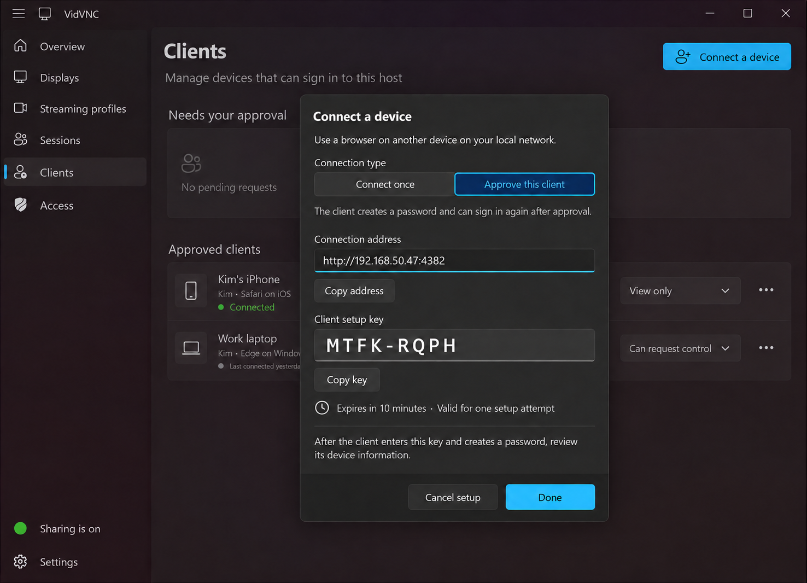
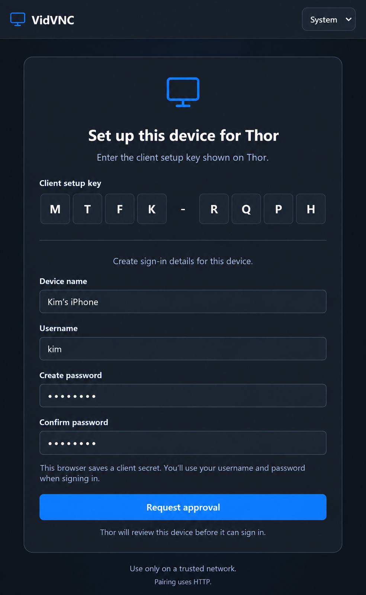
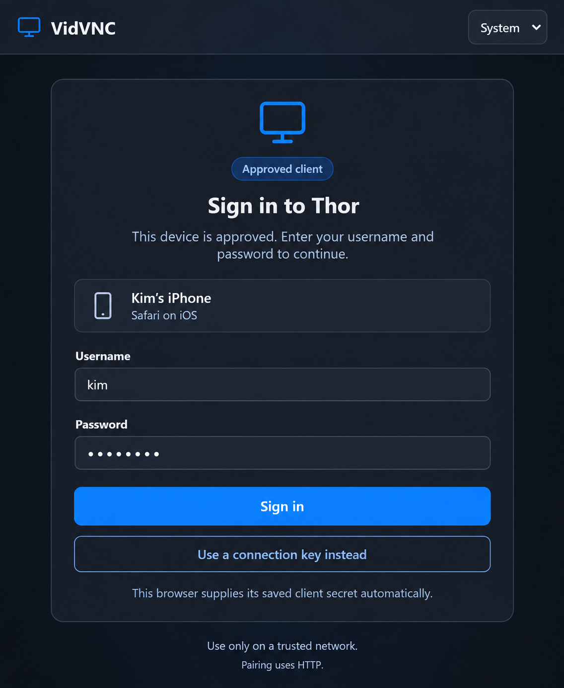

# Approved clients and remembered sign-in design

Status: milestone 1 implemented. QR transfer and platform passkeys remain future work.

## Intent

Let the host approve a client once so that client can later choose **Sign in** without entering another shared connection key. Keep the existing unremembered connection path available and clearly separate from client approval.

Milestone 1 uses human-readable pre-shared keys. QR transfer is out of scope. Apple passkeys, Windows Hello, and other platform passkeys are a later authentication option.

## Host connection modes

The Access page selects one ordinary-connection policy for the host:

- **Reusable session key** accepts the sharing-instance Session key and also allows the host to create an explicit One-time connection key when preferred.
- **One-time connection keys** rejects the Session key and lets the host create short-lived single-use connection keys from the shared connection dialog.
- **Approved clients only** rejects both ordinary key types.

Approved-client sign-in and host-issued Client setup keys remain available in every mode. Changing modes immediately revokes undispatched One-time connection keys and rotates the Session key so a previously displayed key cannot become valid again if reusable keys are later re-enabled. Existing authenticated media sessions are not disconnected merely because this setting changes. The active mode is returned by server information, enforced by key inspection and admission, and reflected in the host Overview, Access page, connection dialog, and web-client instructions.

## Milestone 1: three key types in one format

All key types keep the exact existing `AAAA-BBBB` presentation: eight letters total, displayed as four letters, one dash, and four letters. There is no prefix, suffix, or additional setup-key character. The dash is only a presentation separator and does not contribute entropy. Two non-secret purpose bits are encoded in the first letter, so the web client, host, and server can distinguish the flow without changing the visible format or adding a second input field.

The shared alphabet remains `ABCDEFGHJKLMNPQRSTUVWXYZ`. Its characters have indexes `0` through `23`:

- Index modulo four `0` identifies a Session key.
- Index modulo four `1` identifies a Client setup key.
- Index modulo four `2` identifies a One-time connection key.
- Index modulo four `3` is reserved and rejected.

The generator chooses the first character from the appropriate six-character quarter-keyspace and chooses the remaining seven characters uniformly from the full alphabet. Each purpose therefore has `6 × 24⁷` possible keys, about 34.7 bits of entropy—two bits less than the current undifferentiated format. The purpose bits are routing metadata, not an authorization decision or extra secret.

For example, `NLYJ-LGFN` is a Session key because `N` has alphabet index 12. `BTFK-RQPH` is a Client setup key because `B` has index 1. `CLYJ-LGFN` is a One-time connection key because `C` has index 2. This pattern is intentionally unobtrusive; people do not need to understand it.

### Session key

The **Session key** is the existing per-sharing-instance key with the session purpose bit. It admits an ordinary, unremembered connection and produces the current short-lived session bearer. The same key may admit multiple allowed clients while that sharing instance is running. Stopping and restarting sharing rotates it. Using it never adds an approved client.

### One-time connection key

When the reusable Session key is disabled, the host creates a **One-time connection key** for an ordinary unremembered connection. It expires after a short interval, is removed atomically by the first successful admission, and cannot register or approve a client. Failed validation does not consume it. The resulting media session is otherwise identical to one admitted by a Session key.

### Client setup key

The user selects **Connect a device** on the host and chooses **Approve this client**. The host displays a **Client setup key** with the setup purpose bit that:

- expires after a short interval;
- is consumed by the first valid setup request;
- cannot start an ordinary session; and
- grants no media, display-inventory, or input access by itself.

The client chooses **Add this host**, enters the setup key, supplies its device name, registers a username and password, and waits. The host shows the request for review in the shared **Connect a device** dialog and under **Needs your approval** on the Clients page. Rejection or expiry creates no saved credential. Approval creates one approved-client record and releases a new, client-specific secret to that requester.

The setup key is only a bootstrap secret. Neither side stores it as the reusable credential.

The server parses the purpose bits and then performs an exact, timing-safe lookup only among active records of that purpose. Changing the first character or any other character cannot turn one valid key into another unless the resulting complete key was independently generated and is currently active for the decoded purpose.

## Server connection-key registry

The server owns one authoritative in-memory registry containing only currently active connection keys. The registry is a unified list for lifecycle management, while each record's purpose and usage policy keep the three admission paths separate. An active record contains:

- a non-reversible lookup value for the normalized eight-letter key;
- **purpose:** `session`, `approved-client-setup`, or `one-time-connection`;
- **createdAt** and **expiresAt**;
- **usage:** multi-client for the sharing instance or single successful use.

The Session key record lives only for its sharing instance and may be used by multiple clients subject to normal session limits. Client setup and One-time connection records have short expiries and one permitted successful use. The server atomically removes a single-use record while claiming it so two clients cannot use it concurrently. Cancel, sharing shutdown, and expiry remove active records. Consumed keys are not retained as registry tombstones; later reuse receives the same generic invalid-key response as any unknown key.

The short human-readable keys are not persisted as durable approved-client credentials. The host process receives the plaintext key only through its local control channel for display and copy actions. Logs, diagnostics, status APIs, and persisted approved-client records never include it.

## Web-client key dispatch

The web client keeps one field labeled **Connection key** and accepts exactly eight letters with an optional presentation dash. After all eight normalized letters are present, the server uses the shared alphabet-index rule to select and authorize the flow:

- Session purpose opens **Connect once** and submits to ordinary session admission.
- Setup purpose opens the approved-client form for device name, required username, password, and password confirmation.
- One-time connection purpose opens **Connect once** and submits to ordinary session admission, where the server consumes it only if admission succeeds.
- Invalid characters or length show **Check the connection key and try again** without probing both server operations.

On **Continue**, the client sends the complete key to one dispatch operation. The server decodes the purpose bits, finds the exact active registry record, checks the current host connection mode, expiry, and usage, and returns the authoritative result:

- a valid Session or One-time connection key returns `connect-once`, its usage policy, the sharing-instance context, and the resulting short-lived session data;
- a valid Client setup key returns `approved-client-setup`, the setup-attempt reference, and `expiresAt`; and
- every unknown, expired, already-used, cancelled, malformed, reserved-pattern, or wrong-purpose key returns the same generic invalid-key response.

The web client advances based on this server response, not solely on the embedded bit. It waits for the complete key and a Continue action before changing flows, so partial typing does not make the page jump between modes. The response never echoes the key. Setup-key confirmation does not consume the permitted setup submission until the client atomically submits its device information and password verifier.

## Web-client registration and sign-in

After the server confirms that an entered `AAAA-BBBB` value is an active Client setup key, the same web-client card expands into the registration form. The person confirms an editable device name and creates a required username and password. Submitting the form consumes the single-use setup key and creates the request that waits for host approval. The page never displays the generated client secret.

On a later visit, the browser recognizes its saved approved-client record and shows the remembered device plus username and password fields. **Sign in** submits all three inputs to authentication: the entered username, the entered password, and the browser's saved client secret. **Use a connection key instead** returns to the ordinary eight-character key entry without deleting the approved-client credential.

## Approved-client credential

An approved-client sign-in uses three values:

- **Client secret:** a high-entropy, host-specific value issued only after host approval. The client stores it; the person never types or sees it.
- **Username:** chosen during setup, stored readably with the approved-client record, and entered again at sign-in. It identifies the credential but is not a secret.
- **Client password:** chosen on the client during setup and entered by the person for future sign-ins. The client does not save it by default.

A native client stores the client secret in platform-protected storage. The current web client cannot access the operating-system credential vault directly, so it uses origin-scoped browser storage such as IndexedDB rather than local storage or a cookie sent with every request. The server stores the username readably, a verifier or hash for the client secret, and a separately salted, slow password hash. Of the sign-in fields, only the username is readable from stored server data. It never stores the plaintext password, Session key, or Client setup key.

On a later visit, the client shows the remembered host, username and password fields, and **Sign in**. The server locates the approved-client record by username and requires both the matching saved client secret and password verifier before creating a normal short-lived session bearer. A username, client secret, or password cannot authenticate on its own, and none is used directly as a media-session identifier. Stopping sharing ends sessions but preserves approved clients. Removing an approved client invalidates its client secret and disconnects any current session authenticated by it.

The server rate-limits password attempts per approved client and source, compares verifiers without timing leaks, and returns one generic authentication error. Passwords are never included in host approval details, logs, diagnostics, URLs, or status responses. Password recovery is deliberately absent in this milestone: forgetting it requires removing and approving the client again.

Browser storage does not make the current HTTP transport secure: same-origin script compromise or a local-network observer could steal the client secret or observe password submission. Client-side hashing alone does not fix this because a reusable hash becomes a password equivalent. Until HTTPS, a password-authenticated key exchange, or equivalent authenticated transport is available, this remains a trusted-local-network feature and must not claim resistance to a network observer.

## Client information shown for approval

The setup request contains only useful, explainable information:

- **Device name:** required and editable, with a suggested name such as `Safari on iPhone` or `Edge on Windows`.
- **Username:** required and entered by the person using the client. It is the readable account identifier used at sign-in; a web page cannot infer the operating-system account name.
- **Client installation ID:** a random identifier generated and stored by the client, never a hardware fingerprint.
- **Platform and browser family:** derived conservatively from User-Agent Client Hints when available, with the ordinary user agent as fallback.
- **Client version:** the VidVNC web or native client version when available.

The host adds request time, remote address or local-network label, and setup-key verification state. Language, screen resolution, fonts, and other fingerprinting-oriented browser data are not collected for approval.

The approval row emphasizes device name and username, then shows concise supporting metadata such as `Safari on iOS · Local network`. Approval defaults to **Use Access default**, which follows the Access page's keyboard-and-mouse setting until the host overrides it for that client with **Require host approval**, **Allow when available**, or **View only**.

## Shared Connect a device dialog

The existing **Connect a device** dialog owns both connection-key experiences. It has a **Connection type** selector:

- **Use session key** shows the existing connection address and Session key while reusable admission is enabled.
- **Create one-time key** creates and shows one short-lived One-time connection key while ordinary key admission is enabled.
- **Approve this client** creates a new setup attempt and shows the same address plus that attempt's Client setup key.

The selector contains only choices allowed by the current Access policy. Reusable-session mode shows all three choices, One-time mode shows One-time and approval, and Approved-only mode shows only approval.

Opening the dialog from Overview defaults to **Connect once**. Opening it from the Clients page defaults to **Approve this client**. Switching into the approval mode creates the setup key only when one is not already active.

The first valid client submission atomically consumes the setup key and creates exactly one pending client-information payload plus password verifier. The plaintext password is discarded as soon as the verifier is derived and is never presented to the host. If the modal is closed, a submitted request remains under **Needs your approval** on the Clients page; an unused key remains active only until its ten-minute expiry or host shutdown.

The modal never shows both the Session key and Client setup key at once. Its explanatory copy states that the setup key is short-lived, valid for one setup attempt, still requires host approval, and that the client creates a password during setup. The password field and password value exist only on the client side.

## Host Clients page

The native host adds **Clients** between Sessions and Access. It contains:

- **Connect a device**, opening the shared dialog directly in **Approve this client** mode.
- **Needs your approval**, with client information, setup-key verification state, and explicit Approve/Reject actions.
- **Approved clients**, with device/user labels, client type, connection status, permission, and actions to rename, inspect, or remove.

The Clients page never contains an inline setup-key card. Current activity is deliberately lightweight: an approved client that has a live session gets a small green **Connected** status in its row. The Sessions page remains the only place for session details and disconnect controls. An inactive approved client shows muted last-connected text.

## State model

The ordinary path remains:

`session key entered → short-lived session → disconnected/expired`

The approved-client path is separate:

`dialog approval mode → setup attempt/key created → device name, username, and password submitted → key consumed → pending approval → approved → client secret saved → username-and-password sign-in`

Alternative exits are `setup key → cancelled/expired`, `pending approval → rejected`, and `approved client → removed`. Retrying after any exit requires a new host-created setup key. A pending request cannot use stream or input endpoints.

## Later milestone: platform passkeys

Add platform passkeys as another way to authenticate and approve a client, for example Apple passkeys or Windows Hello-backed passkeys. A passkey credential can replace the saved-client-secret and password combination without changing host approval, permissions, removal, or the short-lived session model.

Passkey work requires HTTPS and relying-party/trust provisioning first. Cross-device passkey behavior must be evaluated explicitly rather than assuming every platform exposes the same experience.

## Implementation boundaries and tests

Milestone 1 needs a durable host-owned approved-client store plus separate operations for creating/consuming a setup key, submitting/listing/approving/rejecting requests, completing client-secret and password-verifier enrollment, authenticating both credential parts, listing/removing approved clients, and exchanging successful authentication for a session.

Tests must prove that every key type contains exactly eight letters plus the display dash, every generator sets the correct purpose bits, client and server parsers agree on every alphabet character, normalization preserves the purpose bits, registry responses authoritatively select the flow and never echo keys, Session keys remain multi-use for one sharing instance, Session and One-time connection keys cannot add clients, Client setup keys cannot start sessions, both single-use key types are removed atomically after successful use, a key with any changed character fails exact lookup, all invalid-key conditions return the same external error, setup confirmation does not consume the key prematurely, setup submission is single-use and expires, two clients cannot claim one key, rejected requests receive no client secret, username is required and registered readably, plaintext passwords are never persisted or returned, username, client secret, or password alone cannot authenticate, password attempts are rate-limited, approved clients survive Session-key rotation, removal blocks future sign-in and ends any current session, secrets and password data are redacted, and pending requests cannot list displays or inject input.

## Visualization provenance

The PNGs were generated with the built-in image-generation tool. `docs/images/windows-host-overview.png` supplied the existing native host shell, proportions, palette, and icon language. The existing web-client connection screen supplied the browser shell and form language for the registration and sign-in previz. All people, devices, keys, and statuses are illustrative.
