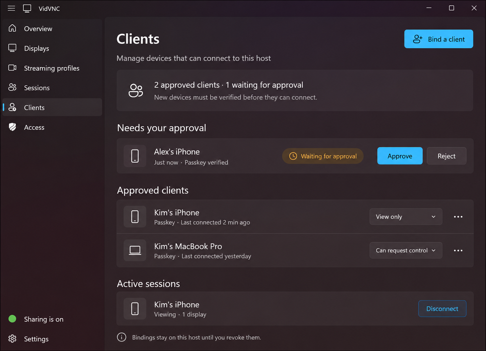

# Client–host binding design

Status: concept design and visualization only. This document does not claim that the binding flow is implemented.

## Intent

Give the native host a clear authority boundary: a client may discover the host, but it cannot use the shared desktop until the host approves a verified binding. The binding is durable for that client installation; an individual session remains temporary and can be disconnected without revoking the binding.

The host remains the source of truth for the client list, permission, and revocation state. The existing Access page owns policy defaults; the new Clients page owns individual device approval and lifecycle.

## Core flow

1. The host selects **Bind a client** and creates a short-lived pairing handoff. The handoff may be completed with a passkey-backed client identity or a one-time code/deep link. The host does not grant access merely by opening this flow.
2. The client proves possession of its authentication method and submits a signed binding request containing a stable installation identifier and a user-facing device name.
3. The host shows the request under **Needs your approval**, including verification method and request time. The host explicitly chooses **Approve** or **Reject**.
4. Approval creates a bound client record with a default permission. The client can reconnect without repeating pairing until the host revokes the binding.
5. When a bound client connects, it appears separately under **Active sessions**. Disconnect ends the current session; it does not revoke the client.

## Host page model

The page is a dedicated **Clients** navigation item between Sessions and Access. It contains:

- A compact summary of approved and pending devices, plus the rule that new devices require verification.
- A pending-approval row with device name, verification method, timestamp, and explicit Approve/Reject actions.
- Approved client rows with authentication method, last-connected time, permission selector, and an overflow menu for rename, revoke, or inspect details.
- Active sessions with current activity and a Disconnect action.

The generated previz shows one pending phone, two approved devices, and one active viewing session as illustrative data. The sidebar and dark WinUI/Mica shell follow `windows-host-overview.png`; the screenshot is a style reference, not a product requirement.

## State and safety rules

Binding and session state are separate:

`unbound → verifying → pending approval → bound → active session`

`pending approval → rejected/expired` and `bound → revoked` are terminal for that attempt or record. A revoked client must complete a new binding flow. A pairing handoff expires quickly and is single-use. Approval defaults to **View only**; control is a separate capability and at most one active client may hold it at a time.

Failures should be understandable and recoverable: show when a handoff expired, when verification failed, when a request was rejected, or when the host is offline; preserve existing approved bindings when a session drops. Do not display secrets, reusable passwords, or imply that a connection is trusted solely because it is on the local network.

## Follow-up implementation boundaries

The eventual implementation should introduce a host-owned binding store and explicit operations for create-handoff, submit-request, approve, reject, revoke, list-clients, and disconnect-session. Transport authentication and authorization should consume the binding record rather than infer trust from discovery. Tests should cover replay/expiry, duplicate installation identifiers, permission changes, revocation during an active session, and the one-controller rule.

## Visualization provenance

The PNG was generated with the built-in image-generation tool using `docs/images/windows-host-overview.png` as the reference image for shell, proportions, palette, and icon language. The generation prompt requested a native WinUI 3 `Clients` page and the exact labels visible in the concept. It is intentionally a high-fidelity product visualization, not executable UI.
