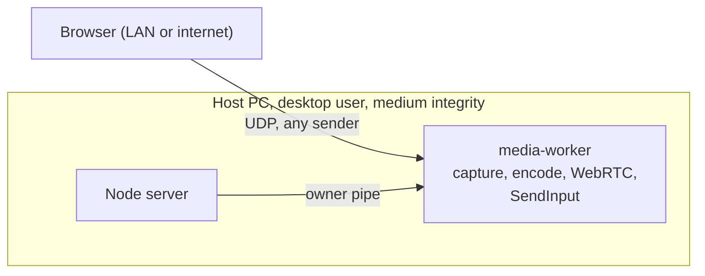
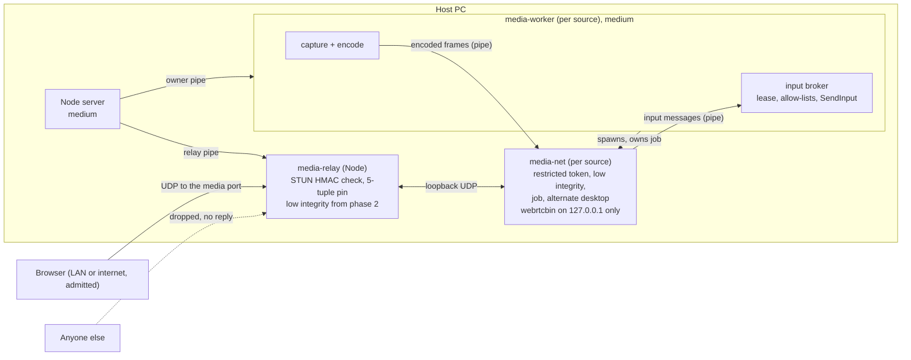
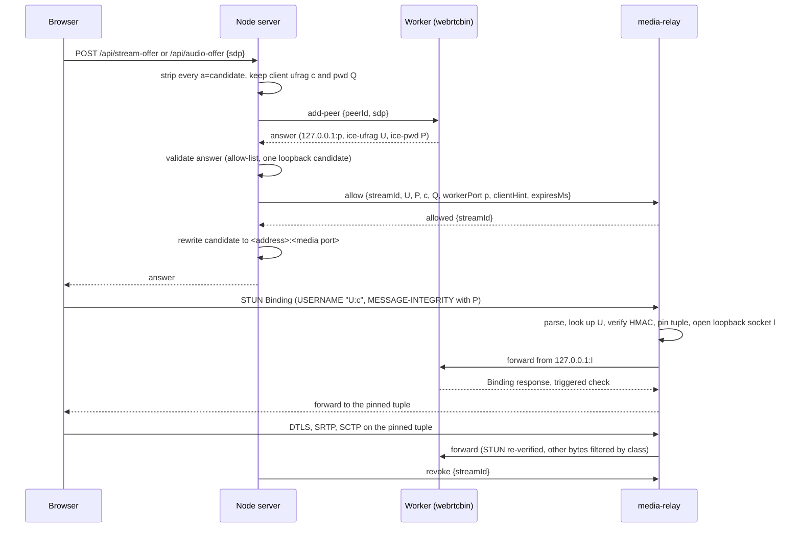
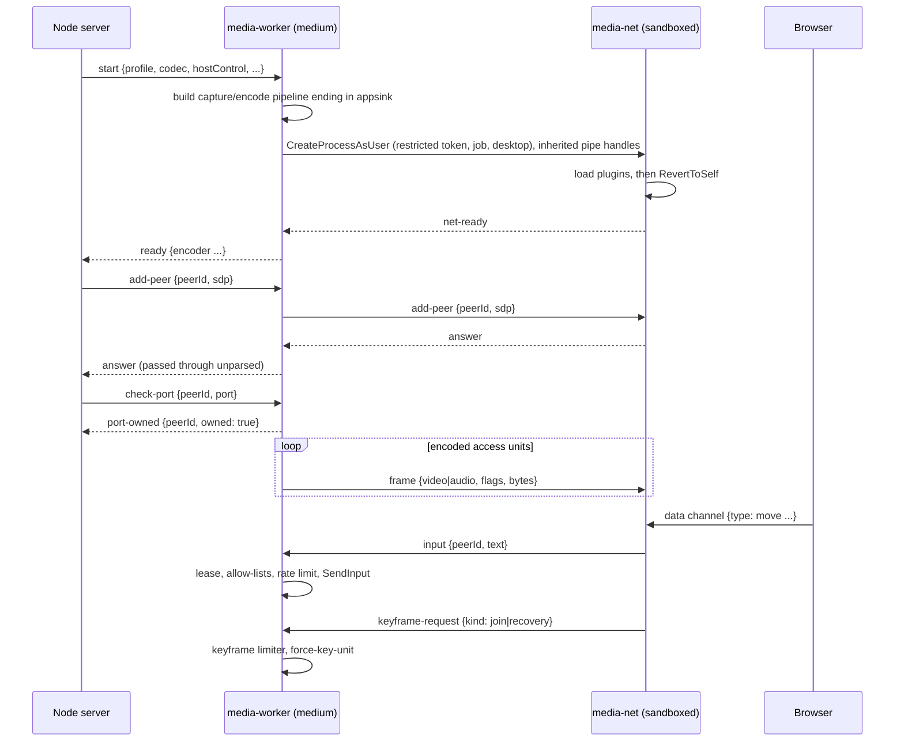

# R4: authenticating media relay, firewall rules and privilege split

**Status: design for review, revision 2, 2026-09-26.** Implements the options selected from
[R4 hardening: design options](../../security/r4-hardening-options.md#recommendation):
**A** (authenticating UDP relay), **F1** (install-time firewall rules) and **B** (privilege
split). Revision 2 applies the review of revision 1: every session, LAN and remote, now goes
through the relay (the owner's decision), and the relay, sandbox, firewall and pipe designs
are tightened; see [Revision history](#revision-history). Nothing here is implemented. After
approval, the next step is a dated implementation plan in `docs/superpowers/plans/`.

## Contents

- [Problem and goals](#problem-and-goals)
- [Scope and non-goals](#scope-and-non-goals)
- [Architecture overview](#architecture-overview)
- [Part A: authenticating media relay](#part-a-authenticating-media-relay)
- [Part F1: firewall rules](#part-f1-firewall-rules)
- [Part B: privilege split](#part-b-privilege-split)
- [Settings, CLI and host UI](#settings-cli-and-host-ui)
- [Failure handling](#failure-handling)
- [Security analysis](#security-analysis)
- [Testing and validation](#testing-and-validation)
- [Phasing and prototype gates](#phasing-and-prototype-gates)
- [Documentation changes](#documentation-changes)
- [Risks and open questions](#risks-and-open-questions)
- [References](#references)
- [Revision history](#revision-history)

## Problem and goals

Each source worker binds libnice UDP sockets for every viewer
([media-worker.cpp](../../../native/media-worker/src/media-worker.cpp), `add_peer`). With a
`media-ports` range set, the sockets use that range on every interface, **whether or not
remote access is on**: the server passes `mediaPorts` to every worker it starts
([main.mjs](../../../apps/server/src/main.mjs)). Without a range they use ephemeral ports on
every interface. Either way, while a stream is live anyone who can reach those ports (every
LAN peer, and the internet whenever the range is forwarded) can make libnice parse STUN
before MESSAGE-INTEGRITY is checked. The worker is unsandboxed and holds `SendInput`, so a
parser exploit becomes input injection as the desktop user
([R4](../../security/internet-exposure.md#r4-native-parsing-is-reachable-before-authentication-on-the-media-ports-open-reduced)).

| ID  | Goal                                                                                                                                                                                                                                                                                                                                           |
| --- | ---------------------------------------------------------------------------------------------------------------------------------------------------------------------------------------------------------------------------------------------------------------------------------------------------------------------------------------------- |
| G1  | No STUN from a sender that has not proved the session's ICE password reaches native code, and no datagram from an unauthenticated 5-tuple reaches native protocol parsing. The only unauthenticated bytes that can reach native parsing are DTLS or RTP/RTCP packets forged with the exact source address and port of an authenticated client. |
| G2  | The code that parses unauthenticated datagrams is small and memory-safe, and from phase 2 runs in a low-integrity process that cannot inject input or capture the screen.                                                                                                                                                                      |
| G3  | The process that runs WebRTC (ICE, DTLS, SRTP, SCTP) cannot inject input, read the screen, read the user's files or reach the network beyond loopback, even if fully compromised. It can only ask the input broker, which applies today's permission checks.                                                                                   |
| G4  | The media worker, in both of its roles, has no network reach beyond loopback. Every inbound permission VidVNC needs is scoped to a program **and** a port.                                                                                                                                                                                     |
| G5  | No browser change, no third party, no persistent privileged service. The server-to-worker owner protocol stays compatible, apart from the additions listed here.                                                                                                                                                                               |
| G6  | Every control can be checked by VidVNC itself (tests, diagnostics), and failure of any new component fails closed.                                                                                                                                                                                                                             |

## Scope and non-goals

In scope:

- The relay (A) for **every** session: LAN, VPN, loopback and internet peers.
- A single `media-port` setting, replacing the `media-ports` range.
- Firewall rule management (F1) for the Windows host and the CLI, including an audit of
  existing rules.
- Splitting the media worker into a medium-integrity capture, encode and input process and a
  sandboxed network process (B), and running the relay at low integrity (phase 2).

Non-goals:

- Automatic router configuration (option G), media over HTTPS (C), a memory-safe ICE stack
  (D), and per-client firewall rules through an elevated helper (F2/F3).
- Sandboxing the capture/encode process: DXGI desktop duplication needs access to the user's
  desktop and stays at medium integrity.
- ICE restarts. A viewer whose network changes reconnects, as today.
- macOS. The design is Windows-only; the relay itself is portable.

## Architecture overview

### Today

### After A, F1 and B

Three independent layers, each with its own guarantee:

| Layer         | Guarantee                                                                                                                              | Holds even if…                                                                                   |
| ------------- | -------------------------------------------------------------------------------------------------------------------------------------- | ------------------------------------------------------------------------------------------------ |
| Relay (A)     | Only peers that prove the ICE password reach libnice; strangers get no reply                                                           | libnice has a STUN parser bug                                                                    |
| Split (B)     | The WebRTC process cannot inject input, read the screen or the user's files, or reach the network beyond loopback                      | the WebRTC stack is exploited by an admitted peer, or by forged packets on an authenticated path |
| Firewall (F1) | The worker has no network reach beyond loopback; inbound traffic reaches only the server's and the relay's ports, per program and port | a VidVNC process opens an unexpected socket                                                      |

## Part A: authenticating media relay

### Components and ownership

| Component               | Where                                                             | Responsibility                                                                                                      |
| ----------------------- | ----------------------------------------------------------------- | ------------------------------------------------------------------------------------------------------------------- |
| `media-relay` process   | `apps/server/src/media-relay/` (new), run with `process.execPath` | Owns the media port; validates, pins and forwards                                                                   |
| `MediaRelay` manager    | `apps/server/src/media-relay.mjs` (new)                           | Spawns and supervises the relay; registers and revokes streams; exposes metrics                                     |
| `stun.mjs`              | `apps/server/src/media-relay/stun.mjs` (new)                      | Pure, bounded STUN parsing, MESSAGE-INTEGRITY and FINGERPRINT verification; no I/O                                  |
| SDP helpers             | `apps/server/src/sdp-candidates.mjs` (extended)                   | Strip offer candidates; validate the answer; read ICE credentials and the loopback port; announce the relay address |
| `mediaPort` setting     | `apps/server/src/access-settings.mjs` (changed)                   | One UDP port, default 4384; migrates the old `mediaPorts` range                                                     |
| Worker loopback binding | `media-worker.cpp` `add_peer` (in `media-net` after B)            | Gather host candidates on `127.0.0.1` only, always                                                                  |

The relay is a separate process rather than code in the server so that media forwarding
never shares the event loop with TLS and signaling, and so it can run at low integrity from
phase 2. It is JavaScript: memory-safe, no new toolchain, and Node's `dgram` and `crypto`
are enough at desktop bitrates (a 50 Mbit/s stream at the worker's 1,200-byte MTU is about
5,200 packets per second).

### Relay for every session

The relay carries **every** viewer's media: LAN, VPN, loopback and internet peers alike.
Workers never bind a non-loopback address, in any mode. This closes R4 on the LAN as well as
for the internet, and it removes the gap where a `media-ports` range stayed live, and
possibly forwarded, while remote access was off: from this change on, nothing but the relay
listens on the media port, and the relay answers only authenticated peers.

The server starts the relay after the owner's approval and before it reports `ready`. If
the relay cannot bind its port, the server still starts (sign-in works) but reports media as
unavailable, with the reason, and refuses stream offers with a clear error.

Remote access no longer changes how media travels; it only decides, as today, whether
internet peers may sign in at all. Switching remote access off disconnects internet sessions
([R6](../../security/internet-exposure.md#findings-register)), and their revocations remove
their relay registrations.

### Media port

A single `mediaPort` setting replaces `mediaPorts`:

- One UDP port, **default 4384** (next to HTTP 4382 and HTTPS 4383), allowed 1024–65535.
  `null` means the default.
- **Migration:** an existing `mediaPorts` range becomes `mediaPort = mediaPorts.min`, so an
  existing router forward keeps working unchanged; the rest of the forwarded range is unused
  and can be removed.
- **CLI:** `media-port [auto|<port>]`. `media-ports` stays as a deprecated alias that sets
  the first port of the range and says so.
- **Format change:** the settings validator refuses unknown keys, so an older VidVNC cannot
  read a file that contains `mediaPort`. The release that ships this is therefore a minor
  version, and its changelog says that downgrading needs `mediaPort` removed from
  `access-settings.json`.
- Changing the port restarts the relay and stops live streams; viewers reconnect.
- The relay binds `::` with dual-stack (`ipv6Only: false`), falling back to `0.0.0.0`.

Workers get `VIDVNC_ICE_BIND=loopback`; `VIDVNC_ICE_PORTS` and the range handling are
removed from the worker launch.

### Worker change: loopback-only candidates

For each peer, before `set-remote-description`, the worker gets the peer's ICE agent
(already done today for the port range) and emits the action signal
`add-local-ip-address("127.0.0.1")`. `GstWebRTCNice` implements it with
`nice_agent_add_local_address`; once a local address is added, libnice gathers only from the
given addresses instead of discovering interfaces. ICE-TCP is always off.

The worker's answer then carries a single host candidate `127.0.0.1 <port> typ host` plus
`a=ice-ufrag` and `a=ice-pwd`. Gate [P1](#phasing-and-prototype-gates) confirms this on
Windows with the pinned GStreamer 1.28.6.

### Signaling changes

1. **Offer.** The server removes **all** `a=candidate` lines from every client's offer
   before the worker sees it, and records the client's `a=ice-ufrag` and `a=ice-pwd`. The
   worker then has no remote candidates, sends no connectivity checks of its own to anyone,
   and learns the client only as a peer-reflexive candidate from the client's authenticated
   checks arriving through the relay. This also removes the class of finding R3.
2. **Answer validation.** The server validates the answer in JavaScript before using it:
   at most 64 KiB; only SDP lines from an allow-list (`v=`, `o=`, `s=`, `t=`, `c=`, `m=`,
   and the `a=` attributes webrtcbin emits today, such as `group`, `msid-semantic`, `mid`,
   `ice-ufrag`, `ice-pwd`, `ice-options`, `fingerprint`, `setup`, direction, `rtcp-mux`,
   `rtpmap`, `fmtp`, `rtcp-fb`, `ssrc`, `sctp-port`, `max-message-size`, `candidate`,
   `end-of-candidates`); credentials of RFC 8839 length and characters; and exactly one
   `a=candidate`, which must be UDP, component 1, `127.0.0.1`, `typ host`. Anything else
   fails the peer. In phase 1 the answer comes from the medium-integrity worker; from phase 2
   it comes from the sandboxed `media-net` and is **untrusted**, so phase 2 adds a port
   attestation: the server asks the worker `check-port {peerId, port}`, and the worker
   confirms with `GetExtendedUdpTable` that `127.0.0.1:<port>` is owned by its own
   `media-net` process. The worker never parses the SDP itself, so no new C parser faces
   `media-net`.
3. **Registration.** The server sends `allow` to the relay and waits for `allowed`
   (bounded by the existing negotiation timeout) **before** returning the answer, so the
   client's first check is never dropped for lack of a registration.
4. **Rewrite.** The server replaces the loopback candidate (and the `c=` and `a=rtcp:`
   lines) with the relay addresses for this client, same component, `typ host`, distinct
   foundations, and keeps `a=ice-ufrag`/`a=ice-pwd` unchanged:
   - internet client: each public IPv4 of the public names (as today's
     `announceCandidates`), and each global IPv6 unicast address of the host (today such
     addresses are announced as the worker's own candidates; they work only where the
     router's IPv6 firewall allows UDP to the media port), all on the media port;
   - LAN, VPN or loopback client: `request.socket.localAddress`, the address the client
     already reached over HTTPS, normalised from `::ffff:`. If it is an IPv6 link-local
     address, use the IPv4, unique-local or global addresses of the interface that owns it
     instead, because a zone index cannot be expressed in SDP.
5. **Revocation.** The server sends `revoke {streamId}` whenever the subscription leaves
   `starting`/`live`: stream stop, session end or reconnect, device revocation, policy
   change, remote access off (internet sessions), `peer-failed`, worker exit, and the
   relay's own `expired`.

The legacy single-peer `/api/offer` route is already refused while the stream runtime runs,
which it always does; it stays refused.

### Relay protocol (server ↔ relay)

JSON lines over the relay's stdin/stdout. The relay accepts commands only from its parent
pipe, validates every field, and exits (fail closed) on an invalid command, matching the
worker's owner-pipe rule. It also exits when its stdin closes, so it never outlives the
server; under the Windows host it inherits the server's job object.

| Direction | Message                                                                                                     | Meaning                                                                                                    |
| --------- | ----------------------------------------------------------------------------------------------------------- | ---------------------------------------------------------------------------------------------------------- |
| S → R     | `{"type":"start","port":4384}`                                                                              | Bind the media port; reply `ready` or exit with an error                                                   |
| R → S     | `{"type":"ready","port":4384,"families":["ipv6","ipv4"]}`                                                   | Bound                                                                                                      |
| S → R     | `{"type":"allow","streamId","ufrag","pwd","clientUfrag","clientPwd","workerPort","clientHint","expiresMs"}` | Register a stream. `clientHint` is the HTTPS source address or `null`; `expiresMs` ≤ 15000 until first pin |
| R → S     | `{"type":"allowed","streamId"}`                                                                             | Registration active                                                                                        |
| S → R     | `{"type":"revoke","streamId"}`                                                                              | Remove the registration, its pins and loopback sockets                                                     |
| R → S     | `{"type":"pinned","streamId","tuple":"203.0.113.9:53122","hintMatched":true}`                               | A tuple authenticated (for Sessions and diagnostics)                                                       |
| R → S     | `{"type":"unpinned","streamId","tuple","reason":"idle"}`                                                    | A pin ended                                                                                                |
| R → S     | `{"type":"expired","streamId"}`                                                                             | No valid check before `expiresMs`; the server fails the stream                                             |
| R → S     | `{"type":"metrics","dropped":{...},"forwarded":{...}}` every 2 s                                            | Counters by reason, for diagnostics and the security log                                                   |
| S → R     | `{"type":"stop"}`                                                                                           | Close sockets and exit                                                                                     |

Limits: at most 64 registrations (the session limit's ceiling), 4 registrations sharing one
ufrag, 4 pinned tuples per registration; `ufrag` and `clientUfrag` 4–256 ICE characters,
`pwd` and `clientPwd` 22–256 ICE characters (RFC 8839); `workerPort` 1024–65535 on
loopback. libnice's ufrags are only 4 characters, so two live registrations can share one;
the relay keeps both and tries the HMAC against each.

### Packet handling: unauthenticated senders

For a datagram from a tuple that is not pinned:

1. **Budget, in two lanes.** Senders whose address matches a live registration's
   `clientHint` (IPv6 compared by /64) get 200 datagrams per second per registration. All
   other senders get 50 per second per source (IPv4 address or IPv6 /64) and share a global
   cap of 5,000 per second. A flood with forged source addresses therefore exhausts only
   the strangers' lane, not the clients whose address is known. Excess is dropped before
   parsing.
2. **Parse** with `stun.mjs`. Anything that is not a well-formed STUN Binding request is
   dropped. The relay never sends anything to an unpinned tuple: no error responses, nothing
   that confirms a live port.
3. **Look up** the registrations whose ufrag equals the part of `USERNAME` before the
   colon. None: drop.
4. **Verify MESSAGE-INTEGRITY** with each such registration's `pwd`; the one that verifies
   wins. None: drop.
5. **Address hint.** Compare the sender with the registration's `clientHint`. A mismatch is
   counted (`address-differs`) and logged once per registration, but **not** dropped: the
   HTTPS and media paths legitimately differ with iCloud Private Relay (Safari sends HTTPS
   through Apple's relay but WebRTC traffic directly), with carrier-grade NAT that uses
   "arbitrary" address pooling, and across address families. The HMAC is the gate.
6. **Pin** the tuple: open a new loopback UDP socket bound to `127.0.0.1:0`, record
   `tuple ↔ socket ↔ registration`, then forward the request to `127.0.0.1:workerPort` from
   it.

### Packet handling: authenticated paths

For a datagram from a pinned tuple, classified by its first byte (RFC 7983):

| First byte | Class        | Handling                                                                                                                                                                                                                                                                             |
| ---------- | ------------ | ------------------------------------------------------------------------------------------------------------------------------------------------------------------------------------------------------------------------------------------------------------------------------------ |
| 0–3        | STUN         | A Binding request must carry `USERNAME` `<ufrag>:<clientUfrag>` of **this** registration and verify with `pwd`; a Binding success or error response (the client answering a check the worker sent) must verify with `clientPwd`. Everything else, including indications, is dropped. |
| 20–63      | DTLS         | Forwarded unchanged                                                                                                                                                                                                                                                                  |
| 128–191    | RTP and RTCP | Forwarded unchanged                                                                                                                                                                                                                                                                  |
| other      | —            | Dropped                                                                                                                                                                                                                                                                              |

A valid Binding request for a **different** registration arriving on a pinned tuple is
dropped and counted (`cross-registration`), never forwarded to the wrong worker. DTLS and
SRTP cannot be checked by the relay (it has no keys); their integrity is enforced by the
worker's DTLS and SRTP stacks.

Datagrams arriving on a pin's loopback socket are accepted only from `127.0.0.1:workerPort`
and sent to the pinned tuple. A pin ends after 30 seconds without a datagram in either
direction (RFC 7675 consent checks arrive about every 5 seconds), on `revoke`, or when the
registration is removed.

**Mapped addresses.** The worker's Binding success responses carry `XOR-MAPPED-ADDRESS`
`127.0.0.1:<pin socket>`, because that is where the worker sees the client. The browser then
learns a loopback address as its own peer-reflexive candidate. Gate P1 checks that Chrome,
Firefox and Safari accept this. If any does not, the relay rewrites `XOR-MAPPED-ADDRESS` in
those responses to the client's real tuple and recomputes MESSAGE-INTEGRITY (with `pwd`,
which it holds) and FINGERPRINT.

**Socket buffers.** The public socket and every loopback socket are created with
`recvBufferSize` and `sendBufferSize` of 4 MiB (tuned in P2): a keyframe burst at 4K arrives
faster than one event-loop turn, and Windows' default UDP buffers are small.

### STUN verification (`stun.mjs`)

Pure functions over a `Buffer`, no allocation beyond small slices, no exceptions escaping:

- Length 20–1280 bytes; first two bits zero; message class and method from the type field
  (Binding request `0x0001`, success response `0x0101`, error response `0x0111`); magic
  cookie `0x2112A442`; header length field a multiple of 4 and equal to the datagram length
  minus 20.
- Walk attributes as type/length/value with 4-byte padding, bounds-checked against the
  header length; at most 32 attributes; a duplicate `USERNAME` or `MESSAGE-INTEGRITY` is
  malformed.
- `USERNAME` (`0x0006`): required in requests, 3–512 bytes, printable ASCII with exactly one
  `:`.
- `MESSAGE-INTEGRITY` (`0x0008`): required, 20 bytes. After it only
  `MESSAGE-INTEGRITY-SHA256` (`0x001C`, ignored) and `FINGERPRINT` (`0x8028`, last) may
  appear; anything else after it is malformed (the coturn issue class).
- HMAC-SHA1 per RFC 5389 section 15.4: the key is the ICE password (short-term credentials;
  ICE passwords are ASCII, so SASLprep is the identity); the input is the message up to but
  excluding the MESSAGE-INTEGRITY attribute, with the header length field rewritten to cover
  the message up to and including MESSAGE-INTEGRITY. Compare with `crypto.timingSafeEqual`.
- If `FINGERPRINT` is present, verify CRC-32 XOR `0x5354554E`; a mismatch is malformed.
- Other attributes (`PRIORITY`, `ICE-CONTROLLING`, `USE-CANDIDATE`, browser-specific ones)
  are length-checked and otherwise ignored; libnice parses them only after the check passes.

Test vectors: RFC 5769 section 2.1 (request, `USERNAME` `evtj:h6vY`, password
`VOkJxbRl1RmTxUk/WvJxBt`) and sections 2.2 and 2.3 (IPv4 and IPv6 responses, same password)
must verify; single-bit flips anywhere in them must not.

### Diagnostics and Sessions

- Sessions and `sessions` in the CLI show, per stream, the HTTPS address and the media
  address (the pinned tuple), and mark them when they differ.
- Diagnostics show the relay's counters: forwarded packets and bytes, drops by reason
  (`budget`, `malformed`, `unknown-ufrag`, `bad-integrity`, `class`, `cross-registration`),
  `address-differs`, and live pins.
- The server log records, per stream, `pinned`, `unpinned` and `expired`, and once a minute
  a summary of unauthenticated drops when there were any, without packet contents or
  credentials.

## Part F1: firewall rules

### What changes

| Program                         | Today                                                                | After                                                                                                                                                                                                     |
| ------------------------------- | -------------------------------------------------------------------- | --------------------------------------------------------------------------------------------------------------------------------------------------------------------------------------------------------- |
| `media-worker.exe` (both roles) | Windows prompts on first listen; the user's answer covers every port | Binds loopback only in every mode, so Windows never prompts. VidVNC adds **block** rules for this executable, inbound and outbound, on all profiles: it never needs the network beyond loopback (gate P5) |
| Node server                     | Prompt on first listen, any port                                     | Allow: TCP on the HTTPS port (any remote address); TCP on the HTTP port with remote address `LocalSubnet`                                                                                                 |
| Relay (`node.exe`)              | —                                                                    | Allow: UDP on the media port (any remote address)                                                                                                                                                         |

Allow rules are keyed on program **and** local port: `node.exe` is shared by every Node
program on the machine, so the port condition is what keeps them narrow. Rule names start
with `VidVNC` and carry the group `VidVNC`, so they can be listed and removed as a set.

### Audit of existing rules

Windows creates its own rules from its prompt, and those can undo F1. VidVNC reads the rules
for its programs (the bundled or configured `node.exe`, and `media-worker.exe`) through the
`HNetCfg.FwPolicy2` COM object and reports three problems:

- **Missing** VidVNC rules.
- **Broad allow** rules, such as the ones Windows creates when someone clicks **Allow** at
  the prompt: they cover every port and undo the port scoping.
- **Block** rules, such as the ones Windows creates when someone clicks **Cancel**: a block
  rule beats every allow rule, so sign-in or media silently stop working.

The owner can have VidVNC replace broad or block rules for VidVNC-owned executables (the
bundled `node.exe` and `media-worker.exe`). Rules for a system-wide Node.js install are shown
but removed only if the owner selects them, because other programs may rely on them.

### How rules are applied

Changing Windows Firewall rules requires administrator rights. VidVNC keeps no elevated
service; the owner applies rules explicitly, with one UAC prompt:

- **Host app:** Settings → Firewall shows the audit. **Apply firewall rules** starts
  `powershell.exe -NoProfile -NonInteractive -EncodedCommand …` elevated. The command is
  generated in memory from validated values only (program paths, port numbers, and the IDs
  of the rules the owner chose to replace) and uses only `New-NetFirewallRule`,
  `Set-NetFirewallRule` and `Remove-NetFirewallRule` on the `VidVNC` group and those IDs. No
  script file is executed, so nothing in a user-writable folder (such as an unzipped CLI)
  ever runs elevated. The host re-reads the rules afterwards and reports the result.
- **CLI:** `firewall` prints the audit and the exact commands; `firewall apply` performs the
  same elevation from the terminal; `firewall remove` deletes the `VidVNC` group.
- **When:** after install, when the owner changes the HTTP, HTTPS or media port, and whenever
  the audit finds a problem (the host shows a banner).
- **MSIX with bundled Node:** the package manifest also declares `desktop2:FirewallRules`
  for `runtime\node\node.exe` on the default ports (TCP 4382, TCP 4383, UDP 4384), so a
  default install works without a UAC prompt. Manifest rules cannot scope remote addresses
  (the schema has no such attribute), so there the HTTP rule is not limited to the local
  subnet and the listener's own address checks remain the control. The worker's block rules
  come from the apply step unless P5 shows the manifest can declare them.
- **Without F1 applied:** Windows' own prompt still lets VidVNC work, as today, with the
  broad rules the audit then flags.
- **Uninstall:** MSIX removes its manifest rules itself; the host's uninstall guidance and
  `firewall remove` delete the `VidVNC` group (one UAC prompt).

### Profiles

Allow rules apply to the profiles of the adapters that carry VidVNC traffic (the LAN adapter
and VPN adapters such as Tailscale), which the host lists with their current profile.
Windows marks new networks Public by default; VidVNC recommends marking the LAN Private,
matching today's guidance, and adds Public-profile allow rules only when the owner confirms
that the adapter carrying their traffic is Public. The worker's block rules apply to all
profiles.

## Part B: privilege split

### Process model

| Process                                 | Token                                                                                                                                    | Holds                                                                                     | Receives from                                                         |
| --------------------------------------- | ---------------------------------------------------------------------------------------------------------------------------------------- | ----------------------------------------------------------------------------------------- | --------------------------------------------------------------------- |
| `media-worker` (per source)             | Desktop user, medium integrity (unchanged)                                                                                               | Capture (DXGI, WASAPI), encoder, input broker (`SendInput`), permission lease, owner pipe | Server (owner pipe); `media-net` (control and input pipes, untrusted) |
| `media-net` (per source)                | Restricted token (user SID deny-only, restricting SIDs), low integrity, job object, alternate desktop; see [Token](#token-for-media-net) | `webrtcbin` per peer, payloaders, data channels, loopback UDP sockets                     | `media-worker` (control and frame pipes); the relay (loopback UDP)    |
| `media-relay` (one per server), phase 2 | Low integrity, job object, alternate desktop; user SID kept, because Node must read its own files and the relay must reach the network   | The media port and per-pin loopback sockets                                               | Server (relay pipe); clients (UDP)                                    |

`media-net` is the same `media-worker.exe` started with `--network` (one binary, one
packaging entry, one set of firewall rules). The worker spawns it; the server still talks
only to the worker. From phase 2 the server starts the relay through
`media-worker.exe --sandbox -- <node> <relay script>`, which applies the relay's token, job
and desktop, connects the relay's stdio to its own and exits with the relay's exit code.

The broker keeps host-controlled permission mandatory: a worker started in split mode
refuses to run if the owner's `start` command does not set `hostControl` (the server always
sets it today), so no path lets a peer take control without the owner's lease.

### Token for `media-net`

Without administrator rights, the worker builds:

1. **Primary token**, a restricted version of its own token, modelled on Chromium's
   `USER_LIMITED` level:
   - the user SID and all group SIDs deny-only, except Everyone and Users;
   - restricting SIDs Everyone, Users and RESTRICTED, plus a random per-process SID;
   - all privileges removed except `SeChangeNotifyPrivilege`;
   - integrity level Low;
   - a default DACL granting only SYSTEM and the per-process SID, so other `media-net`
     processes cannot open this one (verified in P3).

   Effect: files that grant access to the user alone (the whole profile, including VidVNC's
   TLS key and settings, browser data and documents) cannot be opened; world-readable
   locations such as `Program Files` stay readable.

2. **Initial impersonation token:** the worker's own token at low integrity. The worker sets
   it on `media-net`'s suspended main thread (`SetThreadToken`), so `media-net` can load its
   DLLs and GStreamer plugins from install locations the primary token cannot read (a CLI
   unzipped into the user's profile, the MSIX `WindowsApps` folder). After initialisation
   `media-net` calls `RevertToSelf`, dropping to the primary token, **before** it creates any
   socket or reads any peer data. This is Chromium's `LowerToken` pattern.

Sockets are therefore created under the restricted primary token. Gate P3 must show that
Winsock UDP on loopback works there. If it does not, the fallbacks in order are:

| Tier | Token                                                                                                                                            | Can read the user's files | Needs                                                         |
| ---- | ------------------------------------------------------------------------------------------------------------------------------------------------ | ------------------------- | ------------------------------------------------------------- |
| T1   | As above                                                                                                                                         | No                        | —                                                             |
| T2   | Less-privileged AppContainer with `privateNetworkClientServer`, file access granted to the install folder only, loopback exemption for the relay | No                        | The exemption, set once in the F1 elevated step               |
| T3   | Low integrity with the user SID enabled (revision 1's design)                                                                                    | **Yes**                   | Nothing; the outbound firewall block still stops data leaving |

The implemented tier is fixed at design time from the P3 result and recorded here; the
product never weakens it at runtime. If `media-net` cannot start with the recorded tier, the
worker refuses to start the source.

### Starting `media-net`

1. Create a job object with `JOB_OBJECT_LIMIT_KILL_ON_JOB_CLOSE`,
   `JOB_OBJECT_LIMIT_ACTIVE_PROCESS` = 1, `JOB_OBJECT_LIMIT_DIE_ON_UNHANDLED_EXCEPTION`, a
   commit cap, and UI restrictions `JOB_OBJECT_UILIMIT_DESKTOP`, `DISPLAYSETTINGS`,
   `EXITWINDOWS`, `GLOBALATOMS`, `HANDLES`, `READCLIPBOARD`, `SYSTEMPARAMETERS`,
   `WRITECLIPBOARD`. The worker already runs inside the host's job; nested jobs are
   supported.
2. Create an alternate desktop (`CreateDesktop`, random name) in the current window
   station, with a low mandatory label and a DACL granting only the tokens that need it, so
   the process cannot see or message windows on the user's desktop.
3. Start `media-worker.exe --network` with `CreateProcessAsUser` (allowed for a restricted
   version of the caller's own token), `CREATE_SUSPENDED` and `EXTENDED_STARTUPINFO_PRESENT`,
   with these attributes:
   - `PROC_THREAD_ATTRIBUTE_HANDLE_LIST`: only the three pipe handles;
   - `PROC_THREAD_ATTRIBUTE_CHILD_PROCESS_POLICY`: `PROCESS_CREATION_CHILD_PROCESS_RESTRICTED`;
   - `PROC_THREAD_ATTRIBUTE_MITIGATION_POLICY`: strict handle checks, extension point
     disable, no remote images, no low-label images, prefer System32 images.
4. Assign the process to the job, set the initial impersonation token on its main thread,
   then resume it.

Win32k lockdown and arbitrary-code-guard are **not** enabled in this change: GLib and
GStreamer may use `user32`, and ORC may generate code. Gate P4 measures whether they can be
added.

### What the sandbox stops

- **Input:** User Interface Privilege Isolation blocks `SendInput` and window messages from a
  lower to a higher integrity level, and the alternate desktop and job UI limits remove the
  remaining window, clipboard and hook surfaces.
- **Files:** the restricted primary token cannot open files that grant access to the user
  alone.
- **Network:** the worker's firewall block rules stop any traffic beyond loopback.
- **Processes:** no child processes; other `media-net` processes cannot be opened.

The only way out is the three pipes. A compromised `media-net` can **ask** the worker for
input, and the worker applies exactly the checks it applies today: the permission lease from
the owner pipe, the per-peer control flag, the allow-lists, 1,000 messages per second, and
the release of held keys.

Residual: `media-net` handles every peer of its source. A compromised `media-net` can act as
the peer that currently holds control, but only **while** the owner has granted control and
only through allow-listed keys and buttons; it cannot grant control or inject input when
nobody holds it. It also sees the encoded stream of its source (which it forwards anyway)
and could send malformed SDP or RTP to that source's viewers.

### Pipes between the worker and `media-net`

The worker creates three named pipes with random names, `FILE_FLAG_FIRST_PIPE_INSTANCE`,
`PIPE_REJECT_REMOTE_CLIENTS` and `FILE_FLAG_OVERLAPPED`, opens the client ends itself as
inheritable handles, and passes only those handles to `media-net` through the handle list.
The names are never used by `media-net`, so they cannot be squatted.

| Pipe    | Direction    | Content                                                                                                                                                                                                               | Trust                                    |
| ------- | ------------ | --------------------------------------------------------------------------------------------------------------------------------------------------------------------------------------------------------------------- | ---------------------------------------- |
| control | both         | JSON lines: `add-peer`, `remove-peer`, `answer`, `peer-failed`, `peer-closed`, `channel-closed`, `peer-connected`, `keyframe-request {kind}`, peer transport metrics, `control-state`, `net-ready`, `stop`, log lines | Worker treats every message as untrusted |
| frames  | worker → net | Binary records: 32-byte header (kind, flags, stream index, duration, length) plus payload; a `caps` record whenever caps change                                                                                       | Net bounds-checks every record           |
| input   | net → worker | Binary records: peer id (≤ 64 bytes) and message text (≤ 1,024 bytes), exactly as the data channel delivered it                                                                                                       | Worker applies full validation           |

**No blocking.** The worker does all pipe I/O on dedicated threads with bounded queues; the
GLib main loop never waits on a pipe. The frame queue holds at most about 2 seconds or
32 MiB; on overflow it drops queued access units up to the next keyframe and requests a
recovery keyframe. The input reader posts to the main loop with today's cap of 256 pending
messages per peer. A stalled or malicious `media-net` can therefore delay video, but never
the worker's owner pipe, its input release, or its fail-closed shutdown.

**Validation.** The worker bounds everything it reads from `media-net`: record sizes, rates,
known peer ids only, and JSON through json-glib, which already parses data-channel input
from peers today. The `answer` is passed to the server unparsed. A malformed record ends the
source, as an invalid owner command does today.

### Pipeline split

The split point is after the encoder's parser and after `opusenc`, where the shared `tee`
elements sit today:

- **Worker:** `d3d11screencapturesrc ! d3d11convert ! <encoder> ! <caps> ! <parser> ! appsink`
  and `wasapisrc … ! opusenc ! appsink`. Raw frames never leave the GPU or the worker.
- **media-net:** `appsrc is-live=true do-timestamp=true (caps from the caps record) ! tee`
  for video, and the same for audio. Everything from the per-peer leaky queue onward
  (payloaders, payload-type probe, `webrtcbin`, data channel handling, transport telemetry)
  moves unchanged from today's `add_peer`. Buffers are timestamped on arrival in
  `media-net`'s own clock; video and audio are already separate sources with independent
  timing today, and P3 measures the added jitter.
- **Keyframes:** when a peer connects, `media-net` sends `keyframe-request {kind: "join"}`;
  upstream force-key-unit events at its `appsrc` (PLI and FIR from viewers) become
  `keyframe-request {kind: "recovery"}`. The worker applies its existing `KeyframeLimiter`
  rules for each kind and calls `request_keyframe`. The server's `keyframe` command keeps
  going to the worker.
- **Data channel close:** `channel-closed {peerId}` makes the broker revoke that peer's
  control, as `channel_closed` does today.
- **Metrics:** `media-net` sends peer transport rows every second; the worker merges them
  into its existing `metrics` output, so the server contract is unchanged.

### Environment for `media-net`

- **Plugins:** during initialisation, under the impersonation token, `media-net` reads the
  worker's existing GStreamer registry with `GST_REGISTRY_UPDATE=no` and
  `GST_REGISTRY_FORK=no` (the job forbids the `gst-plugin-scanner` child process), and
  preloads every plugin it needs (for example `coreelements`, `app`, `rtp`, `rtpmanager`,
  `webrtc`, `nice`, `dtls`, `srtp`, `sctp`) with their libraries. After `RevertToSelf`
  nothing new is loaded; P3 verifies this. No file in a low-integrity-writable location
  (such as `LocalLow`) influences what it loads.
- **Logs:** `media-net` writes no files; it sends log lines over the control pipe and the
  worker writes them to `native-worker.log`.

## Settings, CLI and host UI

| Surface                              | Change                                                                                                                                                      |
| ------------------------------------ | ----------------------------------------------------------------------------------------------------------------------------------------------------------- |
| `access-settings.json`               | `mediaPort` (UDP, default 4384) replaces `mediaPorts`, migrated from its first port. Settings format change                                                 |
| Host: Settings → Remote access       | "Media port (UDP)" field instead of the range; "Forward UDP port `<port>`"; relay state (listening, pins, recent unauthenticated drops)                     |
| Host: Settings → Firewall (new card) | The audit and **Apply firewall rules** (UAC)                                                                                                                |
| Host: Sessions                       | HTTPS address and media address per stream, marked when they differ                                                                                         |
| CLI                                  | `media-port`, with `media-ports` as a deprecated alias; `firewall`, `firewall apply`, `firewall remove`; `status` includes relay state and the audit result |
| Diagnostics                          | Relay counters; per source, `media-net`'s token tier, integrity level and job status (read by the worker with `GetTokenInformation`)                        |

## Failure handling

Every new component fails closed:

| Failure                                                  | Result                                                                                                                                        |
| -------------------------------------------------------- | --------------------------------------------------------------------------------------------------------------------------------------------- |
| Relay cannot bind the media port                         | Media unavailable for **all** viewers, with the reason (for example "UDP 4384 is in use") and how to choose another port; sign-in still works |
| Relay exits                                              | Every stream stops; the server restarts the relay (at most 3 times a minute, then media unavailable)                                          |
| `allow` not acknowledged in time                         | The peer fails with the usual negotiation error; nothing is forwarded                                                                         |
| Answer fails validation, or `check-port` fails (phase 2) | The peer fails; logged as a worker or sandbox contract violation                                                                              |
| No valid check before `expiresMs`                        | `expired`; the server fails the stream                                                                                                        |
| `media-net` cannot start with the recorded token tier    | The worker refuses to start the source and reports why; no fallback to a weaker token                                                         |
| `media-net` exits, stalls or sends a malformed record    | The worker releases held input and ends the source; a stall only fills the bounded frame queue                                                |
| Firewall audit finds a problem                           | Banner in the host and a warning in the CLI; streaming continues (the owner may manage rules elsewhere)                                       |

## Security analysis

### Effect on the threat model

| Threat (ARCHITECTURE)                              | Before                                                                                                     | After                                                                                                                                                      |
| -------------------------------------------------- | ---------------------------------------------------------------------------------------------------------- | ---------------------------------------------------------------------------------------------------------------------------------------------------------- |
| T17 exploit native STUN/DTLS before authentication | libnice reachable by any LAN peer, and by the internet when the range is forwarded, while a stream is live | Unauthenticated senders reach only `stun.mjs`; libnice's STUN parser only after a valid HMAC; forged DTLS/RTP bytes only with an exact authenticated tuple |
| T18 inject input without a grant                   | Worker-side lease; the worker also holds all network code                                                  | Network code in a sandboxed process; input only through the broker's existing checks                                                                       |
| T6 aim ICE checks at internal addresses            | Offer candidates filtered to public IPs for internet clients                                               | The worker gets no candidates from any client and sends no checks of its own                                                                               |
| T16 exhaust media resources                        | libnice per-peer sockets                                                                                   | One port, two budget lanes before parsing, bounded registrations and pins                                                                                  |

### New attack surface and its controls

| New surface                        | Control                                                                                                                                                                                                       |
| ---------------------------------- | ------------------------------------------------------------------------------------------------------------------------------------------------------------------------------------------------------------- |
| Relay's STUN parser                | Memory-safe, bounded, fuzzed, rate-limited before parsing; never replies to unpinned senders; low integrity from phase 2                                                                                      |
| Relay pipe                         | Parent-only stdin; strict validation; exit on invalid input or EOF                                                                                                                                            |
| Forged packets on a pinned tuple   | STUN must verify with the right password in either direction; only DTLS and RTP/RTCP classes pass unchecked, and forging them needs the exact client address, port and source spoofing or an on-path position |
| ICE credentials                    | Travel only in the HTTPS offer and answer and the relay pipe; never logged                                                                                                                                    |
| Answers from `media-net` (phase 2) | Validated in JavaScript against an allow-list; loopback port attested by the worker                                                                                                                           |
| Firewall elevation                 | Owner-initiated UAC; command generated in memory from validated values; touches only the `VidVNC` group and rules the owner selected                                                                          |
| Worker ↔ `media-net` pipes         | Explicit handle list, unguessable names never used by the child, bounded non-blocking I/O, full validation of everything from `media-net`                                                                     |

### Residual risk after all three parts

- Forged DTLS or RTP/RTCP packets with an exact authenticated tuple still reach OpenSSL and
  libsrtp, inside the sandboxed `media-net`.
- `stun.mjs`, Node's `dgram` and V8 process unauthenticated datagrams: at medium integrity in
  phase 1, at low integrity from phase 2. The relay can read the user's files, because Node
  must read its own; its protection is memory safety and low integrity.
- A compromised `media-net` can act as the controlling viewer while control is granted, and
  can send malformed SDP or RTP to its source's viewers.
- If P3 forces token tier T3, a compromised `media-net` can read the user's files (it still
  cannot send them anywhere beyond loopback).
- Volumetric floods remain an upstream concern (operating condition A5).

After phase 1, R4 is recorded as **reduced** (libnice reachable only after the HMAC); after
phase 2, as **mitigated**, with the above as its residual.

## Testing and validation

| Area            | Portable tests (`npm test`)                                                                                                                                                                                                                                                         | Windows hardware tests                                                                                                                                                                                                                                                                 |
| --------------- | ----------------------------------------------------------------------------------------------------------------------------------------------------------------------------------------------------------------------------------------------------------------------------------- | -------------------------------------------------------------------------------------------------------------------------------------------------------------------------------------------------------------------------------------------------------------------------------------- |
| STUN            | RFC 5769 request and response vectors; bit flips; truncations; attributes after MESSAGE-INTEGRITY; `MESSAGE-INTEGRITY-SHA256` accepted; bad FINGERPRINT; length mismatches; 1 million random buffers never throw and never verify                                                   | —                                                                                                                                                                                                                                                                                      |
| Relay           | Two budget lanes under a forged-source flood (known clients still connect); shared ufrags; pinned-path STUN verification in both directions; first-byte classes; cross-registration drops; hint mismatch counted, not dropped; idle, revoke, expiry; exit on bad command and on EOF | LAN and internet viewers through the relay; `netstat` shows the workers' UDP sockets only on `127.0.0.1`; socket buffer sizes                                                                                                                                                          |
| SDP             | Offer stripping; answer allow-list validation; rewrite for internet (IPv4 and global IPv6), LAN (IPv4, unique-local, link-local mapped to its interface) and loopback clients                                                                                                       | —                                                                                                                                                                                                                                                                                      |
| Settings        | `mediaPorts` to `mediaPort` migration; CLI alias; relay restart on port change                                                                                                                                                                                                      | —                                                                                                                                                                                                                                                                                      |
| Server          | Registration before answer; revocation on every exit path, including worker exit; relay exit stops streams; `check-port`                                                                                                                                                            | Reconnect and remote-access toggling during a live stream                                                                                                                                                                                                                              |
| Firewall        | Generated commands from settings; audit classification (missing, broad allow, block)                                                                                                                                                                                                | Apply, read back and remove on a test VM; no prompt for the worker; loopback unaffected by the worker's block rules; outbound block effective                                                                                                                                          |
| Privilege split | Pipe record encoding and decoding; queue overflow; malformed records end the source; a `media-net` that stops reading does not delay input release                                                                                                                                  | Token checks: `media-net` cannot open a file in the profile, cannot open another `media-net`, cannot `SendInput` to the user's desktop, cannot connect beyond loopback; job limits in force; killing `media-net` ends the source and releases held keys; MSIX and CLI layouts; latency |
| End to end      | —                                                                                                                                                                                                                                                                                   | iPhone on mobile data through the owner's router, with and without iCloud Private Relay; iPhone and desktop browsers on the LAN; packet capture shows no worker traffic on non-loopback interfaces                                                                                     |

Latency budget: the relay hop and the frame pipe together add no more than 1 ms at the 95th
percentile at 1080p60 and 4K30, measured with the receiver statistics; the 99th percentile is
reported too, to expose garbage-collection pauses in the relay.

## Phasing and prototype gates

| Phase | Content                                                                                                                                                                                | Exit criteria                                                       |
| ----- | -------------------------------------------------------------------------------------------------------------------------------------------------------------------------------------- | ------------------------------------------------------------------- |
| 0     | Prototypes for gates P1–P6                                                                                                                                                             | All gates pass, or the design is revised                            |
| 1     | Part A for every session, the `mediaPort` setting and its migration, and Part F1 with the audit                                                                                        | Tests above; R4 status "reduced: libnice reachable only after HMAC" |
| 2     | Part B, the relay at low integrity through the `--sandbox` launcher, and `check-port`                                                                                                  | Tests above; R4 status "mitigated"                                  |
| 3     | Follow-ups: Win32k lockdown and ACG if P4 allows; a socket-free `media-net` (a pipe-backed ICE transport, since the relay already authenticates); a native relay if P2 shows GC jitter | Separate spec                                                       |

| Gate | Question                                                                                                                                                                                                                                                                                                                                                                                                                                                | Method                                                                    |
| ---- | ------------------------------------------------------------------------------------------------------------------------------------------------------------------------------------------------------------------------------------------------------------------------------------------------------------------------------------------------------------------------------------------------------------------------------------------------------- | ------------------------------------------------------------------------- |
| P1   | Does `add-local-ip-address("127.0.0.1")` confine gathering to loopback with GStreamer 1.28.6 on Windows? Does webrtcbin complete ICE and DTLS with a peer that exists only as a peer-reflexive candidate through a loopback relay? Do Chrome, Firefox and Safari (including iPhone) accept a loopback `XOR-MAPPED-ADDRESS`, and does libnice accept the browser's mapped address? Do several peer connections from one browser work on one shared port? | Throwaway relay in Node plus the existing `media-ports-check.mjs` harness |
| P2   | Relay latency and jitter (95th and 99th percentile) at 1080p60 and 4K30; socket buffer sizes; CPU                                                                                                                                                                                                                                                                                                                                                       | Same harness, receiver statistics                                         |
| P3   | Under token tier T1: does Winsock UDP on loopback work after `RevertToSelf`; do plugins preload fully; are profile files unreadable; can other `media-net` processes not open it; does webrtcbin run on the alternate desktop, fed by `appsrc` from a pipe; in both the MSIX and the CLI layouts? Record the tier.                                                                                                                                      | Minimal `--network` prototype                                             |
| P4   | Can Win32k lockdown or ACG be enabled for `media-net`?                                                                                                                                                                                                                                                                                                                                                                                                  | Enable each mitigation in the P3 prototype                                |
| P5   | Do inbound and outbound block rules on `media-worker.exe` leave loopback UDP working? Can a standard user read the rules through `HNetCfg.FwPolicy2`? Can MSIX manifest rules block? Does Windows still prompt for `node.exe` when only port-scoped rules exist?                                                                                                                                                                                        | Rules on a test VM plus the P1 harness                                    |
| P6   | With iCloud Private Relay on, do the HTTPS and WebRTC source addresses differ, and does the hint-only design still connect?                                                                                                                                                                                                                                                                                                                             | iPhone on mobile data                                                     |

## Documentation changes

When each phase lands, per [AGENTS.md](../../../AGENTS.md):

- `docs/ARCHITECTURE.md`: system overview and process diagrams; input and control (the
  broker); media pipeline (the split point); security architecture (assets, trust zones and
  boundaries B2 and B5, attack surface with the media port, process isolation, secure
  defaults, threat model rows T6, T16, T17 and T18); failure handling.
- `docs/security/internet-exposure.md`: R4 status and residual, the exposure map's media row
  (one port for all sessions), controls, verification record.
- `docs/security/remote-access.md`: forward one UDP port; the firewall step.
- `docs/security/r4-hardening-options.md`: mark A, F1 and B as implemented.
- `README.md` (`media-port`, firewall commands, data and configuration), `CHANGELOG.md` (a
  minor version because of the settings format change, with the downgrade note),
  `packaging/windows/README.md` (manifest rules, firewall step), `CONTRIBUTING.md` if test
  commands change.

## Risks and open questions

- **ICE through the relay (P1)** is the main technical risk. If a browser rejects the
  loopback mapped address, the relay rewrites it; if libnice refuses peer-reflexive-only
  operation or loopback gathering, revisit option D.
- **Every stream depends on the relay**, LAN included; a relay bug now affects everyone.
  Mitigated by the restart policy, the portable test suite and fuzzing.
- **Token tier (P3):** Winsock under a restricted token is the open question; the tier table
  above decides the outcome in advance.
- **Frame pipe throughput** at high bitrates on busy machines; mitigated by the bounded queue
  and keyframe recovery.
- **Settings downgrade:** older versions refuse the new setting; covered by the changelog.
- **Default port 4384** may be taken by another program; the error says so and the port is
  configurable.
- **Firewall UX:** a UAC prompt is unfamiliar to some owners; the host explains it, and
  streaming still works if rules are managed elsewhere.

## References

- [R4 hardening: design options](../../security/r4-hardening-options.md) and its sources
- [RFC 5389 (STUN), section 15.4 MESSAGE-INTEGRITY](https://www.rfc-editor.org/rfc/rfc5389.html#section-15.4)
- [RFC 5769: test vectors for STUN](https://www.rfc-editor.org/rfc/rfc5769.html)
- [RFC 7675: STUN usage for consent freshness](https://www.rfc-editor.org/rfc/rfc7675.html)
- [RFC 7983: multiplexing scheme updates for DTLS-SRTP](https://www.rfc-editor.org/rfc/rfc7983.html)
- [RFC 8445 (ICE), peer-reflexive candidates](https://www.rfc-editor.org/rfc/rfc8445.html)
- [RFC 8839: SDP offer/answer for ICE (ufrag and password lengths)](https://www.rfc-editor.org/rfc/rfc8839.html)
- [RFC 4787: NAT behavioural requirements (address pooling)](https://www.rfc-editor.org/rfc/rfc4787.html)
- [webrtcHacks: Apple's not so private relay fails with WebRTC](https://webrtchacks.com/apples-not-so-private-relay-fails-with-webrtc/)
- [GStreamer `GstWebRTCNice` source (`add-local-ip-address`)](https://gitlab.freedesktop.org/gstreamer/gstreamer/-/blob/main/subprojects/gst-plugins-bad/gst-libs/gst/webrtc/nice/nice.c)
- [libnice `nice_agent_add_local_address`](https://libnice.freedesktop.org/libnice/NiceAgent.html)
- [GStreamer registry and plugin scanner](https://gstreamer.freedesktop.org/documentation/gstreamer/gstregistry.html)
- [User Interface Privilege Isolation](https://en.wikipedia.org/wiki/User_Interface_Privilege_Isolation)
- [Restricted tokens](https://learn.microsoft.com/en-ca/windows/win32/secauthz/restricted-tokens)
- [Chromium sandbox design](https://chromium.googlesource.com/chromium/src/+/HEAD/docs/design/sandbox.md),
  [Chromium `security_level.h`](https://github.com/chromium/chromium/blob/master/sandbox/win/src/security_level.h)
- [UpdateProcThreadAttribute](https://learn.microsoft.com/en-us/windows/win32/api/processthreadsapi/nf-processthreadsapi-updateprocthreadattribute)
- [GetExtendedUdpTable](https://learn.microsoft.com/en-us/windows/win32/api/iphlpapi/nf-iphlpapi-getextendedudptable)
- [Windows Firewall rules](https://learn.microsoft.com/en-us/windows/security/operating-system-security/network-security/windows-firewall/rules)
- [MSIX `desktop2:Rule`](https://learn.microsoft.com/en-au/uwp/schemas/appxpackage/uapmanifestschema/element-desktop2-rule)

## Revision history

- **Revision 1 (2026-09-26):** initial design, with the relay in remote access mode only,
  firewall rules and the privilege split.
- **Revision 2 (2026-09-26):** after review.
  - **Relay for every session** (the owner's decision). This resolves the conflict between
    the worker's block rule and LAN streaming, and closes the forwarded range that stayed
    live with remote access off. New `mediaPort` setting (default 4384) with migration.
  - **The client address is a hint, not a gate** (iCloud Private Relay, carrier-grade NAT
    pooling), with a budget lane for known clients.
  - **Authenticated paths re-verified:** STUN in both directions, RFC 7983 classes,
    cross-registration drops; a loopback mapped-address check in P1.
  - **Sandbox:** restricted token with the user SID deny-only and Chromium's `LowerToken`
    pattern, with fallback tiers; outbound firewall block; the relay at low integrity in
    phase 2; phase 2 answers validated in JavaScript and their port attested.
  - **Firewall:** audit of existing prompt-created rules; elevation without a script file.
  - **Pipes:** overlapped, bounded, never blocking the worker.
  - Join and recovery keyframes kept distinct; registry, child-process and image-load
    mitigations corrected; socket buffers; shared ufrags; IPv6 and lifecycle details;
    wording fixes.
