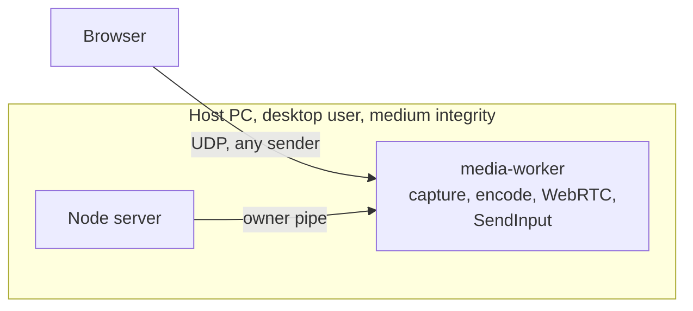
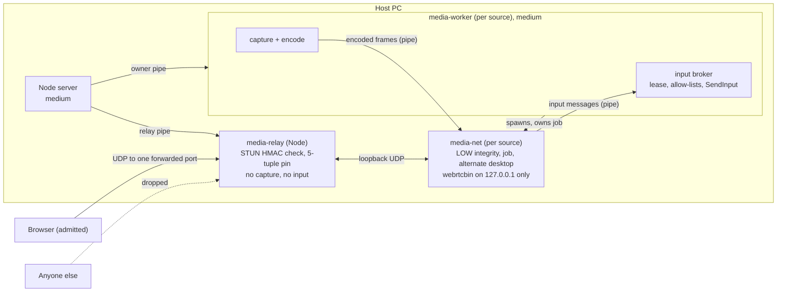
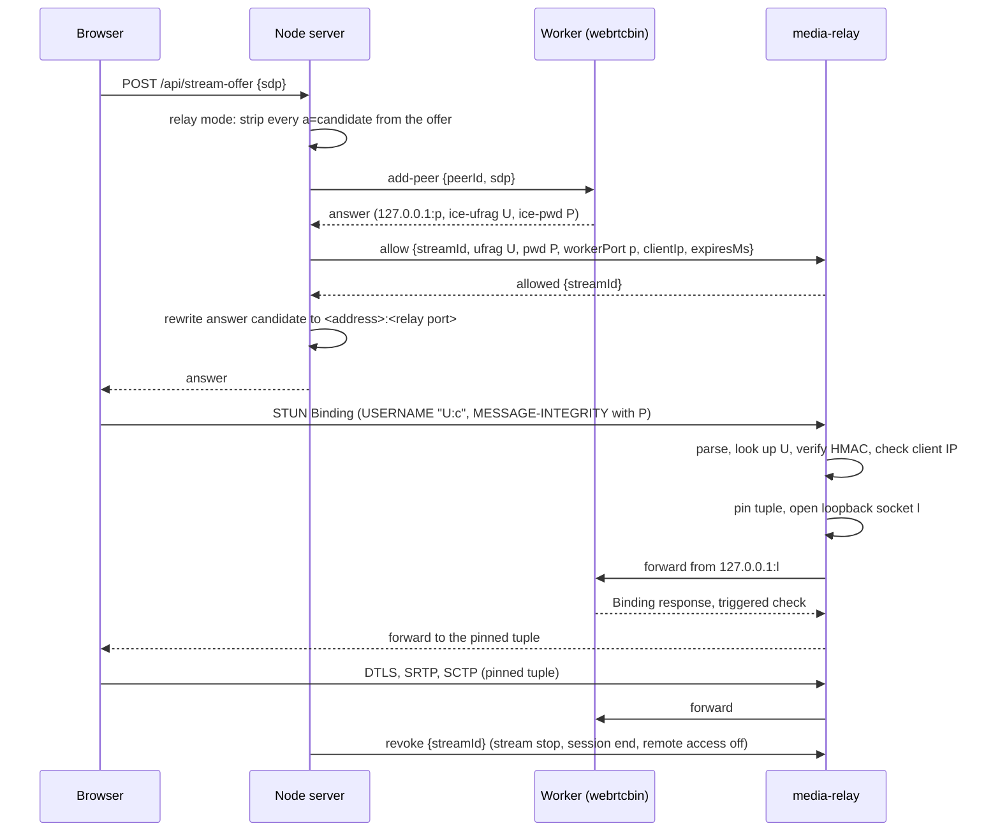
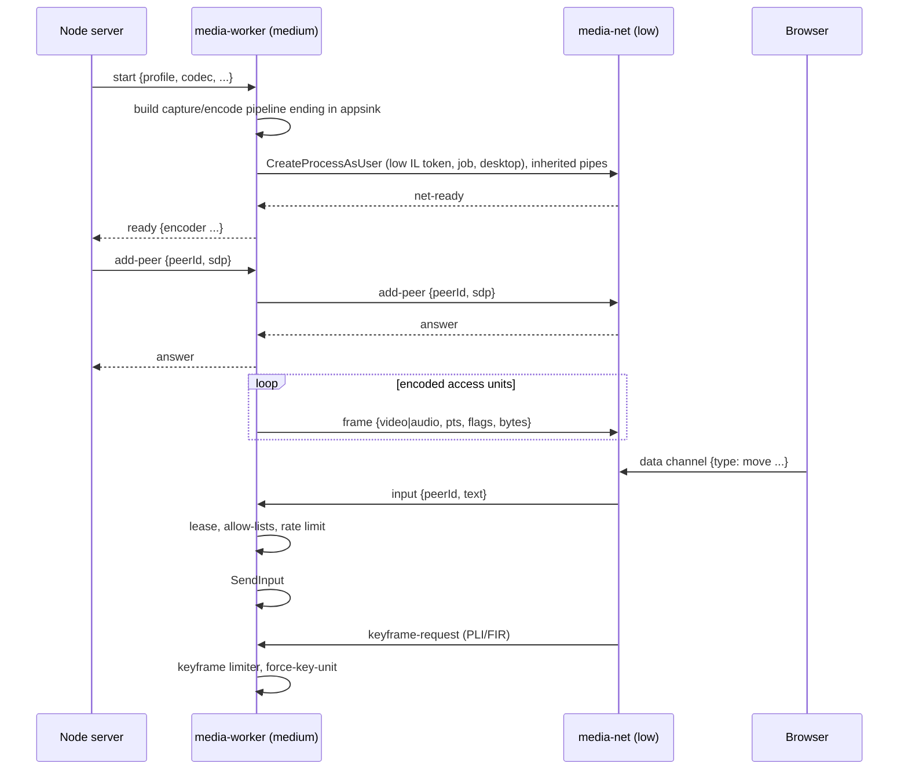

# R4: authenticating media relay, firewall rules and privilege split

**Status: design for review, 2026-09-26.** Implements the options selected from
[R4 hardening: design options](../../security/r4-hardening-options.md#recommendation):
**A** (authenticating UDP relay), **F1** (install-time firewall rules) and **B** (privilege
split). Nothing here is implemented. After review, the next step is a dated implementation
plan in `docs/superpowers/plans/`.

## Contents

- [Problem and goals](#problem-and-goals)
- [Scope and non-goals](#scope-and-non-goals)
- [Architecture overview](#architecture-overview)
- [Part A: authenticating media relay](#part-a-authenticating-media-relay)
- [Part F1: firewall rules](#part-f1-firewall-rules)
- [Part B: privilege split](#part-b-privilege-split)
- [Settings, CLI and host UI](#settings-cli-and-host-ui)
- [Failure handling](#failure-handling)
- [Security analysis](#security-analysis)
- [Testing and validation](#testing-and-validation)
- [Phasing and prototype gates](#phasing-and-prototype-gates)
- [Documentation changes](#documentation-changes)
- [Risks and open questions](#risks-and-open-questions)
- [References](#references)

## Problem and goals

With remote access on, every source worker binds libnice UDP sockets in the forwarded
`media-ports` range ([media-worker.cpp](../../../native/media-worker/src/media-worker.cpp),
`add_peer`), and an unauthenticated internet sender can make libnice parse STUN before
MESSAGE-INTEGRITY is checked. The worker is unsandboxed and holds `SendInput`, so a parser
exploit becomes input injection as the desktop user
([R4](../../security/internet-exposure.md#r4-native-parsing-is-reachable-before-authentication-on-the-media-ports-open-reduced)).

| ID  | Goal                                                                                                                                           |
| --- | ---------------------------------------------------------------------------------------------------------------------------------------------- |
| G1  | No packet from an unauthenticated sender reaches native (C) code. Only peers that prove knowledge of the session's ICE password reach libnice. |
| G2  | The code that does see unauthenticated packets is small, memory-safe and holds no capture or input capability.                                 |
| G3  | The process that runs WebRTC (ICE, DTLS, SRTP, SCTP) cannot inject input or read the desktop directly, even if fully compromised.              |
| G4  | The media worker needs no inbound firewall permission; every inbound permission VidVNC does need is scoped to a program **and** a port.        |
| G5  | No browser change, no third party, no persistent privileged service, and the server-to-worker owner protocol stays compatible where possible.  |
| G6  | Every control can be checked by VidVNC itself (tests, diagnostics), and failure of any new component fails closed.                             |

## Scope and non-goals

In scope: the relay (A) in remote access mode, firewall rule management (F1) for the
Windows host and CLI, and splitting the media worker into a medium-integrity
capture/encode/input process and a low-integrity network process (B).

Non-goals:

- Relay mode for LAN-only sharing. The design supports it (the relay serves LAN peers too
  when on), but it is switched on only with remote access in this change; see
  [phasing](#phasing-and-prototype-gates).
- Automatic router configuration (option G), media over HTTPS (C), a memory-safe ICE stack
  (D), and per-client firewall rules through an elevated helper (F2/F3).
- Sandboxing the capture/encode process: DXGI desktop duplication needs access to the
  user's desktop and stays at medium integrity.
- macOS. The design is Windows-only; the relay itself is portable.

## Architecture overview

### Today

### After A, F1 and B

Three independent layers, each with its own guarantee:

| Layer         | Guarantee                                                                        | Holds even if…                                  |
| ------------- | -------------------------------------------------------------------------------- | ----------------------------------------------- |
| Relay (A)     | Only password-proving peers reach libnice                                        | libnice has a parser bug                        |
| Split (B)     | WebRTC code cannot call `SendInput` usefully or read the screen                  | an admitted peer, or a relay bug, exploits it   |
| Firewall (F1) | Only the relay's port and the server's ports accept inbound traffic, per program | another VidVNC process opens an unexpected port |

## Part A: authenticating media relay

### Components and ownership

| Component               | Where                                                             | Responsibility                                                                                          |
| ----------------------- | ----------------------------------------------------------------- | ------------------------------------------------------------------------------------------------------- |
| `media-relay` process   | `apps/server/src/media-relay/` (new), run with `process.execPath` | Owns the public UDP port; validates, pins and forwards                                                  |
| `MediaRelay` manager    | `apps/server/src/media-relay.mjs` (new)                           | Spawns and supervises the relay; registers and revokes streams; exposes metrics                         |
| `stun.mjs`              | `apps/server/src/media-relay/stun.mjs` (new)                      | Pure, bounded STUN parsing and MESSAGE-INTEGRITY verification; no I/O                                   |
| SDP helpers             | `apps/server/src/sdp-candidates.mjs` (extended)                   | Strip offer candidates; read the worker's ufrag, password and loopback port; announce the relay address |
| Worker loopback binding | `media-worker.cpp` `add_peer` (or `media-net` after B)            | Gather host candidates on `127.0.0.1` only                                                              |

The relay is a separate process rather than code in the server so that media forwarding
never shares the event loop with TLS and signaling, and so it can later run at low integrity
([phase 3](#phasing-and-prototype-gates)). It is JavaScript: memory-safe, no new toolchain,
and Node's `dgram` and `crypto` are sufficient at desktop bitrates (a 50 Mbit/s stream is
about 4,500 packets per second).

### When relay mode is on

Relay mode is on exactly when remote access is on (`access.remoteAccess === true` with a
valid `mediaPorts` range). It applies to **every** peer while it is on, LAN and internet
alike, because the worker then has no non-loopback candidates. Turning remote access on or
off already disconnects internet sessions ([R6](../../security/internet-exposure.md)); with
this change, switching relay mode stops all live streams so that no worker keeps its old
binding, and viewers reconnect.

### Ports

The relay binds **one** UDP port, the first port of `mediaPorts` (`mediaPorts.min`), on
all addresses (`::` with dual-stack, falling back to `0.0.0.0`). All peers of all sources
share it, demultiplexed by 5-tuple. The rest of the range is unused in relay mode. The
setting keeps its range form for compatibility; the remote access guide changes to "forward
UDP port `<min>`" (forwarding the whole range remains harmless).

Worker sockets bind to `127.0.0.1` on ephemeral ports. `VIDVNC_ICE_PORTS` is not set in
relay mode; the worker instead gets `VIDVNC_ICE_BIND=loopback`.

### Worker change: loopback-only candidates

For each peer, before `set-remote-description`, the worker gets the peer's ICE agent
(already done for the port range) and emits the action signal
`add-local-ip-address("127.0.0.1")`. `GstWebRTCNice` implements it with
`nice_agent_add_local_address`; once a local address is added, libnice gathers only from
the given addresses instead of discovering interfaces. ICE-TCP is turned off as today.

The worker's answer then carries a single host candidate `127.0.0.1 <port> typ host` plus
`a=ice-ufrag` and `a=ice-pwd`. Prototype gate P1 confirms this on Windows with the pinned
GStreamer 1.28.6.

### Signaling changes

1. **Offer.** In relay mode the server removes **all** `a=candidate` lines from the
   client's offer before the worker sees it (a superset of today's
   `filterOfferCandidates`). The worker then has no remote candidates, sends no
   connectivity checks of its own to anyone, and learns the client only as a peer-reflexive
   candidate from the client's authenticated checks arriving through the relay. This also
   removes the whole class of finding R3 for relay mode.
2. **Answer.** The worker's answer is trusted (the server started the worker). The server
   reads `a=ice-ufrag`, `a=ice-pwd` and the single loopback candidate's port, and refuses
   the answer (peer fails, stream fails closed) if there is not exactly one UDP
   `127.0.0.1` host candidate.
3. **Registration.** The server sends `allow` to the relay and waits for `allowed` (bounded
   by the existing negotiation timeout) **before** returning the answer, so the client's
   first check is never dropped for lack of a registration.
4. **Rewrite.** The server replaces the loopback candidate (and the `c=` line) with the
   relay address for this client, same component and priority, `typ host`, and keeps
   `a=ice-ufrag`/`a=ice-pwd` unchanged:
   - internet client: each public IPv4 from `publicIpv4Addresses(publicHosts)` on the relay
     port (as today's `announceCandidates`, but with the relay port);
   - LAN or private client: `request.socket.localAddress` (the address the client already
     reached over HTTPS, normalised from `::ffff:`), on the relay port.
5. **Revocation.** The server sends `revoke {streamId}` whenever the stream's subscription
   leaves `live`/`starting` (stream stop, session end, reconnect, revocation of the device,
   policy change, remote access off), and on `peer-failed`.

### Relay protocol (server ↔ relay)

JSON lines over the relay's stdin/stdout. The relay accepts commands only from its parent
pipe; it has no other control input. Every field is validated; an invalid command makes the
relay exit (fail closed), matching the worker's owner-pipe rule.

| Direction | Message                                                                         | Meaning                                                                                      |
| --------- | ------------------------------------------------------------------------------- | -------------------------------------------------------------------------------------------- |
| S → R     | `{"type":"start","port":41000}`                                                 | Bind the public port; reply `ready` or exit with an error                                    |
| R → S     | `{"type":"ready","port":41000,"families":["ipv6","ipv4"]}`                      | Bound                                                                                        |
| S → R     | `{"type":"allow","streamId","ufrag","pwd","workerPort","clientIp","expiresMs"}` | Register a stream; `clientIp` may be `null` (see below); `expiresMs` ≤ 15000 until first pin |
| R → S     | `{"type":"allowed","streamId"}`                                                 | Registration active                                                                          |
| S → R     | `{"type":"revoke","streamId"}`                                                  | Remove the registration, its pins and loopback sockets                                       |
| R → S     | `{"type":"pinned","streamId","tuple":"203.0.113.9:53122"}`                      | A tuple authenticated (for Sessions and diagnostics)                                         |
| R → S     | `{"type":"unpinned","streamId","tuple","reason":"idle"}`                        | A pin ended                                                                                  |
| R → S     | `{"type":"expired","streamId"}`                                                 | No valid check before `expiresMs`; the server fails the stream                               |
| R → S     | `{"type":"metrics","dropped":{...},"forwarded":{...}}` every 2 s                | Counters by reason, for diagnostics and the security log                                     |
| S → R     | `{"type":"stop"}`                                                               | Close sockets and exit                                                                       |

Limits: at most 64 registrations (the session limit's ceiling), 4 pinned tuples per
registration, `ufrag` 4–256 ICE characters, `pwd` 22–256 ICE characters (RFC 8839),
`workerPort` 1024–65535 on loopback.

### Packet handling

For every datagram on the public socket:

1. **Pinned tuple?** Forward the datagram unchanged to the worker from that pin's loopback
   socket. Update the pin's last-seen time. Done.
2. **Budget.** Unpinned senders are rate-limited per source (IPv4 address or IPv6 /64):
   50 datagrams per second, and 2,000 per second in total; excess is dropped before parsing.
3. **Parse** with `stun.mjs` (below). Anything that is not a well-formed STUN Binding
   request is dropped without a reply. The relay never sends anything to an unpinned
   tuple: no error responses, no ICMP-like signals, nothing that confirms a live port.
4. **Look up** the registration by the part of `USERNAME` before the colon (the worker's
   ufrag). Unknown ufrag: drop.
5. **Client IP.** If the registration has a `clientIp` of the same address family as the
   sender, the sender's address must equal it (IPv6 compared by /64). `clientIp` is the
   HTTPS session's source address for internet clients; for LAN and private clients it is
   also set. Across families (HTTPS over IPv6, media over IPv4) the check is skipped and
   the HMAC alone decides, because the relay's public candidate is IPv4-only.
6. **Verify MESSAGE-INTEGRITY** with the registration's `pwd`. Failure: drop.
7. **Pin** the tuple: open a new loopback UDP socket bound to `127.0.0.1:0`, record
   `tuple ↔ socket`, then forward the request to `127.0.0.1:workerPort` from it.

Datagrams arriving on a pin's loopback socket are accepted only from
`127.0.0.1:workerPort` and sent to the pinned tuple. A pin ends after 30 seconds without a
datagram in either direction (browsers send consent checks about every 5 seconds), on
`revoke`, or when the registration expires.

Because each pinned tuple has its own loopback socket, libnice sees one distinct remote
address per client path and its replies route back to the right tuple. A client that
changes network (Wi-Fi to mobile) must pass a new authenticated check before its new tuple
is pinned; ICE restarts are not supported in this change (the viewer reconnects instead,
as today).

### STUN verification (`stun.mjs`)

Pure functions over a `Buffer`, no allocation beyond small slices, no exceptions escaping:

- Length 20–1280 bytes; first two bits zero; message type `0x0001` (Binding request);
  magic cookie `0x2112A442`; header length field a multiple of 4 and equal to the
  datagram length minus 20.
- Walk attributes as type/length/value with 4-byte padding, bounds-checked against the
  header length; at most 32 attributes; duplicate `USERNAME` or `MESSAGE-INTEGRITY` is
  malformed.
- `USERNAME` (`0x0006`) required, 3–513 bytes, printable ASCII containing exactly one `:`.
- `MESSAGE-INTEGRITY` (`0x0008`) required, 20 bytes. Only `FINGERPRINT` (`0x8028`) may
  follow it; anything else after it is malformed (the coturn issue class).
- HMAC-SHA1 per RFC 5389 section 15.4: the key is the ICE password (short-term
  credentials; ICE passwords are ASCII so SASLprep is the identity), the input is the
  message up to but excluding the MESSAGE-INTEGRITY attribute, with the header length field
  rewritten to cover the message up to and including MESSAGE-INTEGRITY. Compare with
  `crypto.timingSafeEqual`.
- If `FINGERPRINT` is present, verify CRC-32 XOR `0x5354554E`; mismatch is malformed.
- Other attributes (`PRIORITY`, `ICE-CONTROLLING`, `USE-CANDIDATE`, …) are length-checked
  and otherwise ignored; libnice parses them only after the check passes.

Test vectors: RFC 5769 section 2.1 (sample request with USERNAME `evtj:h6vY` and password
`VOkJxbRl1RmTxUk/WvJxBt`) must verify; single-bit flips anywhere in it must not.

### Diagnostics and Sessions

- Sessions and `sessions` in the CLI show the pinned tuple as the stream's media address,
  next to the HTTPS address, so the owner sees both.
- Diagnostics show the relay's counters: forwarded packets and bytes, drops by reason
  (`budget`, `malformed`, `unknown-ufrag`, `ip-mismatch`, `bad-integrity`), live pins.
- The server log records, per stream, `pinned`/`unpinned`/`expired`, and once a minute a
  summary of unauthenticated drops when non-zero, without packet contents.

## Part F1: firewall rules

### What changes

| Program                              | Today                                                                | After                                                                                                                                         |
| ------------------------------------ | -------------------------------------------------------------------- | --------------------------------------------------------------------------------------------------------------------------------------------- |
| `media-worker.exe` (and `media-net`) | Windows prompts on first listen; the user's answer covers every port | Listens on loopback only, so Windows never prompts. VidVNC adds an **inbound block rule** for these executables as defence in depth (gate P5) |
| Node server (`node.exe`)             | Prompt on first listen, any port                                     | Inbound allow: TCP on the HTTPS port; TCP on the HTTP port with remote address `LocalSubnet`                                                  |
| Relay (`node.exe`)                   | —                                                                    | Inbound allow: UDP on the relay port only                                                                                                     |

Rules are keyed on program **and** local port. `node.exe` is shared by every Node program
on the machine, so the port condition is what keeps the rule narrow. Rule names start with
`VidVNC` and carry a group `VidVNC` so they can be listed and removed as a set.

### How rules are applied

Changing Windows Firewall rules requires administrator rights. VidVNC keeps no elevated
service; instead the owner applies rules explicitly, with one UAC prompt, whenever they are
missing or out of date:

- **Host app:** Settings → Firewall shows each needed rule and its state (present, missing,
  different), read through the `HNetCfg.FwPolicy2` COM object (expected to work without
  elevation; confirmed in gate P5). **Apply
  firewall rules** starts an elevated PowerShell (`Start-Process -Verb RunAs`) that runs a
  bundled, signed-with-the-package script with the rule set as arguments. The host re-reads
  the state afterwards and reports the result.
- **CLI:** `firewall` prints the state and the exact commands; `firewall apply` does the
  same elevation from the terminal (UAC prompt). `config` works offline as today.
- **When:** the host prompts to apply rules after install, after the owner changes the HTTP,
  HTTPS or media ports, and when turning remote access on (the relay port rule is required
  for remote access; turning it on without the rule is allowed but shows a warning, as
  missing `media-ports` does today).
- **MSIX with bundled Node:** the package manifest additionally declares
  `desktop2:FirewallRules` for `runtime\node\node.exe` on the **default** ports (TCP 4383,
  TCP 4382), so a default install works without the prompt. Configured non-default ports
  still use the script. Unbundled Node lives outside the package, so its rules always come
  from the script.
- **Uninstall:** MSIX removes manifest rules itself; the host's uninstall guidance and the
  CLI's `firewall remove` delete the `VidVNC` group (one UAC prompt).

The script only accepts the parameters it needs (program paths inside the installation or
the configured Node path, and port numbers), validates them, and creates or replaces rules
in the `VidVNC` group. It never disables the firewall or touches other rules.

### Profiles

Rules apply to the Private and Domain profiles by default. When remote access is on, the
HTTPS and relay rules also apply to the Public profile only if the owner's LAN adapter is
Public (the host shows the adapter's profile and explains the choice).

## Part B: privilege split

### Process model

| Process                     | Token                                                                                                    | Holds                                                                                     | Receives from                                                        |
| --------------------------- | -------------------------------------------------------------------------------------------------------- | ----------------------------------------------------------------------------------------- | -------------------------------------------------------------------- |
| `media-worker` (per source) | Desktop user, medium integrity (unchanged)                                                               | Capture (DXGI, WASAPI), encoder, input broker (`SendInput`), permission lease, owner pipe | Server (owner pipe); `media-net` (input pipe, untrusted)             |
| `media-net` (per source)    | Desktop user, **low integrity**, `DISABLE_MAX_PRIVILEGE` restricted token, job object, alternate desktop | `webrtcbin` per peer, payloaders, data channels, loopback UDP sockets                     | `media-worker` (control and frame pipes); relay/peers (loopback UDP) |

`media-net` is the same `media-worker.exe` started with `--network` (one binary, one
packaging entry, one set of firewall considerations). The worker spawns it; the server
still talks only to the worker, so the owner protocol between server and worker is
unchanged except for new `VIDVNC_ICE_BIND` handling.

### Starting `media-net` at low integrity

Without administrator rights, the worker:

1. Opens its own token and duplicates it as a primary token.
2. Creates a restricted token with `CreateRestrictedToken(DISABLE_MAX_PRIVILEGE)`.
3. Sets `TokenIntegrityLevel` to Low (`S-1-16-4096`) with `SetTokenInformation`.
4. Creates a job object with `JOB_OBJECT_LIMIT_KILL_ON_JOB_CLOSE`,
   `JOB_OBJECT_LIMIT_ACTIVE_PROCESS` = 1 (no children), `JOB_OBJECT_LIMIT_DIE_ON_UNHANDLED_EXCEPTION`,
   a working-set/commit cap, and UI restrictions `JOB_OBJECT_UILIMIT_DESKTOP`,
   `DISPLAYSETTINGS`, `EXITWINDOWS`, `GLOBALATOMS`, `HANDLES`, `READCLIPBOARD`,
   `SYSTEMPARAMETERS`, `WRITECLIPBOARD`.
5. Creates an alternate desktop (`CreateDesktop`, random name) in the current window
   station, with a low mandatory label and a DACL granting only the desktop user, so the
   process cannot enumerate or message windows on the user's desktop (the approach
   Chromium's sandbox uses; confirmed in gate P3).
6. Starts `media-worker.exe --network` with `CreateProcessAsUser` (allowed for a restricted
   version of the caller's own token), `CREATE_SUSPENDED`, an explicit
   `PROC_THREAD_ATTRIBUTE_HANDLE_LIST` containing only the three pipe handles, and
   `PROC_THREAD_ATTRIBUTE_MITIGATION_POLICY` (no child process creation, strict handle
   checks, extension point disable). Assigns it to the job, then resumes it.

Win32k lockdown and arbitrary-code-guard are **not** enabled in this change: GLib and
GStreamer may use `user32` and ORC may generate code. Gate P4 measures whether they can be
added.

### Why low integrity is enough for input

User Interface Privilege Isolation blocks `SendInput` and window messages from a lower to a
higher integrity level, and the alternate desktop and job UI limits remove the remaining
window, clipboard and hook surfaces. A compromised `media-net` can therefore only **ask**
the worker for input, over the input pipe, and the worker applies exactly the checks it
applies today (permission lease from the owner pipe, per-peer control flag, allow-lists,
1,000 messages per second, release of held keys).

Residual: `media-net` handles every peer of its source, so a compromised `media-net` can
send input under the peer id that currently holds control. It gains the controlling
viewer's power **only while** the owner has granted control, and only through allow-listed
keys and buttons. It cannot inject input when nobody holds control, cannot grant control,
and cannot read the screen other than the encoded stream it already forwards.

### Pipes between the worker and `media-net`

Three anonymous pipes created by the worker and inherited by `media-net` (explicit handle
list, so nothing else is inherited):

| Pipe    | Direction    | Content                                                                                                                                                   | Trust                                    |
| ------- | ------------ | --------------------------------------------------------------------------------------------------------------------------------------------------------- | ---------------------------------------- |
| control | both         | JSON lines: `add-peer`, `remove-peer`, `answer`, `peer-failed`, `peer-closed`, peer transport metrics, `control-state` notifications, `net-ready`, `stop` | Worker treats every message as untrusted |
| frames  | worker → net | Binary frames: 32-byte header (kind, flags, stream index, PTS, DTS, duration, length) plus payload; a `caps` record whenever caps change                  | Net treats as trusted but bounds-checks  |
| input   | net → worker | Binary records: peer id (≤ 64 bytes), message text (≤ 1,024 bytes), exactly as the data channel delivered it                                              | Worker applies full validation           |

The worker bounds everything it reads from `media-net`: record sizes, message rates (the
existing 256 pending-input cap per peer, 1,000 per second), known peer ids only, and JSON
parsing through the existing `input_message` path. A malformed record from `media-net`
ends the source (fail closed), as an invalid owner command does today.

### Pipeline split

The split point is after the encoder's parser and after `opusenc`, where the shared `tee`
elements sit today:

- **Worker:** `d3d11screencapturesrc ! d3d11convert ! <encoder> ! <caps> ! <parser> ! appsink`
  and `wasapisrc … ! opusenc ! appsink`. Raw frames never leave the GPU or the worker.
  `appsink` callbacks write access units to the frames pipe; back-pressure drops whole
  access units (never partial) and requests a keyframe, mirroring today's leaky queues.
- **media-net:** `appsrc (caps from the caps record) ! tee name=video-fanout` and the same
  for audio; everything from the per-peer leaky queue onward (payloaders, payload-type
  probe, `webrtcbin`, data channel handling, transport telemetry) moves unchanged from
  today's `add_peer`.
- **Keyframes:** `media-net` turns upstream force-key-unit events at its `appsrc` into a
  `keyframe-request` control message; the worker applies its existing `KeyframeLimiter` and
  `request_keyframe`. The server's `keyframe` command keeps going to the worker.
- **Metrics:** `media-net` sends peer transport rows every second; the worker merges them
  into its existing `metrics` output, so the server contract is unchanged.

### Environment for `media-net`

Low-integrity processes cannot write to medium-integrity locations such as
`%LOCALAPPDATA%\VidVNC`. `media-net` therefore gets: the plugin path and an existing
read-only GStreamer registry (`GST_REGISTRY_UPDATE=no`) prepared by the worker, a
`GST_REGISTRY` file the worker copies into a directory labelled low (for example under
`%USERPROFILE%\AppData\LocalLow\VidVNC`), and no log file: it sends log lines over the
control pipe and the worker writes them to `native-worker.log`.

## Settings, CLI and host UI

| Surface                              | Change                                                                                                                   |
| ------------------------------------ | ------------------------------------------------------------------------------------------------------------------------ |
| `access-settings.json`               | No new fields. Relay mode derives from `remoteAccess`; the relay port is `mediaPorts.min`.                               |
| Host: Settings → Remote access       | Says "Forward UDP port `<min>`" instead of the range; shows relay state (listening, pins, recent unauthenticated drops). |
| Host: Settings → Firewall (new card) | Rule state and **Apply firewall rules** (UAC).                                                                           |
| Host: Sessions                       | Media address (pinned tuple) per stream in relay mode.                                                                   |
| CLI                                  | `firewall`, `firewall apply`, `firewall remove`; `status` includes relay state and firewall state.                       |
| Diagnostics                          | Relay counters; `media-net` integrity level and job status per source (read by the worker with `GetTokenInformation`).   |

## Failure handling

Every new component fails closed:

| Failure                                              | Result                                                                                                                      |
| ---------------------------------------------------- | --------------------------------------------------------------------------------------------------------------------------- |
| Relay cannot bind its port                           | Remote access reports media unavailable (host and CLI status); internet sign-in still works; no stream starts in relay mode |
| Relay exits                                          | Every relay-mode stream is stopped; the server restarts the relay (at most 3 times a minute, then media unavailable)        |
| `allow` not acknowledged in time                     | The peer fails with the usual negotiation error; nothing is forwarded                                                       |
| Worker answer without exactly one loopback candidate | The peer fails; logged as a worker contract error                                                                           |
| No valid check before `expiresMs`                    | `expired`; the server fails the stream                                                                                      |
| `media-net` cannot start at low integrity            | The worker refuses to start the source (no fallback to medium integrity) and reports why                                    |
| `media-net` exits or sends a malformed record        | The worker releases held input and ends the source                                                                          |
| Firewall rules missing                               | Warning in host and CLI; remote access still allowed (the owner may manage rules elsewhere)                                 |

## Security analysis

### Effect on the threat model

| Threat (ARCHITECTURE)                              | Before                                                | After                                                                                                         |
| -------------------------------------------------- | ----------------------------------------------------- | ------------------------------------------------------------------------------------------------------------- |
| T17 exploit native STUN/DTLS before authentication | libnice reachable by anyone while a stream is live    | Unauthenticated senders reach only `stun.mjs` (memory-safe, no capabilities); libnice only after a valid HMAC |
| T18 inject input without a grant                   | Worker-side lease; worker also holds all network code | Network code in a low-integrity process; input only through the broker's existing checks                      |
| T6 aim ICE checks at internal addresses            | Offer candidates filtered to public IPs               | In relay mode the worker gets no candidates and sends no checks of its own                                    |
| T16 exhaust media resources                        | libnice per-peer sockets                              | One port, per-source budgets before parsing, bounded registrations and pins                                   |

### New attack surface and its controls

| New surface                | Control                                                                                                                                                                                                         |
| -------------------------- | --------------------------------------------------------------------------------------------------------------------------------------------------------------------------------------------------------------- |
| Relay's STUN parser        | Memory-safe; bounded; fuzzed; rate-limited before parsing; never replies to unpinned senders                                                                                                                    |
| Relay pipe                 | Parent-only stdin; strict validation; exit on invalid input                                                                                                                                                     |
| Pinned tuple spoofing      | A spoofed source can inject datagrams into a pinned path, but they reach libnice and then fail DTLS/SRTP authentication; same as a spoofed packet toward the browser today. Pins are per tuple, not per address |
| ICE password exposure      | Passwords travel only in the HTTPS answer and the relay pipe; never logged                                                                                                                                      |
| Firewall script            | Runs only on owner action with UAC; bundled in the package; validated parameters; touches only the `VidVNC` group                                                                                               |
| `media-net` ↔ worker pipes | Explicit handle list; worker validates all input from `media-net`                                                                                                                                               |

### Residual risk after all three parts

- `stun.mjs`, Node's `dgram` and V8 still process unauthenticated datagrams, in a
  medium-integrity process until phase 3 moves the relay to low integrity.
- An admitted peer (one that holds the ICE password) still reaches libnice, now inside a
  low-integrity sandbox.
- A compromised `media-net` can act as the controlling viewer while control is granted.
- Address-based checks are coarse under carrier-grade NAT; the HMAC is the real gate.

R4 would then be recorded as **mitigated**, with the above as its residual.

## Testing and validation

| Area            | Portable tests (`npm test`)                                                                                                                                                               | Windows hardware tests                                                                                                                                                                                                             |
| --------------- | ----------------------------------------------------------------------------------------------------------------------------------------------------------------------------------------- | ---------------------------------------------------------------------------------------------------------------------------------------------------------------------------------------------------------------------------------- |
| STUN            | RFC 5769 vectors; bit flips; truncations; attribute after MESSAGE-INTEGRITY; bad FINGERPRINT; length mismatches; 1 million random buffers never throw and never verify                    | —                                                                                                                                                                                                                                  |
| Relay           | Pinning and forwarding with fake sockets; budgets; unknown ufrag; IP mismatch; family skip; idle unpin; revoke; expiry; registration limits; protocol validation and exit on bad commands | Relay forwards a real browser session: `media-ports-check.mjs` extended to assert the worker's UDP socket is on `127.0.0.1` only (`netstat`) and the browser connects                                                              |
| SDP             | Offer candidate stripping; answer parsing (exactly one loopback candidate); rewrite for internet and LAN clients; IPv6 `localAddress`                                                     | —                                                                                                                                                                                                                                  |
| Server          | Registration before answer; revoke on every exit path (stop, disconnect, revoke, policy change, remote access off); relay exit stops streams                                              | Reconnect and remote-access toggling during a live stream                                                                                                                                                                          |
| Firewall        | Rule-set generation from settings; script parameter validation (script run with `-WhatIf`)                                                                                                | Apply, read back, remove on a test VM; worker gets no prompt                                                                                                                                                                       |
| Privilege split | Frame and input record encoding/decoding; malformed records end the source                                                                                                                | `media-net` integrity is Low (`GetTokenInformation`); `SendInput` from `media-net` has no effect on a medium-integrity window; job limits in force; killing `media-net` ends the source and releases held keys; latency comparison |
| End to end      | —                                                                                                                                                                                         | iPhone on mobile data through the owner's router, as in the R8 run; packet capture shows no worker traffic on non-loopback interfaces                                                                                              |

Latency budget: the relay hop and the frame pipe together must add no more than 1 ms at the
95th percentile at 1080p60 and 4K30, measured with the existing receiver statistics.

## Phasing and prototype gates

| Phase | Content                                                                                                                                       | Exit criteria                                                                  |
| ----- | --------------------------------------------------------------------------------------------------------------------------------------------- | ------------------------------------------------------------------------------ |
| 0     | Prototypes for gates P1–P5                                                                                                                    | All gates pass, or the design is revised                                       |
| 1     | Part A (relay mode with remote access) and Part F1                                                                                            | Tests above; R4 status updated to "reduced: libnice reachable only after HMAC" |
| 2     | Part B (privilege split), for LAN and remote                                                                                                  | Tests above; R4 status "mitigated"                                             |
| 3     | Follow-ups: relay at low integrity through the same launcher; Win32k lockdown if P4 allows; decide whether relay mode becomes the LAN default | Separate spec                                                                  |

| Gate | Question                                                                                                                                                                                                                                        | Method                                                                    |
| ---- | ----------------------------------------------------------------------------------------------------------------------------------------------------------------------------------------------------------------------------------------------- | ------------------------------------------------------------------------- |
| P1   | Does `add-local-ip-address("127.0.0.1")` confine gathering to loopback on Windows with GStreamer 1.28.6, and does webrtcbin complete ICE and DTLS with a peer that exists only as a peer-reflexive candidate arriving through a loopback relay? | Throwaway relay in Node plus the existing `media-ports-check.mjs` harness |
| P2   | Relay latency and jitter at 1080p60 and 4K30                                                                                                                                                                                                    | Same harness, receiver statistics                                         |
| P3   | Does `webrtcbin` run in a low-integrity, restricted, job-limited process on an alternate desktop, fed by `appsrc` from a pipe?                                                                                                                  | Minimal `--network` prototype                                             |
| P4   | Can Win32k lockdown or ACG be enabled for `media-net`?                                                                                                                                                                                          | Enable each mitigation in the P3 prototype                                |
| P5   | Does an inbound block rule on `media-worker.exe` leave loopback UDP between the relay and `media-net` working? Can a standard user read the rules through `HNetCfg.FwPolicy2`?                                                                  | Rule on a test VM plus the P1 harness                                     |

## Documentation changes

When each phase lands, per [AGENTS.md](../../../AGENTS.md):

- `docs/ARCHITECTURE.md`: system overview and process diagrams, input and control (broker),
  media pipeline (split point), security architecture (zones, boundaries B2 and B5, attack
  surface, process isolation, threat model rows T6, T16, T17, T18), failure handling.
- `docs/security/internet-exposure.md`: R4 status and residual, exposure map (media ports
  row), controls, verification record.
- `docs/security/remote-access.md`: forward one UDP port; firewall rules step.
- `docs/security/r4-hardening-options.md`: mark A, F1 and B as selected and link here.
- `README.md` (firewall section, CLI `firewall` commands), `CHANGELOG.md`,
  `packaging/windows/README.md` (manifest rules, script), `CONTRIBUTING.md` if test commands
  change.

## Risks and open questions

- **ICE behaviour through the relay (P1)** is the main technical risk; if libnice refuses
  peer-reflexive-only operation or loopback gathering, the fallback is to keep the worker's
  own candidates on loopback via a different binding method, or to revisit option D.
- **Browser behaviour with a single host candidate on a shared port:** all browsers support
  this (it is how SFUs with UDP mux work), but it must be checked on iPhone Safari.
- **Frame pipe throughput** at high bitrates and on busy machines; mitigated by dropping whole
  access units and requesting keyframes.
- **Two-stage negotiation** (server → worker → `media-net`) adds a few milliseconds to stream
  start; acceptable.
- **Firewall UX:** a UAC prompt is unfamiliar for some owners; the host explains it, and
  remote access remains usable if rules are managed elsewhere.
- **Open:** whether to shrink the `media-ports` setting to a single port once relay mode is
  proven; whether relay mode should become the LAN default (phase 3).

## References

- [R4 hardening: design options](../../security/r4-hardening-options.md) and its sources
- [RFC 5389 (STUN), section 15.4 MESSAGE-INTEGRITY](https://www.rfc-editor.org/rfc/rfc5389.html#section-15.4)
- [RFC 5769: test vectors for STUN](https://www.rfc-editor.org/rfc/rfc5769.html)
- [RFC 8445 (ICE), peer-reflexive candidates](https://www.rfc-editor.org/rfc/rfc8445.html)
- [RFC 8839: SDP offer/answer for ICE (ufrag and password lengths)](https://www.rfc-editor.org/rfc/rfc8839.html)
- [GStreamer `GstWebRTCNice` source (`add-local-ip-address`)](https://gitlab.freedesktop.org/gstreamer/gstreamer/-/blob/main/subprojects/gst-plugins-bad/gst-libs/gst/webrtc/nice/nice.c)
- [libnice `nice_agent_add_local_address`](https://libnice.freedesktop.org/libnice/NiceAgent.html)
- [User Interface Privilege Isolation](https://en.wikipedia.org/wiki/User_Interface_Privilege_Isolation)
- [Restricted tokens](https://learn.microsoft.com/en-ca/windows/win32/secauthz/restricted-tokens)
- [Chromium sandbox design](https://chromium.googlesource.com/chromium/src/+/HEAD/docs/design/sandbox.md)
- [Windows Firewall dynamic keywords and rule management](https://learn.microsoft.com/en-us/windows/security/operating-system-security/network-security/windows-firewall/dynamic-keywords)
- [MSIX `desktop2:Rule`](https://learn.microsoft.com/en-au/uwp/schemas/appxpackage/uapmanifestschema/element-desktop2-rule)
