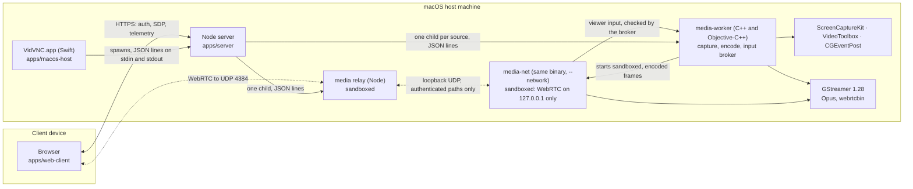
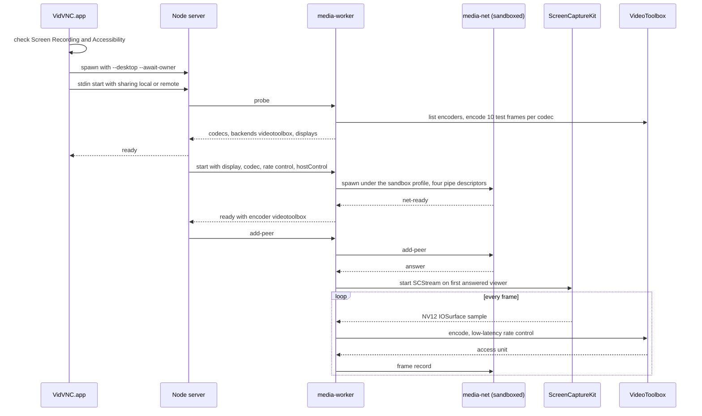

# macOS support: native host, server and distribution

**Status: draft for review, revision 1, 2026-10-09.** Nothing here is implemented. It covers
the `macos-server` and `macos-cli` targets in [targets.json](../../../packaging/targets.json):
a native macOS host app, a macOS build of the server and media worker, and how both are
signed and distributed. The native macOS viewer (`macos-client`) is a separate piece of
work. A dated implementation plan in `docs/superpowers/plans/` follows this spec.

## Contents

- [Problem and goals](#problem-and-goals)
- [Scope and non-goals](#scope-and-non-goals)
- [What is Windows-specific today](#what-is-windows-specific-today)
- [Architecture on macOS](#architecture-on-macos)
- [Decisions](#decisions)
- [Distribution: Developer ID and the Mac App Store](#distribution-developer-id-and-the-mac-app-store)
- [Older macOS versions on Apple Silicon](#older-macos-versions-on-apple-silicon)
- [Security analysis](#security-analysis)
- [Prototype gates](#prototype-gates)
- [Documentation changes](#documentation-changes)
- [Risks and open questions](#risks-and-open-questions)
- [References](#references)

## Problem and goals

VidVNC hosts only on Windows. Every server-side process except the Node server assumes
Win32: the media worker captures with DXGI, encodes with NVENC, Quick Sync, AMF or Media
Foundation, captures audio with WASAPI and injects input with `SendInput`; its network
process is sandboxed with a restricted token, a job and a private desktop; the server finds
eligible LAN adapters and makes its self-signed certificate through PowerShell; and the host
is WinUI 3. The roadmap already commits to "a native macOS host" (milestone 4); this design
says how.

| ID  | Goal                                                                                                                                                                                                            |
| --- | --------------------------------------------------------------------------------------------------------------------------------------------------------------------------------------------------------------- |
| M1  | An Apple Silicon Mac on macOS 27 shares its displays and audio, and takes keyboard and mouse, with the existing browser viewer. No viewer, signaling, relay or owner-protocol change beyond listed additions.   |
| M2  | A native macOS host app (Swift, SwiftUI and AppKit) at parity with the Windows host's pages, plus a Permissions page for macOS privacy settings.                                                                |
| M3  | A macOS command-line server built from the same server payload as the app, as on Windows.                                                                                                                       |
| M4  | The app installs as a Developer ID–signed, notarized and stapled app that Gatekeeper opens without warnings. **This is the committed distribution.**                                                            |
| M5  | A Mac App Store build is pursued as a second signing configuration of the same app, **only if** the App Store gates pass (see [Mac App Store](#channel-b-mac-app-store-gated)).                                 |
| M6  | Security properties match Windows: the server listens only after the owner approves, the worker never touches the network, WebRTC runs in a sandboxed process, the relay is sandboxed, every link fails closed. |
| M7  | One source tree. The server and web client are shared unchanged in behaviour; the worker's platform-neutral C++ (broker, policy, records, rate control, telemetry) is shared; only platform modules differ.     |

## Scope and non-goals

In scope: the media worker and media-net on macOS, the server's platform seams, the macOS
host app, the macOS CLI bundle, Developer ID signing and notarization, a Mac App Store
feasibility track, permission onboarding, and the documentation and tests for all of it.

Not in scope:

- The native macOS viewer (`apps/macos-client`). The browser viewer works with a Mac host
  unchanged.
- Intel Macs. macOS 27 requires Apple Silicon ([Apple, WWDC25](#references)), so the
  existing `arm64`, `minimumOS: 27` target needs no universal binary.
- macOS versions before 27. The first release supports macOS 27 only.
  [Older macOS versions](#older-macos-versions-on-apple-silicon) says what each earlier
  floor would cost, back to the macOS 11 that the first M1 Macs shipped with.
- Capturing the login window, running before login, or a LaunchDaemon. These need root
  and a different trust model.
- Fast user switching and more than one console user.
- Moonlight compatibility, the hub, and adaptive quality, which stay on their own
  roadmap entries.

## What is Windows-specific today

| Area                  | Windows today                                                                                                                       | macOS replacement                                                                                          |
| --------------------- | ----------------------------------------------------------------------------------------------------------------------------------- | ---------------------------------------------------------------------------------------------------------- |
| Worker build          | [CMakeLists.txt](../../../native/media-worker/CMakeLists.txt) stops unless `WIN32` and MSVC                                         | Clang, Objective-C++ for Apple framework code, GStreamer.framework                                         |
| Display inventory     | [display-inventory.hpp](../../../native/media-worker/src/display-inventory.hpp), DXGI outputs                                       | `CGGetActiveDisplayList`, `CGDisplayCreateUUIDFromDisplayID` for a stable id, `NSScreen` for scale         |
| Video capture         | `d3d11screencapturesrc`, `d3d11convert`                                                                                             | ScreenCaptureKit `SCStream` per display, NV12 IOSurface buffers, cursor shown                              |
| Video encode          | NVENC, Quick Sync, AMF, Media Foundation elements, [encoder-backend.hpp](../../../native/media-worker/src/encoder-backend.hpp)      | VideoToolbox `VTCompressionSession`, one backend `videotoolbox` ([D1](#d1-capture-and-encode-natively))    |
| Audio capture         | `wasapisrc` loopback                                                                                                                | ScreenCaptureKit audio (`capturesAudio`, excluding VidVNC's own audio) into the existing Opus branch       |
| Input                 | `SendInput`, Windows virtual-key table in [input-policy.hpp](../../../native/media-worker/src/input-policy.hpp)                     | `CGEventPost` with a macOS virtual-key table behind the same allow-list ([D4](#d4-input))                  |
| Worker to media-net   | Win32 anonymous pipes, [net-pipes.hpp](../../../native/media-worker/src/net-pipes.hpp)                                              | POSIX pipes passed as inherited descriptors; record formats unchanged                                      |
| Sandbox               | Restricted token, job, desktop, mitigations, [sandbox.hpp](../../../native/media-worker/src/sandbox.hpp)                            | macOS sandbox profile applied by the launcher ([D3](#d3-sandbox-for-media-net-and-the-relay))              |
| Port attestation      | `check-port` with `GetExtendedUdpTable`                                                                                             | `proc_pidinfo`/`proc_pidfdinfo` on media-net's pid                                                         |
| Relay sandbox         | `media-worker.exe --sandbox -- node …` ([media-relay.mjs](../../../apps/server/src/media-relay.mjs))                                | `media-worker --sandbox -- node …` with the macOS profile                                                  |
| LAN eligibility       | PowerShell `Get-NetAdapter` and the Private profile ([windows-lan-adapters.mjs](../../../apps/server/src/windows-lan-adapters.mjs)) | A macOS adapter provider ([D6](#d6-lan-eligibility-without-a-network-profile))                             |
| Self-signed TLS       | PowerShell into `Cert:\CurrentUser` ([windows-self-signed.mjs](../../../apps/server/src/tls/strategies/windows-self-signed.mjs))    | A portable `self-signed` strategy in JavaScript ([D7](#d7-tls-without-powershell))                         |
| Runtime paths         | [runtime.mjs](../../../native/media-worker/runtime.mjs) assumes `LOCALAPPDATA` and `out/native/windows-x64`                         | Per-platform defaults; [paths.mjs](../../../apps/server/src/paths.mjs) already maps to Application Support |
| Encoder ids           | `nvenc`, `qsv`, `amf`, `mediafoundation` in [encoder-backends.mjs](../../../apps/server/src/encoder-backends.mjs) and the CLI       | Add `videotoolbox`                                                                                         |
| Host and process tree | WinUI 3, a kill-on-close job ([ServerJob.cs](../../../apps/windows-host/ServerJob.cs))                                              | SwiftUI and AppKit; pipe-closure cascade plus parent-exit watches ([D8](#d8-host-app))                     |
| Firewall              | Rules keyed to the executable                                                                                                       | macOS Application Firewall prompt, keyed to the signed server binary                                       |
| Packaging             | MSIX and ZIP, [packaging/windows](../../../packaging/windows/README.md)                                                             | `.app` in a DMG, a `.pkg` for the CLI, optionally a Mac App Store `.pkg`                                   |

The server's session, admission, policy, relay, signaling and diagnostics code, the web
client, and the worker's broker, policy and record code are already portable. The Portable
checks workflow runs `npm test` on macOS today.

## Architecture on macOS

The process model is the Windows one with Apple pieces in each box. Every arrow is the same
protocol as on Windows.





## Decisions

Each decision names its alternative and the gate that confirms it.

### D1. Capture and encode natively

On macOS the worker captures with ScreenCaptureKit and encodes with `VTCompressionSession`
directly, in Objective-C++, rather than through GStreamer elements. The worker hands media-net
the same encoded access units it hands it on Windows, so nothing from the frames pipe onward
changes.

- ScreenCaptureKit is Apple's supported capture API. GStreamer has no upstream
  ScreenCaptureKit source (only a work-in-progress third-party plugin), and `avfvideosrc`
  screen capture relies on `AVCaptureScreenInput`, which ScreenCaptureKit supersedes.
- `SCStream` can deliver NV12 IOSurface-backed `CVPixelBuffer`s at the profile's output size
  and frame rate, which VideoToolbox takes without a copy. This keeps the Windows property
  that raw frames never reach system memory or leave the worker.
- VideoToolbox gives the low-latency controls GStreamer's `vtenc` does not all expose:
  `kVTVideoEncoderSpecification_EnableLowLatencyRateControl`, real-time mode, no frame
  reordering, `MaxKeyFrameInterval`, `AverageBitRate` and `DataRateLimits`.
- The encoder model stays two tables. `video-codec.hpp` keeps the bitstream facts. A new
  `videotoolbox` backend row records that it has no GStreamer element and no adapter
  affinity (one GPU). The one file that turns `RateControl` intent into properties on macOS
  is `vt-rate-control.mm`, tested with the same intent inputs as `encoder-properties.hpp`.
- The probe does what it does on Windows: a codec is advertised only after 10 real frames
  encode. AV1 is advertised only if `VTCopyVideoEncoderList` lists a hardware AV1 encoder
  and it passes; no Apple Silicon generation is assumed to have one.
- No software encoder fallback, as on Windows.

Alternative: `appsrc` into `vtenc_h264_hw` and `vtenc_h265_hw`, keeping the encode in
GStreamer. Simpler to wire, but it gives up the low-latency rate control and adds a buffer
wrapping step. Gate MG2 measures both if the native path disappoints.

Audio: ScreenCaptureKit's audio samples (48 kHz float) go into an `appsrc` feeding the
existing `audioconvert`, `audioresample`, `opusenc` and `appsink` branch, so the Opus
settings and the audio record format are unchanged. `excludesCurrentProcessAudio` keeps
VidVNC's own sounds out.

### D2. Pipes and media-net

media-net is already mostly portable: it is GStreamer `webrtcbin` and the record protocol.
`net-pipes.hpp` gains a POSIX implementation (four `pipe(2)` pairs, `FD_CLOEXEC` on
everything except the four ends passed to the child, dedicated I/O threads as now).
`net-records.hpp`, `sdp-payload.hpp` and `transport-telemetry.hpp` are unchanged. The
Winsock start and `RevertToSelf` steps become no-ops; the macOS equivalent of "load
everything, then drop privilege" is that the sandbox profile is applied before `exec`, and
GStreamer's plugin registry is prepared by the worker and passed read-only.

`check-port` uses `proc_pidinfo(PROC_PIDLISTFDS)` and `proc_pidfdinfo(PROC_PIDFDSOCKETINFO)`
on media-net's pid to confirm that the answer's `127.0.0.1:<port>` belongs to it, with the
same refusal on mismatch.

### D3. Sandbox for media-net and the relay

Windows tier T1 guarantees that a compromised media-net or relay can neither capture the
screen, inject input, read the user's files nor reach the network beyond what it needs. On
macOS the risk specific to this design is **TCC attribution**: privacy grants such as Screen
Recording and Accessibility are attributed to the responsible app, so a child of VidVNC.app
may be able to use them unless something stops it.

Candidate mechanisms, in order of preference for the Developer ID build:

1. **A sandbox profile applied by the launcher** (`media-worker --sandbox -- …`, as on
   Windows): deny by default; allow only the inherited descriptors, reading the app bundle
   and the prepared plugin registry, and for media-net loopback UDP only, for the relay UDP
   and the inherited stdio. Deny `mach-lookup` to the window server, ScreenCaptureKit,
   `tccd` and the event system, and deny `process-fork` and `process-exec`. This mirrors the
   Windows launcher exactly and is how Chromium sandboxes its renderers, but it depends on
   the deprecated `sandbox_init` family. Not usable in a Mac App Store build.
2. **Sandboxed helper executables** signed with `com.apple.security.app-sandbox` and only
   the network entitlements, without `inherit`, so each gets its own App Sandbox. Public API,
   but App Sandbox allows window-server access by default, and whether TCC grants carry over
   must be measured.
3. **XPC services** with their own entitlements, passing the pipe descriptors over the XPC
   connection. The sanctioned privilege-separation mechanism on the Mac App Store.

Gate MG4 ports `sandbox-probe` to macOS and runs it under each candidate. The design does
not proceed with a mechanism that lets the sandboxed process capture the screen, post
events, read the user's files, or open a non-loopback socket (media-net). If none passes,
macOS ships without the privilege split only with the owner's written acceptance of that
residual risk in the security analysis, not silently.

### D4. Input

The broker is unchanged: the owner's lease, the peer's control flag, allow-lists, rate limit
and release on loss. Only the last step differs.

- `CGEventCreateMouseEvent`, `CGEventCreateKeyboardEvent` and `CGEventCreateScrollWheelEvent2`
  posted to `kCGHIDEventTap`. Button state is tracked so drags post `…MouseDragged` events.
- `input-policy.hpp` keeps one allow-list of browser `code` values; the Windows virtual-key
  values and the macOS `kVK_*` values become two tables behind it, tested for the same key
  set.
- Coordinates map the normalised point onto the display's bounds in global points
  (`CGDisplayBounds`), which handles mixed Retina and non-Retina displays and negative
  origins.
- Modifiers are passed by position: a viewer's Control is the Mac's Control. A host setting
  to swap Control and Command for viewers on Windows or iPhone is left to a later change
  ([open question Q3](#risks-and-open-questions)).
- Posting events needs the user's Accessibility approval (the `PostEvent` privilege). The
  worker checks `CGPreflightPostEventAccess` at `start` and reports `input-unavailable`
  rather than silently dropping input; the host shows it.

### D5. Permissions and onboarding

| Privacy setting                           | Needed for                 | When asked                                         |
| ----------------------------------------- | -------------------------- | -------------------------------------------------- |
| Screen & System Audio Recording           | ScreenCaptureKit           | First Start sharing, from the host                 |
| Remote Desktop (new in macOS 27)          | To be established (MG6)    | To be established                                  |
| Accessibility                             | `CGEventPost`              | First time the host grants or allows control       |
| Local Network                             | Relay replies to LAN peers | First start, with `NSLocalNetworkUsageDescription` |
| Application Firewall ("accept incoming…") | The server's listeners     | First listen, keyed to the signed server binary    |

- The host gets a **Permissions** page showing each state (`CGPreflightScreenCaptureAccess`,
  `CGPreflightPostEventAccess`) with buttons that open the matching System Settings pane.
  Nothing is requested at app launch; each prompt follows an owner action that needs it.
- The grants belong to the responsible app, VidVNC.app, so prompts name VidVNC. For the CLI
  started from Terminal the responsible app is the terminal, which then needs the grants.
  That is documented, not worked around, at first ([Q4](#risks-and-open-questions)).
- Since macOS 15, ScreenCaptureKit users are asked again periodically to keep allowing
  capture. Apple's managed `com.apple.developer.persistent-content-capture` entitlement
  removes this for remote-desktop products, but Apple describes it as for headless "VNC"
  deployments and grants it on request. The owner applies for it; if refused, the periodic
  prompt is a documented known limitation.
- macOS 27 adds a "Remote Desktop" privacy category separate from Screen Recording, with no
  public API to read it. Gate MG6 establishes what triggers it and whether VidVNC needs it.

### D6. LAN eligibility without a network profile

Windows binds only physical adapters on networks the user marked Private. macOS has no
network profile. Proposal: a `macos-lan-adapters.mjs` provider returning the same rows as
`normalizeWindowsLanRows`, where a row is eligible when the interface is a physical Ethernet
or Wi-Fi port (from SystemConfiguration, through the worker's new read-only `--adapters`
mode, so it works inside an App Sandbox), is up, and has a private, unique-local or
link-local address. VPN, bridge, `utun` and Thunderbolt-bridge interfaces are ineligible.
`VIDVNC_HOST` can still only narrow. Remote access keeps its separate opt-in. Whether the
owner must also confirm each new network the first time is [Q2](#risks-and-open-questions).

### D7. TLS without PowerShell

A new portable `self-signed` strategy generates a P-256 key with `node:crypto` and writes a
self-signed X.509 certificate with a small DER writer, with the same subject alternative
names, validity and renewal checks as `windows-self-signed`. The key is stored in the data
directory with mode `0600`. It is used on macOS (and could replace the PowerShell strategy
on Windows later, which is out of scope). `mkcert` keeps working on macOS in the Developer
ID build; the Mac App Store build cannot run tools from `PATH` and offers `provided` and
`self-signed` only. Moving the key into the Keychain is a later hardening.

### D8. Host app

- `apps/macos-host`: an Xcode project with Swift 6, SwiftUI for pages and AppKit where
  SwiftUI falls short (the Identify overlays, the display arrangement canvas, the status
  item). Minimum macOS 27.
- **Owner protocol first.** The protocol between host and server is defined today by
  [main.mjs](../../../apps/server/src/main.mjs) and the C# that speaks it. Before Swift UI
  work, write it down as a contract (commands, `*-result` replies, `status` fields) with
  JSON fixtures, and check both hosts against the existing
  [owner fixture](../../../apps/windows-host/tests/Navigation/owner-fixture.mjs). The
  contract describes the existing protocol; it is not a new one.
- Pages at parity with Windows: Overview, Sharing, Displays (arrangement and Identify),
  Profiles, Allowed options, Codecs, Access, Clients, Sessions, TLS, Versions, plus
  Permissions. A menu bar item shows sharing state next to macOS's own capture indicator.
  The roadmap's rule applies: a design preview in [docs/design](../../design) first.
- **Process tree without job objects.** The host spawns the server with `posix_spawn` and
  pipes. The server already stops when its owner pipe closes; the relay and workers already
  exit when their input closes. Add, as defence in depth, a `kqueue` `EVFILT_PROC`
  `NOTE_EXIT` watch on the parent in the worker and relay launcher, and a `process.ppid`
  check in the server. Acceptance is the Windows one: kill the host with `SIGKILL` and no
  VidVNC process survives.
- Login at startup is an explicit opt-in through `SMAppService`.

### D9. Bundle layout and runtime

```text
VidVNC.app/Contents/
  MacOS/VidVNC                  Swift host
  MacOS/VidVNC Server           Node.js, renamed, signed with allow-jit
  MacOS/media-worker            worker and media-net (one binary, as on Windows)
  Frameworks/                   allow-listed GStreamer, GLib, libnice, OpenSSL, Opus, libsrtp, usrsctp dylibs
  PlugIns/gstreamer/            allow-listed GStreamer plugins
  Resources/server/             apps/server, apps/web-client, media-worker JS adapter
  Resources/runtime.json        packaged runtime manifest, paths relative to the bundle
  Resources/notices/            third-party notices
```

- Node.js is bundled as plain files, as the Windows host package already may. Renaming it
  makes firewall and Activity Monitor entries say VidVNC.
- GStreamer comes from the pinned 1.28.6 macOS framework; the allow-list is the Windows one
  minus the Windows-only plugins (`d3d11`, `wasapi`, the four encoder plugins) plus
  `applemedia` only if D1's alternative is chosen. Install names are rewritten to `@rpath`.
  The plugin registry lives in the user's cache, as on Windows.
- `runtime.json` gains `architecture: arm64` and `os: macos`; the manifest rules (relative
  paths, nothing escaping the bundle) are unchanged.
- Mutable data stays in `~/Library/Application Support/VidVNC`, logs in its `logs` folder,
  as `paths.mjs` already has for non-Windows.

## Distribution: Developer ID and the Mac App Store

### Channel A: Developer ID (committed)

VidVNC.app, signed with the owner's **Developer ID Application** certificate, hardened
runtime on every executable, notarized with `notarytool` and stapled, shipped in a signed
DMG. The CLI bundle ships as a `.pkg` signed with **Developer ID Installer**, notarized and
stapled, installing to `/usr/local/vidvnc` with a `vidvnc` link in `/usr/local/bin`; like the
Windows CLI it uses Node.js from `PATH` as a declared prerequisite.

- Entitlements are per executable and minimal: the server binary
  `com.apple.security.cs.allow-jit` (V8); the worker none beyond the hardened runtime
  defaults (library validation stays on: every dylib is signed by the same team). Gate MG5
  confirms the minimal set.
- Signing order is inside-out: dylibs and plugins, helpers, then the app, then the DMG.
  `codesign --verify --deep --strict`, `spctl --assess` and `stapler validate` are part of
  the package check.
- Credentials stay out of the repository: the signing identity in the owner's login
  keychain, notarization through a `notarytool` keychain profile. The package scripts take
  their names from the environment and fail with instructions when absent.
- This is the channel that satisfies "at the very least, sideloaded and signed with my
  Apple developer identity": the app is not sideloaded in any unsupported sense, it is the
  standard way to ship Mac software outside the store.

### Channel B: Mac App Store (gated)

A second signing configuration of the same app, built only if the gates below pass. What
is known now:

| Requirement                     | Effect on VidVNC                                                                                                                                                                                                                                                              | Status            |
| ------------------------------- | ----------------------------------------------------------------------------------------------------------------------------------------------------------------------------------------------------------------------------------------------------------------------------- | ----------------- |
| App Sandbox on every executable | Server, relay, worker and media-net must be sandboxed; plain child executables must use exactly `app-sandbox` plus `inherit`, so they share the app's sandbox                                                                                                                 | Feasible, MG7     |
| Input injection                 | `CGEventPost` works in the sandbox (Apple DTS, 2026: the `PostEvent` privilege is sandbox-compatible), **but App Review rejected sandboxed apps that post events under guideline 2.4.5 in 2026** ("Accessibility features should not be used for non-accessibility purposes") | **Main blocker**  |
| Privilege split                 | Launcher profiles (D3 option 1) are not allowed; only XPC services (option 3) can give media-net a sandbox narrower than the app's                                                                                                                                            | MG4, MG7          |
| JIT in Node.js                  | Electron apps ship V8 on the store with `allow-jit` and inherited sandboxes                                                                                                                                                                                                   | Likely, MG7       |
| Data location                   | Settings move into the app's container; the CLI cannot share them without an App Group                                                                                                                                                                                        | Design choice     |
| Tools from `PATH`               | No `mkcert`                                                                                                                                                                                                                                                                   | Accepted          |
| Background processes            | Nothing may keep running after the app quits, and login launch needs consent (2.4.5)                                                                                                                                                                                          | Already the model |
| Updates                         | Only through the store                                                                                                                                                                                                                                                        | Accepted          |
| Licensing                       | VidVNC's own code is the owner's to license for the store. The bundled LGPL libraries (GStreamer, GLib, libnice) and App Store terms need a licensing review, possibly a custom EULA                                                                                          | Owner decision    |
| Persistent content capture      | A managed entitlement Apple scopes to headless deployments; without it, periodic capture prompts                                                                                                                                                                              | Apply, MG6        |

Recommendation: build the app **sandbox-clean from the start** (no writes outside its data
directory, everything resolved inside the bundle, no `PATH` lookups in app mode), because it
costs little and keeps the store open, but **ship Developer ID first** and decide on the
store after gate MG7, which includes asking App Review directly whether a remote-desktop
host that posts input events is acceptable. A view-only App Store edition is a fallback the
owner may or may not want; it is not proposed by default.

## Older macOS versions on Apple Silicon

The first release supports **macOS 27 only**. This section records what an earlier floor
would cost, so the owner can lower it later on purpose. The first M1 Macs shipped with
macOS 11 (Big Sur), in November 2020.

**Older versions add no hardware.** Apple's macOS 27 compatibility list includes every Apple
Silicon Mac from 2020 on, M1 included ([AppleInsider](#references)). Supporting an older
macOS reaches people who have not upgraded, not older Macs. Apple also normally patches only
the current release and the two before it, so in late 2026 that is 27, 26 and 15. Anything
older runs VidVNC on a Mac that no longer gets full security fixes, which matters for a
program that takes remote input.

### What changes at each floor

| Floor          | What breaks or changes                                                                                                                                                                                                                                                                                                                                | Cost                |
| -------------- | ----------------------------------------------------------------------------------------------------------------------------------------------------------------------------------------------------------------------------------------------------------------------------------------------------------------------------------------------------- | ------------------- |
| 26 (Tahoe)     | Nothing in capture, encode, input or the server. The host must guard any macOS 27-only SwiftUI or AppKit API with `if #available`, and the Remote Desktop privacy handling (D5) becomes 27-only.                                                                                                                                                      | Small               |
| 15 (Sequoia)   | Same as 26, plus the host's design must not depend on macOS 26 interface APIs. Behaviour matches 27 for the periodic capture prompt and Local Network privacy.                                                                                                                                                                                        | Small               |
| 14 (Sonoma)    | No periodic capture re-approval and no Local Network prompt, so onboarding has two paths. ScreenCaptureKit's `captureResolution` and the content-sharing picker exist from 14. Swift's Observation (`@Observable`) also starts at 14. No longer patched in full.                                                                                      | Small–medium        |
| 13.5 (Ventura) | No Observation: the host's models use `ObservableObject` and Combine throughout, chosen from the start or rewritten later. ScreenCaptureKit audio (`capturesAudio`, `excludesCurrentProcessAudio`), `NavigationSplitView`, `MenuBarExtra` and `SMAppService` all exist from 13. 13.5 is the lowest version Node.js 24 supports.                       | Medium              |
| 13.0–13.4      | Node.js 24, which the Windows packages pin, does not support these. The Mac packages would need an older Node.js line, every one of which reaches end of life by April 2027.                                                                                                                                                                          | Medium, short-lived |
| 12.3–12.x      | ScreenCaptureKit exists, but cannot capture system audio before 13, and Core Audio process taps only arrive in 14.2. Audio would mean a virtual audio driver that VidVNC installs (not possible on the Mac App Store), or no audio. No `MenuBarExtra`, `NavigationSplitView` or `SMAppService`, so those parts of the host need AppKit or older APIs. | Large               |
| 11.0–12.2      | No ScreenCaptureKit. Capture would need a second backend on `CGDisplayStream`, which Apple deprecated and the current SDK marks unavailable, so it needs runtime lookup or an older SDK. macOS 11 cannot run as a virtual machine on Apple Silicon, so testing needs a real Mac kept on 11.                                                           | Massive             |

Unchanged at every floor back to macOS 11: `CGEventPost` and `CGPreflightPostEventAccess`
(10.15), VideoToolbox hardware H.264 and HEVC encoding on every M1, low-latency H.264 rate
control (11.3), hardened runtime and notarization, and the server and web client. The
GStreamer 1.28.6 macOS framework's own minimum is not documented. MG1 reads it from the
binaries (`otool -l`, `LC_BUILD_VERSION`), and it may set a floor of its own.

### What it would take

To lower the floor to macOS 15, which is the cheapest useful step and still patched:

1. Set the deployment target to 15 in the host's Xcode project and the worker's CMake
   (`CMAKE_OSX_DEPLOYMENT_TARGET`), and `minimumOS` in `targets.json` and the packaged
   `runtime.json`.
2. Guard each newer API with `if #available` and an older path, or don't use it. Build
   with `-Wunguarded-availability` treated as an error, so the compiler finds misses.
3. Make the Remote Desktop privacy check (D5) conditional on macOS 27.
4. Run gates MG2, MG3 and MG6 again on macOS 15, and add 15 to the acceptance runs.
   Virtual machines (Virtualization.framework, for macOS 12 and later) cover installation,
   onboarding and the UI. They do not cover hardware encoding or latency, because a virtual
   machine has no VideoToolbox hardware encoder, so those need a real Mac on that version.

Going to 14 adds a second onboarding path, because macOS 14 has no periodic prompt and no
Local Network prompt. Going to 13.5 means writing the host with `ObservableObject` instead
of Observation, and that choice is cheapest to make **before** the host is written. If 13.5
is ever wanted, decide it before the host app is built. Going below 13.5 is not
recommended: it costs an end-of-life Node.js, then system audio, then the whole capture
backend, and it adds no hardware.

## Security analysis

New or changed rows for the [threat model](../../ARCHITECTURE.md#threat-model) when this
lands:

| Threat                                                                                  | Control                                                                                                 |
| --------------------------------------------------------------------------------------- | ------------------------------------------------------------------------------------------------------- |
| A compromised media-net or relay uses VidVNC's Screen Recording or Accessibility grants | D3 sandbox denies the services behind those grants; MG4 proves it                                       |
| Another local process drives VidVNC's worker to capture or inject                       | The worker trusts only its owner pipe, as on Windows; no Mach or XPC service is published by the worker |
| A tampered bundle or dylib                                                              | Hardened runtime, library validation, notarization; Gatekeeper on first launch                          |
| Settings or key files read by other local users                                         | Data directory `0700`, key files `0600`                                                                 |
| CLI from Terminal holds capture and input grants for everything Terminal runs           | Documented; Q4 decides whether to disclaim responsibility                                               |
| Server listens on networks the user does not trust                                      | D6 eligibility rules; Q2 decides on per-network confirmation                                            |

Verification is recorded in the security analysis's verification record as each gate runs.

## Prototype gates

All run on the owner's Apple Silicon Mac on macOS 27, before the matching phase starts.
Results go into this table and, for security results, the verification record.

| Gate | Question                                                                                                                                                                   | Result |
| ---- | -------------------------------------------------------------------------------------------------------------------------------------------------------------------------- | ------ |
| MG1  | Does media-net build with Clang against GStreamer 1.28.6's macOS framework, and pass `relay-check.mjs` (P1, P2) against Chromium on loopback?                              | —      |
| MG2  | Does ScreenCaptureKit into VideoToolbox deliver 1080p60 and 4K30 H.264 and HEVC to Chromium and an iPhone, with latency and CPU at or below the Windows NVENC baseline?    | —      |
| MG3  | Does `CGEventPost` from a worker spawned by app, server and worker in turn work, and which app do the Screen Recording and Accessibility prompts name?                     | —      |
| MG4  | Under each D3 candidate, can a sandboxed probe capture, post events, read `~/Documents`, open a non-loopback socket, fork or exec? Does `webrtcbin` still work?            | —      |
| MG5  | What is the minimal hardened-runtime entitlement set for the bundled Node.js running the server and the relay bundle under Node's permission model?                        | —      |
| MG6  | On macOS 27: what triggers the Remote Desktop privacy category; does the relay's reply to LAN peers need Local Network approval; how often is capture re-approved?         | —      |
| MG7  | Mac App Store: does a sandboxed (inherit) build run end to end, can XPC give media-net its own sandbox, and what does App Review say about a host that posts input events? | —      |
| MG8  | Does a bundle with the host, Node.js, the worker and the GStreamer dylibs pass notarization, stapling and `spctl --assess` on a clean Mac with no developer tools?         | —      |

## Documentation changes

When each phase lands, per [AGENTS.md](../../../AGENTS.md): ARCHITECTURE (macOS sections in
the overview, media pipeline, network process, input, process lifetime, security, layout,
platform target), PACKAGING and `packaging/macos/README.md`, README (install and run on a
Mac, data and log locations, permissions), CONTRIBUTING (building on a Mac), the
`apps/macos-host` README, `tools/debug/README.md` (Xcode and LLDB), LICENSING (macOS
notices; whether the AGPL section 7 permission needs Apple frameworks, which are probably
already system libraries), the security analysis, the roadmap and the changelog. Adding
the `videotoolbox` encoder value is a settings change, so the release that ships it is a
minor version.

## Risks and open questions

| ID  | Question or risk                                                                                                  | Proposed answer                                               |
| --- | ----------------------------------------------------------------------------------------------------------------- | ------------------------------------------------------------- |
| Q1  | Is a Mac App Store edition worth having if App Review refuses input injection?                                    | Owner decides after MG7; default no                           |
| Q2  | Should the owner confirm each new network before the server binds to it, since macOS has no Private profile?      | Yes for the app (one prompt per network), no for the CLI      |
| Q3  | Should viewers on Windows and iPhone get Control mapped to Command?                                               | A per-device setting, later; off by default                   |
| Q4  | Should the CLI disclaim TCC responsibility so its grants are its own rather than Terminal's?                      | Not at first; revisit after MG3                               |
| Q5  | Should the CLI bundle Node.js on macOS, unlike Windows?                                                           | No; keep Node.js a declared prerequisite for parity           |
| Q6  | Will the minimum ever go below macOS 27? If 13.5 is possible, the host must use `ObservableObject` from the start | Owner decides before the host is built; default 27 only       |
| R1  | `sandbox_init` profiles are deprecated API; Apple may remove them                                                 | MG4 also measures option 2; keep the launcher swappable       |
| R2  | The persistent-content-capture entitlement may be refused                                                         | Known limitation: periodic re-approval                        |
| R3  | ScreenCaptureKit and macOS 27 privacy behaviour may change in point releases                                      | Permissions page reads state live; acceptance on each release |
| R4  | The owner has one Mac; multi-display, Retina mix and hotplug coverage are limited                                 | Record what was and was not tested, as on Windows             |

## References

- Apple, macOS 26 is the last release for Intel Macs (WWDC25), as reported by
  [heise](https://heise.de/-10438678); the macOS 27 list covers every Apple Silicon Mac,
  as reported by
  [AppleInsider](https://appleinsider.com/articles/26/06/08/macos-27-compatibility-list-focuses-entirely-on-apple-silicon).
- Node.js v24 [BUILDING.md](https://github.com/nodejs/node/blob/v24.x/BUILDING.md#supported-platforms):
  macOS 13.5 or later on arm64.
- Apple Developer Forums: [Clipboard manager rejected under 2.4.5 for using
  CGEvent.post](https://developer.apple.com/forums/thread/820594) (March 2026, DTS on the
  `PostEvent`, `ListenEvent` and `Accessibility` privileges).
- Apple Developer Forums: [persistent-content-capture
  entitlement](https://developer.apple.com/forums/thread/761641),
  [MDM and Persistent Content Capture](https://developer.apple.com/forums/thread/831795),
  [the macOS 27 Remote Desktop privacy category](https://developer.apple.com/forums/thread/841530).
- Apple: [Capturing screen content in
  macOS](https://developer.apple.com/documentation/screencapturekit/capturing-screen-content-in-macos).
- Apple Developer Forums: [embedding a helper in a sandboxed
  app](https://developer.apple.com/forums/thread/751657) (`app-sandbox` plus `inherit`).
- electron-builder: [Mac App Store configuration](https://electron.build/configuration/mas)
  (inherited entitlements, `allow-jit`).
- [svtlabs/gst_screencapturekit](https://github.com/svtlabs/gst_screencapturekit), a
  work-in-progress third-party GStreamer ScreenCaptureKit source.
- VidVNC: [R4 design](2026-09-26-r4-media-relay-and-privilege-split-design.md) (the Windows
  sandbox this design ports), [PACKAGING.md](../../PACKAGING.md).
